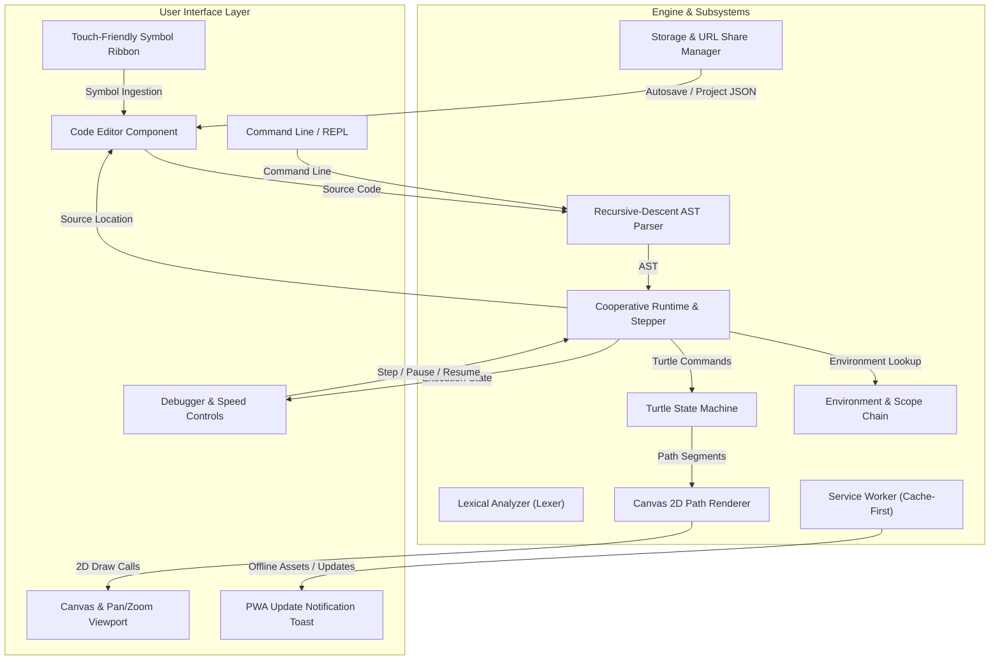
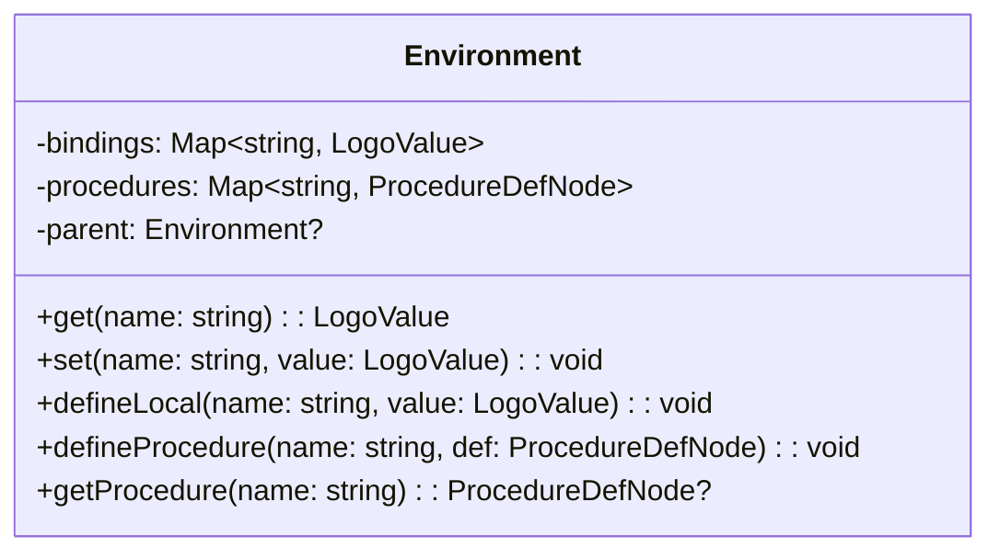
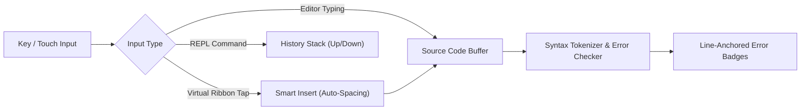
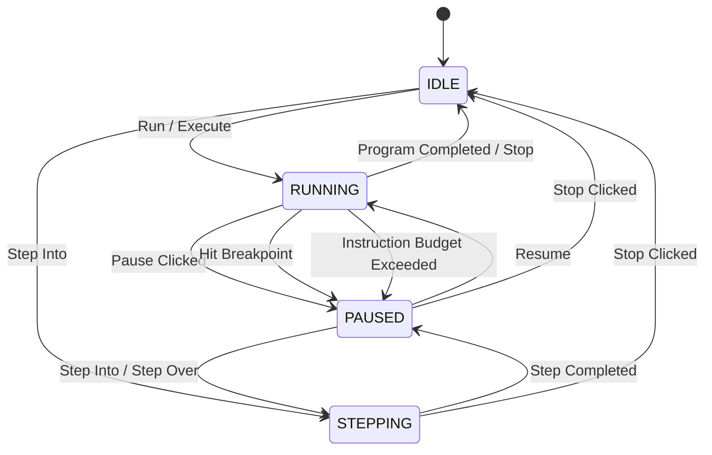
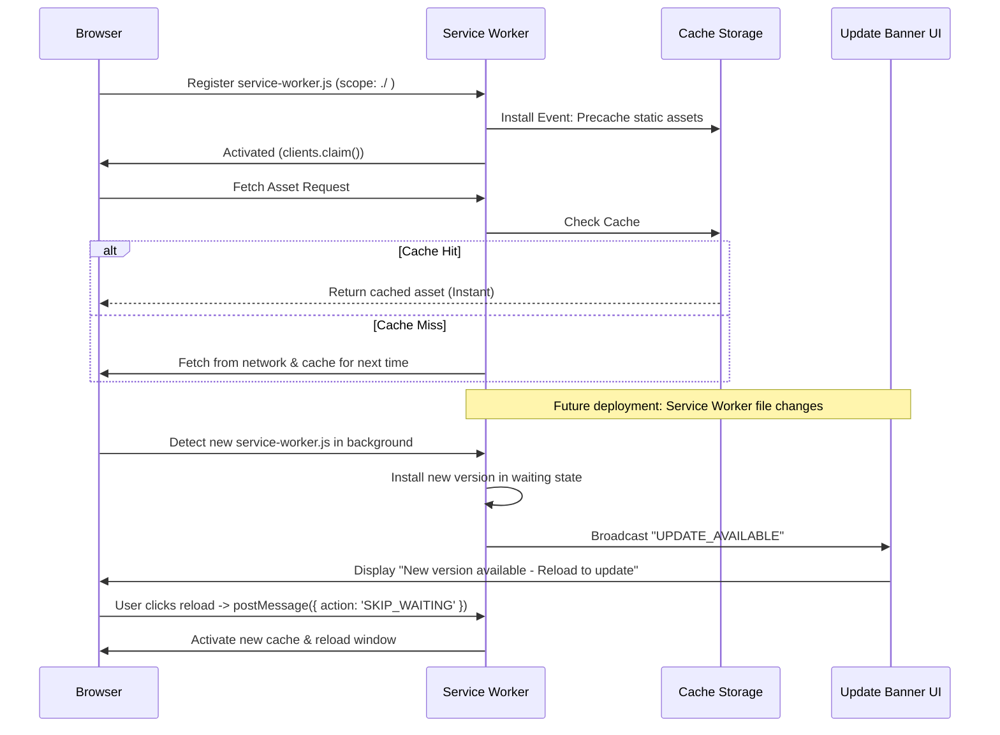

# LearningLogo: Technical Design Document

## 1. System Architecture & Component Topology

LearningLogo is designed as an entirely client-side, zero-backend, offline-first Progressive Web Application. The application architecture decouples the language evaluation engine from graphics rendering, the user interface, and storage through typed event boundaries and cooperative state machines.

### 1.1 High-Level Component Topology



### 1.2 Component Responsibilities & Boundaries

| Component | Primary Responsibility | Input Contract | Output Contract |
| :--- | :--- | :--- | :--- |
| **Lexer** | Tokenizes raw Logo source code into typed tokens | Source string (`string`) | Token stream (`Token[]`) |
| **Parser** | Builds an Abstract Syntax Tree (AST) with source mappings | Token stream (`Token[]`) | Program AST (`ProgramNode`) |
| **Runtime** | Cooperatively executes AST nodes with time-slicing | AST, Environment | Step generator, execution events |
| **Environment** | Manages variable bindings and procedure definitions | Identifiers, scopes | Resolved values (`LogoValue`) |
| **Turtle** | Tracks spatial coordinate, heading, and pen status | Turtle commands | Path segment records |
| **Renderer** | Translates Cartesian coordinates to high-DPI canvas paths | Path segments, viewport | Canvas 2D raster commands |
| **Editor** | Multi-line code editing, syntax highlighting, diagnostics | User input, source maps | Source text, cursor events |
| **Debugger** | Controls execution rate, stepping, pause, and inspection | User actions, step events | Runtime state signals |
| **Storage** | Persists projects locally and handles URL hash sharing | Project state, hash | Serialized JSON / URL string |
| **Service Worker** | Caches static assets for offline execution & updates | HTTP asset requests | Cached responses, update events |

---

## 2. Interpreter Engine Subsystem

### 2.1 Lexical Analysis (Lexer)

The Lexer scans UTF-8 Logo source text into a stream of typed tokens. Logo syntax distinguishes between bare identifiers, variable references (prefixed by `:`), string/word literals (prefixed by `"`), bracketed list delimiters (`[` and `]`), infix mathematical operators, and comments (prefixed by `;`).

#### Token Definitions & Regular Expressions
- `NUMBER`: `^-?\d+(\.\d+)?`
- `WORD_LITERAL`: `^"[a-zA-Z0-9_?#]+` (e.g., `"RED`, `"TOTAL`)
- `VAR_LOOKUP`: `^:[a-zA-Z0-9_?#]+` (e.g., `:COUNT`, `:LENGTH`)
- `LIST_OPEN`: `^\[`
- `LIST_CLOSE`: `^\]`
- `IDENTIFIER`: `^[a-zA-Z_][a-zA-Z0-9_?#]*` (case-insensitive commands, e.g., `FORWARD`, `FD`)
- `OPERATOR`: `^(\+|\-|\*|\/|\%|=|<>|<=|>=|<|>)`
- `COMMENT`: `^;[^\n]*` (ignored by parser)

Every token carries a `SourceLocation` record (`{ line: number, column: number, offset: number }`) enabling line-anchored syntax error reporting and synchronized debugger highlighting.

### 2.2 Recursive-Descent AST Parser

Logo grammar is statement-based with flexible prefix/infix operator expressions and variable arities for primitive commands.

#### Grammar Specification (EBNF)
```ebnf
Program         ::= Statement*
Statement       ::= ProcedureDef | Command
ProcedureDef    ::= "TO" Identifier ( ":" Identifier )* Statement* "END"
Command         ::= "REPEAT" Expression ListBlock
                  | "IF" Expression ListBlock
                  | "IFELSE" Expression ListBlock ListBlock
                  | "MAKE" Expression Expression
                  | "STOP"
                  | "OUTPUT" Expression
                  | CallStatement
ListBlock       ::= "[" Statement* "]"
CallStatement   ::= Identifier Expression*
Expression      ::= LogicalOr
LogicalOr       ::= LogicalAnd ( "OR" LogicalAnd )*
LogicalAnd      ::= Equality ( "AND" Equality )*
Equality        ::= Relational ( ( "=" | "<>" ) Relational )*
Relational      ::= Additive ( ( "<" | "<=" | ">" | ">=" ) Additive )*
Additive        ::= Multiplicative ( ( "+" | "-" ) Multiplicative )*
Multiplicative  ::= Primary ( ( "*" | "/" | "%" ) Primary )*
Primary         ::= NumberLiteral
                  | WordLiteral
                  | VarLookup
                  | ListLiteral
                  | CallExpression
                  | "(" Expression ")"
```

#### AST Node Contracts
```typescript
interface SourceLocation {
  line: number;
  column: number;
  length: number;
}

type ASTNode =
  | ProgramNode
  | ProcedureDefNode
  | RepeatNode
  | IfNode
  | IfElseNode
  | MakeNode
  | CommandCallNode
  | BinaryOpNode
  | NumberLiteralNode
  | WordLiteralNode
  | ListLiteralNode
  | VarLookupNode
  | StopNode
  | OutputNode;
```

### 2.3 Runtime Environment & Scoping Semantics

Classic educational Logo employs **dynamic scoping** with local parameter binding. When a procedure executes:
1. A new `Environment` frame is pushed, holding parameter bindings and any variables declared via `LOCAL`.
2. Variable lookups traverse up the active call-stack frame chain (dynamic scope), allowing nested helper procedures to access caller variables.
3. If an assignment occurs via `MAKE`:
   - If the variable exists in the local frame, it is updated.
   - If the variable exists in an enclosing caller frame, it is updated in that frame.
   - If the variable does not exist in any active frame, it is bound in the global environment.



### 2.4 Cooperative Step Execution & Infinite Loop Guard

To ensure a smooth, non-blocking 60 fps user interface on low-resource Chromebooks and mobile browsers, the interpreter runtime is constructed as a cooperative JavaScript Generator (`function*`).

```typescript
type LogoValue = number | string | boolean | LogoValue[];

interface ExecutionStep {
  type: 'COMMAND' | 'TURTLE_ACTION' | 'FRAME_PUSH' | 'FRAME_POP' | 'YIELD';
  location: SourceLocation;
  node: ASTNode;
}
```

#### Scheduling & Time-Slicing Mechanism
1. **Instruction Budget & Yield**: The runtime executes AST steps continuously within a time slice (target 12 ms per frame). When 12 ms elapsed or a visual turtle action occurs, the generator yields control back to the browser event loop using `requestAnimationFrame`.
2. **Infinite Loop Detection**:
   - An internal monotonically increasing counter `instructionCounter` increments on each AST node evaluation.
   - If `instructionCounter` exceeds `INSTRUCTION_CEILING` (default 100,000 operations) without yielding a visual animation step or user pause, the runtime halts and presents a non-blocking confirmation dialog: *"The turtle has run 100,000 steps without finishing. Pause or Stop?"*.
   - A cooperative cancellation token (`cancellationToken.isCancelled`) allows instantaneous abort from the UI "Stop" button.

#### Tradeoff Analysis: Web Worker vs Cooperative Main-Thread Generators
- **Web Worker Option**: Runs evaluation in a separate thread.
  - *Disadvantages*: Requires serializing canvas draw calls or state updates across `postMessage`, introducing latency for high-frequency turtle steps and complicating synchronous line-by-line visual tracing in the editor.
- **Cooperative Generator Option (Chosen)**:
  - *Advantages*: Zero serialization overhead; direct, synchronous updates to canvas and editor highlights; deterministic stepping and pause states; minimal memory overhead on low-end 2 GB RAM devices.

---

## 3. Graphics & Turtle Subsystem

### 3.1 Coordinate System & Mathematical Transform

Logo uses a standard mathematical Cartesian coordinate plane:
- **Origin (0, 0)**: Centered on the canvas.
- **X-axis**: Positive extending East (right), negative extending West (left).
- **Y-axis**: Positive extending North (up), negative extending South (down).
- **Heading**: 0° is North. Angles increase clockwise (90° = East, 180° = South, 270° = West).

#### Coordinate Transformation Equations
HTML5 Canvas uses a top-left origin (0, 0) with Y increasing downwards. The projection transformation maps Logo Cartesian coordinates $(x_{logo}, y_{logo})$ to Canvas raster coordinates $(x_{canvas}, y_{canvas})$:

$$x_{canvas} = \left( x_{logo} \times \text{zoom} \right) + \frac{W_{canvas}}{2} + \text{pan}_X$$

$$y_{canvas} = \left( -y_{logo} \times \text{zoom} \right) + \frac{H_{canvas}}{2} + \text{pan}_Y$$

#### Forward / Backward Motion Equations
Given heading angle $\theta$ in degrees:

$$\Delta x = \text{distance} \times \sin\left( \theta \times \frac{\pi}{180} \right)$$

$$\Delta y = \text{distance} \times \cos\left( \theta \times \frac{\pi}{180} \right)$$

$$x_{new} = x_{old} + \Delta x, \quad y_{new} = y_{old} + \Delta y$$

### 3.2 Turtle State Model

```typescript
interface TurtleState {
  id: string;
  x: number;
  y: number;
  heading: number; // degrees [0, 360)
  penDown: boolean;
  penColor: string; // Hex color string
  penSize: number;  // Pixels (1 - 50)
  visible: boolean;
}
```

### 3.3 Colorblind-Safe Color Subsystem

To guarantee accessibility for red-green color blind users, the default palette uses the **Okabe-Ito 8-color model**, paired with high-contrast text tags and distinct shape representations.

| Index | Color Name | Hex Code | Accessible Role & Secondary Indicator |
| :--- | :--- | :--- | :--- |
| **0** | Black | `#000000` | Default pen, high-contrast borders |
| **1** | Blue | `#0072B2` | Primary informative color / `[PASS]` |
| **2** | Vermilion / Orange | `#D55E00` | Primary warning & highlight / `[FAIL]` |
| **3** | Sky Blue | `#56B4E9` | Light accent / grid lines |
| **4** | Bluish Green | `#009E73` | Contrast secondary accent |
| **5** | Yellow | `#F0E442` | Attention indicator / `[WARN]` |
| **6** | Reddish Purple | `#CC79A7` | Tertiary accent |
| **7** | Amber / Orange | `#E69F00` | Secondary warning / `[PENDING]` |

Standard numeric color codes (`SETPC 0` through `SETPC 15`) map directly to this colorblind-safe sequence, while named strings (`"BLUE`, `"ORANGE`) and custom hex strings (`"#0072B2"`) are fully supported.

### 3.4 Canvas Rendering Pipeline

1. **High-DPI Display Scaling**:
   The canvas buffer dimensions are scaled by `window.devicePixelRatio` (e.g. 2x for Retina/Chromebook displays), while CSS display dimensions remain at layout size:
   $$\text{bufferWidth} = \text{cssWidth} \times \text{devicePixelRatio}$$
2. **Layered Double-Buffering**:
   - *Static Path Layer*: An offscreen or background canvas layer recording all drawn vector segments. It is only updated on drawing commands, avoiding redraw of thousands of lines on turtle cursor rotation.
   - *Dynamic Sprite Layer*: An overlay canvas rendering the active turtle sprite (a directional vector triangle with heading orientation and pen indicator). Cleared and redrawn each animation frame.

---

## 4. Interactive Editor & REPL Subsystem

### 4.1 Architecture & Touch Ribbon

The editor subsystem delivers dual entry points: a multi-line structured code editor and a bottom single-line REPL.



### 4.2 Touch-Friendly Mobile & Chromebook Ribbon

On touch devices and Chromebooks, accessing brackets (`[`, `]`), quotes (`"`), and colons (`:`) via standard virtual keyboards requires switching keyboard pages, causing high friction.
The editor provides a dedicated touch toolbar directly above the virtual keyboard:
- **Symbol Buttons**: `[`, `]`, `"`, `:`, `(`, `)`
- **Command Shortcuts**: `FD 50`, `BK 50`, `LT 90`, `RT 90`, `REPEAT 4 [ ]`
- **Ergonomics**: Touch target dimensions are guaranteed $\ge 48 \times 48\text{ px}$ with $8\text{ px}$ separation.
- **Smart Placement**: Tapping `REPEAT 4 [ ]` inserts the template and positions the text cursor directly between the brackets.

---

## 5. Debugger Subsystem

### 5.1 Debugger State Machine

The debugger manages the lifecycle of program execution through a formal state machine.



### 5.2 Stepping & Visual Trace Contracts

- **Step Into**: Advances the runtime generator until the next AST node of type `COMMAND` or `TURTLE_ACTION` yields, highlighting the corresponding line and token in the editor, updating the turtle canvas, and returning to `PAUSED`.
- **Step Over**: Evaluates all child nodes within the current call-stack frame, pausing only when execution returns to the parent frame level.
- **Speed Slider Mapping**: A non-linear slider translates user percentage $P \in [0, 100]$ to delay milliseconds:
  - $P = 100$: Turbo mode ($0\text{ ms}$ delay; execute max operations per animation frame).
  - $P = 0$: Single step mode ($1000\text{ ms}$ delay between visual actions).
  - $P \in (0, 100)$: Logarithmic delay curve: $\text{delay} = 1000 \times \left(1 - \frac{P}{100}\right)^2\text{ ms}$.

---

## 6. PWA & Offline Storage Architecture

### 6.1 Service Worker Lifecycle & GitHub Pages Path Compatibility

LearningLogo is hosted on GitHub Pages under a subpath (e.g., `/LearningLogo/`). The Service Worker and router are constructed to be base-path aware.



### 6.2 Cache Versioning Strategy

```typescript
const CACHE_VERSION = 'learning-logo-v1.0.0';
const CORE_ASSETS = [
  './',
  './index.html',
  './manifest.json',
  './favicon.ico',
  './assets/app.js',
  './assets/app.css',
  './icons/icon-192.png',
  './icons/icon-512.png'
];
```
- **Cache Invalidation**: On the `activate` event, any cache key matching the prefix `learning-logo-` that does not equal `CACHE_VERSION` is automatically purged.
- **Zero Loss of Student Work**: Activating a new Service Worker version never impacts `localStorage` or `IndexedDB` project records.

### 6.3 Project Persistence & Accountless Sharing

1. **Local Autosave**: The current editor buffer, turtle state, and settings autosave to `localStorage` key `learning_logo_draft` every 3 seconds.
2. **Project Database**: Complete named projects are persisted in `IndexedDB` under the database `LearningLogoDB`, object store `projects`.
3. **URL Fragment Compression**:
   - Project source code is compressed using LZ-based URL-safe string encoding.
   - The resulting hash format: `https://.../LearningLogo/#code=EQVwzgpgB...`
   - Opening this URL loads the project instantly without any backend API call.
   - Hash payload length is safely capped under 2,000 characters for compatibility with all mobile browsers.

---

## 7. Technology Stack & Local Development Baseline

### 7.1 Tech Stack Rationale

- **Runtime Language**: TypeScript 5.x with `strict: true`. Guarantees robust AST node discrimination, interface type safety, and zero runtime overhead.
- **Build Tool**: Vite. Provides instantaneous development server startup, sub-second HMR, and tree-shaken static production bundling.
- **Testing Framework**: Vitest. Executes TypeScript unit tests with native ESM support and zero build latency.
- **Zero Heavy Frameworks**: Handled via clean, modular TypeScript classes and native DOM elements. Keeps production payload $< 150\text{ KB}$ gzipped.

### 7.2 Core npm Scripts Contract

```json
{
  "scripts": {
    "dev": "vite",
    "build": "tsc --noEmit && vite build",
    "preview": "vite preview",
    "test": "vitest run",
    "test:watch": "vitest"
  }
}
```
