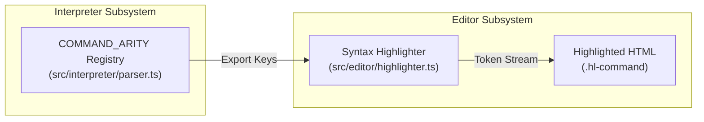

# Design Document: Syntax Highlighter & Parser Command Registry Synchronization

## 1. Problem Statement & Root Cause

The Logo code editor uses `src/editor/highlighter.ts` to tokenize and wrap source code tokens in syntax-highlighted HTML spans (`hl-command`, `hl-keyword`, `hl-var`, etc.).

### Verified Technical Root Cause
The highlighter maintained a disconnected, hardcoded `COMMANDS` Set (`src/editor/highlighter.ts:L22-L66`) that was statically defined early in development and only contained a legacy subset of commands (`FD`, `BK`, `RT`, `LT`, etc.). When drawing commands (including `STAMPOVAL`, `STAMPRECT`, `DOT`, `FILL`, `ORIGIN`, etc.) were implemented in the interpreter and registered in `src/interpreter/parser.ts:COMMAND_ARITY`, `highlighter.ts` was not connected to that registry.

Because `STAMPOVAL` was missing from `COMMANDS`, the highlighter's token scanner fell through from keyword and command checks to generic text (`src/editor/highlighter.ts:L166-L168`), wrapping `STAMPOVAL` in `<span class="hl-text">` instead of `<span class="hl-command">`.

---

## 2. Architectural Solution: Single Source of Truth

To permanently prevent syntax highlighting drift as commands evolve:

1. **Export Canonical Registry**: Export `COMMAND_ARITY` from `src/interpreter/parser.ts` as the single canonical registry for all Logo primitives and commands (including comparison primitives `EQUAL?`, `LESS?`, `GREATER?`).
2. **Dynamic Ingestion**: In `src/editor/highlighter.ts`, derive `COMMANDS: ReadonlySet<string>` directly from `Object.keys(COMMAND_ARITY)`.
3. **Zero Circular Dependencies**: The dependency hierarchy flows strictly downward (`editor/highlighter.ts` -> `interpreter/parser.ts`). `parser.ts` has zero imports from the editor subsystem.

---

## 3. Data Flow & Interface Contracts



### Type Contract
```ts
export const COMMANDS: ReadonlySet<string> = new Set(
  Object.keys(COMMAND_ARITY)
);
```

---

## 4. Verification & Regression Plan

- **TDD Red Phase [FAIL]**: Add unit tests in `tests/unit/editor/highlighter.test.ts` asserting that `STAMPOVAL`, `STAMPRECT`, `DOT`, and `FILL` generate `<span class="hl-command">`. Verify test failure against unpatched codebase.
- **TDD Green Phase [PASS]**: Export `COMMAND_ARITY` from `parser.ts` and import into `highlighter.ts`. Verify test success.
- **Integration**: Verify editor syntax highlighting in end-to-end integration tests.
