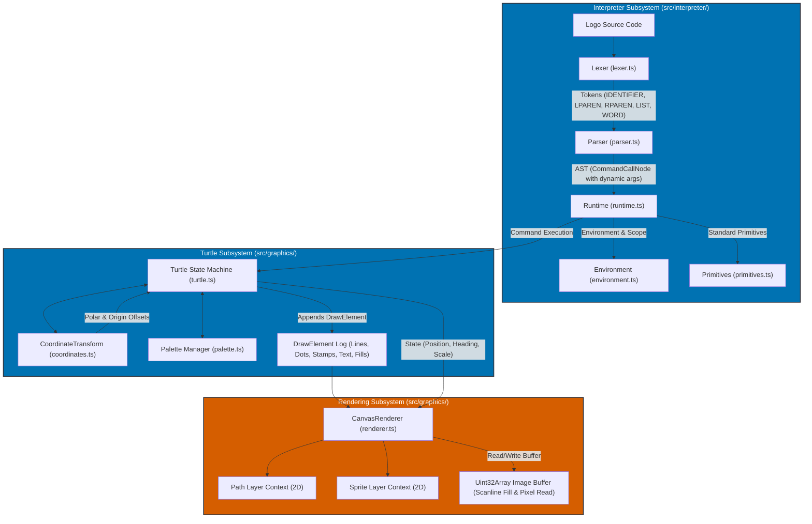

# Technical Design Document: Terrapin Logo 56 Drawing Commands Architecture

**Date**: 2026-09-26  
**Status**: [APPROVED]  
**Author**: Staff AI Architect (Planner)  
**Target Repository**: `/usr/local/google/home/vakh/git/hub/aawc/LearningLogo`  
**Specification Source**: [Terrapin Logo Drawing Documentation](https://resources.terrapinlogo.com/logo/commands/drawing)  

---

## 1. Executive Summary & Architectural Goals

The goal of this design is to specify the comprehensive architecture for supporting all 56 Terrapin Logo drawing commands in LearningLogo. This covers turtle motion, visibility/scaling, coordinate origin shifts, polar coordinate navigation, pen dynamics, speed/velocity simulation, geometric shape stamping, canvas pixel interrogation, high-performance flood filling, typography rendering, and variadic parenthesized invocation syntax.

### Key Architectural Tenets
1. **Decoupled Pure State Machine**: The `Turtle` class maintains purely mathematical and visual state without coupling directly to the DOM or canvas context. This guarantees 100% headless testability in Node.js / Vitest.
2. **First-Class Variadic Parenthesized Invocations**: The Lexer and Parser natively handle Logo grouping parentheses `(...)` to enable variable-arity command execution (e.g. `(DOT)`, `(FILL "RED)`, `(STAMPOVAL 50 50 "TRUE)`), eliminating runtime argument-guessing hacks.
3. **High-Performance Canvas Compositing & Flood Fill**: Raster operations operate through batched `DrawElement` logs. The flood-fill algorithm reads the canvas buffer once into a 32-bit `Uint32Array`, executes an in-memory scanline fill, and writes back once via `putImageData`, avoiding GPU pipeline stalls.
4. **Accessible Visual & Codeblind Compliance**: Default palette assignments leverage the 8-color Okabe-Ito accessible palette (`#0072B2` Blue, `#D55E00` Orange, etc.), with double-encoded status indicators and zero dependence on bare red/green color differences.
5. **Strict Adherence to Standards**: No GitHub alert syntax; clean Markdown tables, type contracts, and architectural diagrams.

---

## 2. Baseline Architecture & Gap Analysis

The existing codebase provides foundational support for 16 core turtle commands (`FD`, `BK`, `RT`, `LT`, `CS`, `HOME`, `PU`, `PD`, `HT`, `ST`, `SETPC`, `SETPW`, `SETBG`, `SETXY`, `PRINT`, `OUTPUT`), but lacks infrastructure for 40 advanced drawing capabilities:

| Functional Category | Current Implementation State | Required Terrapin Capabilities | Architectural Gap |
| :--- | :--- | :--- | :--- |
| **Motion & Coordinates** | Fixed Cartesian `(x, y)` relative to screen center; `SETXY` expects 2 numeric expressions. | Dual parameter forms (`[x y]` or `x y`), `DISTANCE`, `GETX`/`XCOR`, `GETY`/`YCOR`, `GETXY`/`POS`. | Parser lacks list vs. scalar argument flexibility; `DISTANCE` math absent. |
| **Origin Offset** | Hardcoded `(0, 0)` at viewport center. | `ORIGIN` reporter and `SETORIGIN` mutator for per-turtle coordinate offsets. | Missing origin transform matrix in `CoordinateTransform` and `TurtleState`. |
| **Polar Navigation** | None. | `PDIST`, `PANGLE`, `PHEADING`, `PSETHEADING` (`PSETH`), `PPOS`, `SETP`. | Missing polar-to-Cartesian conversion (3 o'clock 0° counter-clockwise polar vs 12 o'clock 0° clockwise Cartesian). |
| **Visibility & Scale** | Binary `isVisible` flag; fixed Chevron sprite dimensions. | `SHOWN?`, `TURTLESIZE`, `SETTURTLESIZE` (scale 0.01 - 99.0). | Missing scale property in `TurtleState`; renderer does not scale sprite path. |
| **Pen Modes & Dynamics** | `isPenDown` boolean; fixed pen color & width. | `PENERASE` (`PE`), `PENREVERSE` (`PX`), `PEN`, `PENDOWN?`, `SETPEN`, `SETWIDTH`/`WIDTH`, `SETSTEPSIZE`/`STEPSIZE`. | Binary pen state cannot represent Erase or Reverse modes; missing step size multiplier in `FD`/`BK`. |
| **Speed & Velocity** | Instantaneous execution or fixed stepper delay. | `SPEED`, `SETSPEED`, `SLOWTURTLE`, `VELOCITY`, `SETVELOCITY`. | Missing speed and crawl velocity properties in state machine. |
| **Shapes, Dots & Fill** | Line segments only (`PathSegment`). | `DOT`, `DOT?`, `DOTCOLOR`, `FILL`, `STAMPOVAL`, `STAMPRECT`. | `Turtle` only records line segments; cannot render points, filled stamps, or execute flood fill. |
| **Typography** | None. | `FONT`, `FONTS`, `SETFONT`, `TURTLETEXT` (`TT`), `TTBASE`, `TTSIZE`. | No font state, text measurement, or text rendering pipeline. |
| **Grammar & Arity** | Fixed arity dictionary (`COMMAND_ARITY`); parentheses only group math. | Parenthesized calls with non-default or variable arities (`(DOT)`, `(FILL "RED)`). | Parser fails on parenthesized command calls because `COMMAND_ARITY` is immutable. |

---

## 3. System Architecture Diagram



---

## 4. Duckie Knowledge Retrieval & Technical Debt Audit

Two formal architectural consultations were conducted via the Duckie expert system to validate design choices against production standards and anti-patterns:

### Consultation 1: Architectural Anti-Patterns & Technical Debt Risks
- **Decoupled State Machine**: Do not query the Canvas 2D context for turtle state (position, heading, pen mode). The `Turtle` class must be a pure, deterministic state machine testable in headless Node.js/Vitest without a `<canvas>` DOM element.
- **Canvas State Leakage**: Wrap all shape stamps, blend modes, and text rendering in `ctx.save()` and `ctx.restore()`. Avoid leaking `globalCompositeOperation` or affine transforms between elements.
- **Pixel Reading Bottleneck (`FILL`)**: Never call `ctx.getImageData(x, y, 1, 1)` in a loop. Doing so flushes the GPU pipeline and stalls execution. The renderer must read the full bounding box once into a `Uint32Array`, execute scanline flood fill in memory, and commit once via `ctx.putImageData`.
- **Pen Mode Emulation (`PENREVERSE`)**: Vintage Logo used hardware Bitwise XOR blitting. Canvas 2D lacks bitwise XOR; the standard web emulation is `ctx.globalCompositeOperation = 'difference'`. This must be documented as an accepted architectural tradeoff for performance.
- **Parenthesized AST Parsing**: Avoid runtime hackery for variadic arguments. The parser must detect opening parenthesis before a command and greedily parse expressions until the matching closing parenthesis.

### Consultation 2: Library Reuse vs. Lightweight Custom Code
- **Scanline Flood Fill**: Custom zero-dependency implementation operating directly on a `Uint32Array` view of `ImageData.data`. Third-party npm packages are bloated, buffer-centric, or fail in browser environments. A custom 60-80 line queue-based scanline algorithm is optimal.
- **Color & Palette**: Retain the zero-dependency `palette.ts` supporting Okabe-Ito accessible hex values, standard web named colors, and `#RRGGBB` strings, with RGB array reporters `[r g b]` for Terrapin compatibility.
- **Vector & Polar Math**: Standard TypeScript mathematical functions (`Math.sin`, `Math.cos`, `Math.atan2`, `Math.hypot`) in `CoordinateTransform`. External matrix libraries (e.g. `gl-matrix`) add unnecessary weight for 2D turtle planar geometry.
- **Text Metrics**: Modern `TextMetrics` (`fontBoundingBoxAscent`, `actualBoundingBoxAscent`, `fontBoundingBoxDescent`) via standard Canvas 2D API for `TTBASE` and `TTSIZE`. Provide deterministic headless fallbacks in unit test environments.

---

## 5. Detailed Technical Specifications

### 5.1 Lexer & Tokenizer Enhancements (`src/interpreter/lexer.ts`)
The lexer must recognize word literals containing symbols (such as font names, hex colors like `"#0072B2`, or identifiers ending in `?`):
- `IDENTIFIER_REGEX`: `/^[a-zA-Z_?][a-zA-Z0-9_?]*/` (retained, supports `SHOWN?`, `DOT?`, `PENDOWN?`).
- `WORD_LITERAL_REGEX`: `/^"([^\s\[\]\(\)]+)/` (expanded from alphanumeric to allow `#`, `-`, `.`, and special characters within quoted words like `"TIMES-ROMAN`, `"#0072B2`, `"TRUE`).

### 5.2 Parser Grammar & Variadic Parenthesized Invocations (`src/interpreter/parser.ts`)
In standard Logo, commands have a fixed default arity. When enclosed in parentheses, commands can accept a variable number of arguments until the closing `)`.

#### Grammar Rules
```ebnf
Statement           ::= ParenthesizedCall | CommandCall | Repeat | If | IfElse | Make | ProcedureDef | Stop | Output | Expression
ParenthesizedCall   ::= '(' CommandIdentifier Expression* ')'
CommandCall         ::= CommandIdentifier ( Argument ){arity}
Argument            ::= Expression | ListLiteral
```

#### Dual-Arity Argument Flexibility
Commands taking 2D points (`SETXY`, `TOWARDS`, `DISTANCE`, `SETORIGIN`, `SETP`, `DOT`) accept either:
1. Two scalar numbers: `SETXY 100 200`
2. A single two-element list: `SETXY [100 200]`
3. Parenthesized form: `(SETXY 100 200)` or `(SETXY [100 200])`

The parser checks if the first argument token is `TokenType.LIST_OPEN` (`[`). If so, it consumes 1 argument (the list). Otherwise, it consumes the default scalar count.

### 5.3 Turtle State Machine & Coordinate Mathematics (`src/graphics/turtle.ts`, `src/graphics/coordinates.ts`)

#### State Contract
```typescript
export type PenMode = 'PENDOWN' | 'PENUP' | 'PENERASE' | 'PENREVERSE';

export interface TurtleFont {
  name: string;
  size: number;        // points (pt)
  attributes: number;  // bitmask: 0=normal, 1=bold, 2=italic, 4=underline
}

export interface TurtleState {
  x: number;
  y: number;
  heading: number;     // 0° to 360°, 0° = North, clockwise
  penMode: PenMode;
  isPenDown: boolean;
  isVisible: boolean;
  penColor: string;
  penWidth: number;
  origin: Point2D;     // coordinate system offset
  speed: number;       // 0.1 to 1.0 (default 1.0)
  velocity: number;    // pixels/sec (default 0)
  stepSize: number;    // pixels per forward/back step (default 1)
  turtleSize: number;  // visual scale 0.01 to 99 (default 1)
  font: TurtleFont;    // default { name: 'Arial', size: 12, attributes: 0 }
}
```

#### Coordinate Transformation Specifications
1. **Origin Offset Translation**:
   ```typescript
   worldX = origin.x + localX;
   worldY = origin.y + localY;
   ```
2. **Polar Heading Translation**:
   Terrapin Logo polar angle: 0° is East (3 o'clock), positive is counter-clockwise.
   Cartesian heading: 0° is North (12 o'clock), positive is clockwise.
   ```typescript
   polarHeading = (450 - cartesianHeading) % 360;
   cartesianHeading = (450 - polarHeading) % 360;
   ```
3. **Polar Coordinates (PDIST & PANGLE)**:
   ```typescript
   pdist = Math.hypot(localX, localY);
   pangle = ((Math.atan2(localY, localX) * 180 / Math.PI) % 360 + 360) % 360;
   ```
4. **Step Size Multiplier**:
   ```typescript
   effectiveDistance = distance * state.stepSize;
   ```

### 5.4 Drawing Element Model & Canvas 2D Rendering Pipeline (`src/graphics/renderer.ts`)

To avoid canvas coupling, `Turtle` maintains an ordered log of immutable `DrawElement` items:

```typescript
export type DrawElement =
  | { type: 'line'; from: Point2D; to: Point2D; color: string; width: number; mode: PenMode }
  | { type: 'dot'; point: Point2D; color: string; width: number; mode: PenMode }
  | { type: 'oval'; center: Point2D; xRadius: number; yRadius: number; filled: boolean; color: string; width: number; mode: PenMode }
  | { type: 'rect'; corner: Point2D; width: number; height: number; filled: boolean; color: string; width: number; mode: PenMode }
  | { type: 'text'; point: Point2D; text: string; font: TurtleFont; color: string; mode: PenMode }
  | { type: 'fill'; startPoint: Point2D; fillColor: string; boundaryColor?: string; mode: PenMode };
```

#### Canvas Compositing Execution
```typescript
switch (element.mode) {
  case 'PENDOWN':
    ctx.globalCompositeOperation = 'source-over';
    break;
  case 'PENERASE':
    ctx.globalCompositeOperation = 'destination-out';
    break;
  case 'PENREVERSE':
    ctx.globalCompositeOperation = 'difference';
    break;
  case 'PENUP':
    return; // No drawing executed
}
```

### 5.5 High-Performance Scanline Flood Fill Engine
When `FILL` or `(FILL color)` executes:
1. `CanvasRenderer` queries `ctx.getImageData(0, 0, bufferWidth, bufferHeight)`.
2. Creates a 32-bit pixel view: `const pixels = new Uint32Array(imgData.data.buffer)`.
3. Maps Logo starting position `(x, y)` to canvas raster pixel `(px, py)`.
4. Executes scanline flood fill:
   - Identifies target color `target = pixels[py * width + px]`.
   - If target color equals replacement color, aborts immediately.
   - Pushes seed segment to stack.
   - While stack is not empty, pops segment, scans horizontal span `[left, right]`, fills span in `pixels`, and inspects rows above and below for new segments.
5. Commits back with `ctx.putImageData(imgData, 0, 0)`.

### 5.6 Typography & TextMetrics Architecture
- **Font String Construction**:
  ```typescript
  const style = (font.attributes & 2) ? 'italic ' : '';
  const weight = (font.attributes & 1) ? 'bold ' : '';
  ctx.font = `${style}${weight}${font.size}pt ${font.name}`;
  ```
- **Baseline Offset (`TTBASE`)**:
  Reports `metrics.fontBoundingBoxAscent ?? metrics.actualBoundingBoxAscent ?? Math.round(font.size * 0.8)`.
- **Dimensions (`TTSIZE`)**:
  Reports `[Math.round(metrics.width), Math.round((metrics.fontBoundingBoxAscent ?? font.size) + (metrics.fontBoundingBoxDescent ?? 0))]`.

---

## 5.7 Complete 56-Command Reference Taxonomy & Interface Contracts

### Group 1: Motion (15 Commands)
1. **`FORWARD` (alias `FD`)**: `FORWARD distance` — Moves turtle forward by `distance * STEPSIZE` at current heading. Adds line if pen is down.
2. **`BACK` (alias `BK`)**: `BACK distance` — Moves turtle backward by `distance * STEPSIZE`. Adds line if pen is down.
3. **`RIGHT` (alias `RT`)**: `RIGHT degrees` — Rotates turtle clockwise by `degrees`.
4. **`LEFT` (alias `LT`)**: `LEFT degrees` — Rotates turtle counter-clockwise by `degrees`.
5. **`HOME`**: `HOME` — Moves turtle to local `[0 0]`, sets heading to 0° (North), without altering lines or pen state.
6. **`SETXY` (alias `SETPOS`)**: `SETXY [x y]` or `SETXY x y` — Sets turtle position to `(x, y)` relative to current origin.
7. **`SETX`**: `SETX x` — Sets X coordinate to `x` without altering Y or heading.
8. **`SETY`**: `SETY y` — Sets Y coordinate to `y` without altering X or heading.
9. **`GETX` (alias `XCOR`)**: `GETX` — Reporter returning current X coordinate.
10. **`GETY` (alias `YCOR`)**: `GETY` — Reporter returning current Y coordinate.
11. **`GETXY` (alias `POS`)**: `GETXY` — Reporter returning `[x y]` list.
12. **`HEADING`**: `HEADING` — Reporter returning heading in degrees `[0, 360)`.
13. **`SETHEADING` (alias `SETH`)**: `SETHEADING degrees` — Sets heading to `degrees` normalized `[0, 360)`.
14. **`TOWARDS`**: `TOWARDS [x y]` or `TOWARDS x y` — Reporter returning heading angle pointing from turtle to target point.
15. **`DISTANCE`**: `DISTANCE [x y]` or `DISTANCE x y` — Reporter returning Euclidean distance between turtle and target point.

### Group 2: Visibility & Scale (5 Commands)
16. **`SHOWTURTLE` (alias `ST`)**: `SHOWTURTLE` — Sets turtle visibility `isVisible = true`.
17. **`HIDETURTLE` (alias `HT`)**: `HIDETURTLE` — Sets turtle visibility `isVisible = false`.
18. **`SHOWN?` (alias `SHOWNP`)**: `SHOWN?` — Reporter returning `true` if visible, `false` if hidden.
19. **`TURTLESIZE` (alias `TSIZE`)**: `TURTLESIZE` — Reporter returning turtle scale factor (default 1.0, range 0.01 - 99.0).
20. **`SETTURTLESIZE` (alias `SETTSIZE`, `SETTS`)**: `SETTURTLESIZE scale` — Sets turtle visual scale factor.

### Group 3: Coordinate Origin (2 Commands)
21. **`ORIGIN`**: `ORIGIN` — Reporter returning coordinate origin offset `[ox oy]` (default `[0 0]`).
22. **`SETORIGIN`**: `SETORIGIN [x y]` or `(SETORIGIN x y)` or `(SETORIGIN)` — Sets origin offset. Called with no arguments, resets to `[0 0]`.

### Group 4: Polar Coordinates (6 Commands)
23. **`PDIST`**: `PDIST` — Reporter returning polar distance from turtle origin (`Math.hypot(x, y)`).
24. **`PANGLE`**: `PANGLE` — Reporter returning polar angle in degrees `[0, 360)` counter-clockwise from East (3 o'clock).
25. **`PHEADING`**: `PHEADING` — Reporter returning polar heading in degrees `[0, 360)`.
26. **`PSETHEADING` (alias `PSETH`)**: `PSETHEADING angle` — Sets heading using polar degrees (`heading = (450 - angle) % 360`).
27. **`PPOS`**: `PPOS` — Reporter returning `[pdist pangle]`.
28. **`SETP`**: `SETP distance angle` or `SETP [distance angle]` — Aims turtle at polar heading `angle` and moves to polar position `(distance, angle)`.

### Group 5: Pen Modes & Attributes (11 Commands)
29. **`PENDOWN` (alias `PD`)**: `PENDOWN` — Sets pen mode to `'PENDOWN'`.
30. **`PENUP` (alias `PU`)**: `PENUP` — Sets pen mode to `'PENUP'`.
31. **`PENERASE` (alias `PE`)**: `PENERASE` — Sets pen mode to `'PENERASE'` (erases/draws with destination-out).
32. **`PENREVERSE` (alias `PX`)**: `PENREVERSE` — Sets pen mode to `'PENREVERSE'` (inverts background via difference).
33. **`PEN`**: `PEN` — Reporter returning `"PENDOWN`, `"PENUP`, `"PENERASE`, or `"PENREVERSE`.
34. **`PENDOWN?` (alias `PENDOWNP`)**: `PENDOWN?` — Reporter returning `true` if pen mode is not `'PENUP'`, `false` otherwise.
35. **`SETPEN`**: `SETPEN [penmode pencolor]` or `SETPEN penmode` — Sets pen mode and optional color.
36. **`SETWIDTH` (alias `SETW`)**: `SETWIDTH width` — Sets pen line width (1 to 99).
37. **`WIDTH`**: `WIDTH` — Reporter returning current pen width.
38. **`SETSTEPSIZE`**: `SETSTEPSIZE pixels` — Sets step size multiplier (default 1).
39. **`STEPSIZE`**: `STEPSIZE` — Reporter returning current step size.

### Group 6: Speed & Dynamics (5 Commands)
40. **`SPEED`**: `SPEED` — Reporter returning movement execution speed `(0.1 to 1.0)`.
41. **`SETSPEED`**: `SETSPEED speed` — Sets execution speed; halts independent velocity (`velocity = 0`).
42. **`SLOWTURTLE`**: `SLOWTURTLE` — Convenience command setting speed to 0.5 (`SETSPEED 0.5`).
43. **`VELOCITY`**: `VELOCITY` — Reporter returning independent movement velocity (pixels/sec).
44. **`SETVELOCITY`**: `SETVELOCITY v` — Sets independent speed in pixels/sec.

### Group 7: Shapes, Dots & Fills (6 Commands)
45. **`DOT`**: `DOT [x y]` or `(DOT)` or `(DOT x y)` or `(DOT [x y] color)` — Draws a dot at point or current turtle position.
46. **`DOT?` (alias `DOTP`)**: `DOT?` or `(DOT? [x y])` — Reporter returning `true` if pixel under turtle (or target) is not background color.
47. **`DOTCOLOR`**: `DOTCOLOR` or `(DOTCOLOR [x y])` or `(DOTCOLOR)` — Reporter returning RGB color `[r g b]` of pixel.
48. **`FILL`**: `FILL` or `(FILL color)` — Flood fills enclosed area starting at turtle position.
49. **`STAMPOVAL`**: `STAMPOVAL xrad yrad` or `(STAMPOVAL xrad yrad "TRUE)` — Stamps an oval around turtle. Fills if parenthesized with `"TRUE`.
50. **`STAMPRECT`**: `STAMPRECT w h` or `(STAMPRECT w h "TRUE)` — Stamps a rectangle with lower-left corner at turtle. Fills if parenthesized with `"TRUE`.

### Group 8: Typography (6 Commands)
51. **`FONT`**: `FONT` — Reporter returning current font as `[name size attributes]`.
52. **`FONTS`**: `FONTS` — Reporter returning list of available system fonts.
53. **`SETFONT`**: `SETFONT name size attributes` or `SETFONT [name size attributes]` or `(SETFONT)` — Sets font parameters. `(SETFONT)` resets to default.
54. **`TURTLETEXT` (alias `TT`)**: `TURTLETEXT wordOrList` — Draws text at turtle position using current font and pen color.
55. **`TURTLETEXTBASE` (alias `TTBASE`)**: `TURTLETEXTBASE` — Reporter returning font baseline offset in pixels.
56. **`TURTLETEXTSIZE` (alias `TTSIZE`)**: `TURTLETEXTSIZE text` — Reporter returning `[width height]` dimensions of text bounding box.

---

## 6. Accessibility & Red-Green Colorblind Compliance

In accordance with user standards and WCAG 2.1 AA accessibility:
1. **Okabe-Ito Color Palette**: Default drawing color is Okabe-Ito Primary Blue (`#0072B2`). Secondary alert color is Vermilion/Orange (`#D55E00`).
2. **Double Encoding**: All statuses and diff representations must combine text labels and distinct geometric brackets (`[PASS]`, `[FAIL]`, `[ADDED]`, `[REMOVED]`, `[MODIFIED]`).
3. **High Contrast Borders**: Shapes and sprite elements are outlined with contrasting 1.5px `#000000` / `#FFFFFF` borders to guarantee readability across all backgrounds.

---

## 7. Risk Assessment & Mitigations

| Risk | Impact | Likelihood | Mitigation Strategy |
| :--- | :--- | :--- | :--- |
| **Variadic Parenthesized Call Ambiguity** (`(HEADING + 90)`) | Infix math expressions inside parentheses misparsed as command arguments. | Medium | Parser inspects lookahead: if identifier is followed by an infix operator (`+`, `-`, `*`, `/`, etc.), treat as standard parenthesized expression rather than command call. |
| **`getImageData` Security Exception** | Canvas tainted by external resources throws in `DOT?` or `FILL`. | Low | Only internal procedural drawings are rendered; no cross-origin assets are loaded onto the drawing canvas. |
| **Infinite Loop in Scanline Fill** | Unbounded fills on open boundaries freeze the browser thread. | Medium | Clamping scanline bounds strictly to buffer dimensions `[0, width]` and `[0, height]` with a max-pixel safety counter. |
| **Headless Test Failures for Canvas Text** | `jsdom` lacks native font layout engine. | High | In unit test environment, implement robust deterministic fallbacks in `renderer.ts` based on font size multipliers when `ctx.measureText` metrics are stubbed. |
