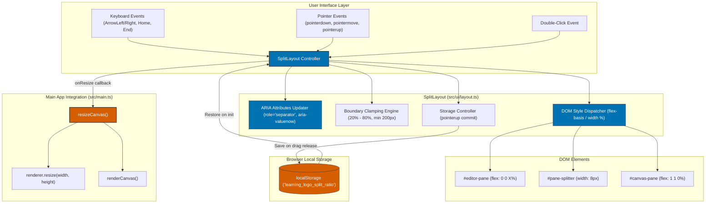

# Accessible & Persistent Draggable Pane Splitter Implementation Plan

## Pre-Flight Check / Workspace Verification

1. **VCS & Branch Status**: Active branch is `main` at `/usr/local/google/home/vakh/git/hub/aawc/LearningLogo`. Git status verified clean with no uncommitted or untracked changes.
2. **Workspace Safety**: Strictly read-only planning phase. No source code, configurations, or build assets will be modified during this phase.
3. **Delegation**: All implementation, refactoring, and test execution tasks are explicitly delegated to the `implementer` agent.

---

## 1. Analysis & Findings

### Key Files & Line Anchors
- `src/ui/layout.ts#L1-L42`: Contains the [SplitLayout](file:///usr/local/google/home/vakh/git/hub/aawc/LearningLogo/src/ui/layout.ts#L1) class which currently handles only mobile vs. desktop class toggling (`workspace-stacked` vs. `workspace-side-by-side`).
- `src/styles/layout.css#L83-L110`: Styles [.workspace](file:///usr/local/google/home/vakh/git/hub/aawc/LearningLogo/src/styles/layout.css#L83), [.pane](file:///usr/local/google/home/vakh/git/hub/aawc/LearningLogo/src/styles/layout.css#L91), [#editor-pane](file:///usr/local/google/home/vakh/git/hub/aawc/LearningLogo/src/styles/layout.css#L99), and [#canvas-pane](file:///usr/local/google/home/vakh/git/hub/aawc/LearningLogo/src/styles/layout.css#L105) with static flex rules (`flex: 1`, `min-width: 320px`).
- `src/styles/layout.css#L132-L148`: Mobile breakpoint media query (`@media (max-width: 767px)`) forcing 50% height and stacked flex-direction.
- `src/styles/tokens.css#L2-L21`: Okabe-Ito color tokens ([--color-primary-blue: #0072B2](file:///usr/local/google/home/vakh/git/hub/aawc/LearningLogo/src/styles/tokens.css#L3), [--color-primary-orange: #D55E00](file:///usr/local/google/home/vakh/git/hub/aawc/LearningLogo/src/styles/tokens.css#L4), [--color-border: #33363F](file:///usr/local/google/home/vakh/git/hub/aawc/LearningLogo/src/styles/tokens.css#L20), [--color-bg-pane: #1E1F24](file:///usr/local/google/home/vakh/git/hub/aawc/LearningLogo/src/styles/tokens.css#L15)).
- `index.html#L14-L24`: DOM tree defining [#workspace-container](file:///usr/local/google/home/vakh/git/hub/aawc/LearningLogo/index.html#L14) with child sections [#editor-pane](file:///usr/local/google/home/vakh/git/hub/aawc/LearningLogo/index.html#L15) and [#canvas-pane](file:///usr/local/google/home/vakh/git/hub/aawc/LearningLogo/index.html#L20).
- `src/main.ts#L74-L89`: Element acquisition in [initializeApp()](file:///usr/local/google/home/vakh/git/hub/aawc/LearningLogo/src/main.ts#L66).
- `src/main.ts#L139-L148`: [resizeCanvas()](file:///usr/local/google/home/vakh/git/hub/aawc/LearningLogo/src/main.ts#L139) function resizing `renderer.resize(width, height)` and calling `renderCanvas()`.
- `src/main.ts#L514-L516`: Layout initialization `new SplitLayout(editorPane, canvasPane, workspaceContainer)`.
- `tests/integration/responsive_layout.test.ts#L4-L33`: Viewport orientation integration tests.
- `tests/unit/ui/layout.test.ts`: Target new unit test suite for splitter mechanics.

### Architectural Findings & Deficiencies
1. **Static 50/50 Layout**: Both `#editor-pane` and `#canvas-pane` use hardcoded `flex: 1` in desktop mode, preventing users on wide monitors or compact laptops from expanding their code editor or graphics viewport.
2. **Missing Splitter Boundary**: There is no draggable separator element between the panes.
3. **Accessibility Gap**: There is no WAI-ARIA window splitter implementation with `role="separator"`, focus handling, or keyboard navigation.
4. **Canvas Desynchronization Risk**: When resizing layout panes, the `<canvas>` DOM dimensions and the internal backing buffer of `CanvasRenderer` must be synchronously notified so that drawings are not distorted or clipped.
5. **Storage Latency & Quota Debt**: Persisting positions during pointer motion causes blocking I/O (up to 60+ times per second). Persistence must be deferred until drag completion (`pointerup`).

---

## 2. System Architecture Diagram



---

## 3. Knowledge Retrieval & Duckie Validation Summary

### Inquiry 1: Technical Debt & Accessibility Violations
- **GAR / WAI-ARIA Standard**: The splitter must declare `role="separator"`, `tabindex="0"`, `aria-orientation="vertical"`, `aria-valuenow`, `aria-valuemin`, and `aria-valuemax`.
- **Keyboard Navigation**: Must implement `ArrowLeft`/`ArrowRight` (2% step), `PageDown`/`PageUp` (10% step), `Home`/`End` (jump to min/max), and `Enter`/`Space` (reset to default 50%).
- **Pointer Events & Pointer Capture**: Must use `setPointerCapture(event.pointerId)` on `pointerdown` and cleanly release on `pointerup` and `pointercancel` to prevent lost drag states when fast mouse gestures move outside the splitter element.
- **Touch Actions**: Must apply CSS `touch-action: none` on `#pane-splitter` to avoid scrolling/zooming collisions.
- **High Contrast Resilience**: Use explicit `border` rules rather than background-only styling to prevent invisibility under Windows High Contrast Mode.
- **I/O Overhead**: Do NOT write to `localStorage` during `pointermove`. Update DOM styles synchronously, commit to `localStorage` on `pointerup`.

### Inquiry 2: Library vs. Vanilla DOM Architecture
- **Recommendation**: Vanilla DOM Pointer Events are preferred over heavy external packages. The component footprint is minimal, fast, zero-dependency, and directly integrable into `SplitLayout` with clean decoupling via an `onResize` observer callback.

---

## 4. Step-by-Step Implementation

### Task 1: Comprehensive Unit & Integration Tests (TDD RED Phase)
**To be executed by Implementer**

- **Target Files**:
  - `tests/unit/ui/layout.test.ts` (new)
  - `tests/integration/responsive_layout.test.ts` (existing)

1. **Audit**: Inspect existing `tests/integration/responsive_layout.test.ts` DOM setup and mock environment.
2. **RED**:
   - Create `tests/unit/ui/layout.test.ts` covering:
     - `[+]` Test 1: Splitter element creation and discovery with complete WAI-ARIA semantics (`role="separator"`, `tabindex="0"`, `aria-orientation="vertical"`, `aria-valuenow="50"`, `aria-valuemin="20"`, `aria-valuemax="80"`, `aria-label`).
     - `[+]` Test 2: LocalStorage hydration restoring saved split ratio (e.g. `0.65`) and defaulting to `0.50` when absent or corrupted.
     - `[+]` Test 3: Clamping mechanics enforcing 20% minimum, 80% maximum, and pixel minimums (`200px`).
     - `[+]` Test 4: Pointer drag lifecycle (`pointerdown` capturing pointer, `pointermove` resizing panes, `pointerup` releasing capture and persisting ratio, `pointercancel` resetting drag state).
     - `[+]` Test 5: Keyboard accessibility (`ArrowLeft` decrementing ratio, `ArrowRight` incrementing ratio, `PageDown`/`PageUp` multi-step, `Home`/`End` limits, `Enter`/`Space` reset).
     - `[+]` Test 6: Double-click event resetting ratio to 50/50 default.
     - `[+]` Test 7: Resize callback notification invoking `onResize` during pointer and keyboard actions.
     - `[+]` Test 8: Safe error handling when `localStorage.setItem` throws `QuotaExceededError` or security exceptions.
     - `[+]` Test 9: Mobile viewport (<768px) suspending splitter actions and restoring state on desktop.
   - Update `tests/integration/responsive_layout.test.ts` to assert that `#pane-splitter` exists between panes and respects responsive mode.
   - Run tests: confirm failure (RED state).
3. **GREEN**: Proceed to Task 2 and Task 3.
4. **Verification**:
   - `/usr/bin/node ./node_modules/vitest/vitest.mjs run tests/unit/ui/layout.test.ts`

---

### Task 2: SplitLayout Controller Implementation
**To be executed by Implementer**

- **Target File**: `src/ui/layout.ts`

1. **Audit**: Review `src/ui/layout.ts#L1-L42`.
2. **Implementation Details**:
   - Define configuration interface:
     ```typescript
     export interface SplitLayoutOptions {
       minRatio?: number;        // default 0.20
       maxRatio?: number;        // default 0.80
       minPixelWidth?: number;   // default 200
       storageKey?: string;      // default 'learning_logo_split_ratio'
       onResize?: (ratio: number) => void;
     }
     ```
   - Extend `SplitLayout` constructor:
     `constructor(editorPane: HTMLElement, canvasPane: HTMLElement, workspace: HTMLElement, splitter?: HTMLElement | null, options?: SplitLayoutOptions)`
   - Implement element discovery & fallback creation:
     If `splitter` is null/undefined, query `#pane-splitter` within `workspace` or create one dynamically and insert between `editorPane` and `canvasPane`.
   - Setup ARIA attributes and focus attributes:
     - `role="separator"`
     - `aria-orientation="vertical"`
     - `tabindex="0"`
     - `aria-label="Resize editor and canvas panes"`
     - `aria-valuemin="20"`, `aria-valuemax="80"`, `aria-valuenow="50"`
   - Pointer event handlers:
     - `pointerdown`: Prevent default, invoke `splitter.setPointerCapture(e.pointerId)`, add `.is-resizing` to `workspace` and `document.body`.
     - `pointermove`: If dragging, compute `clientX` delta relative to `workspace.getBoundingClientRect()`, clamp ratio, apply styles synchronously, trigger `onResize`.
     - `pointerup` & `pointercancel`: Release pointer capture, remove `.is-resizing`, commit ratio to `localStorage`, trigger `onResize`.
   - Double-click reset:
     - `dblclick` sets ratio to `0.50`, persists to storage, triggers `onResize`.
   - Keyboard interaction:
     - Handle `ArrowLeft` (-0.02), `ArrowRight` (+0.02), `PageDown` (-0.10), `PageUp` (+0.10), `Home` (minRatio), `End` (maxRatio), `Enter` / `Space` (0.50).
   - Safe LocalStorage persistence:
     - Encapsulate in `try...catch` logging error context without crashing.
   - Sizing application:
     - Side-by-side: `editorPane.style.flex = 0 0 ${ratio * 100}%`, `canvasPane.style.flex = '1 1 0%'`.
     - Stacked (<768px): Clear flex inline styles so CSS media query rules take full control.
3. **Verification**:
   - `/usr/bin/node ./node_modules/vitest/vitest.mjs run tests/unit/ui/layout.test.ts`

---

### Task 3: Splitter Styles & Colorblind Accessibility Tokens
**To be executed by Implementer**

- **Target Files**:
  - `src/styles/layout.css`
  - `src/styles/tokens.css`

1. **Audit**: Review existing CSS rules in `src/styles/layout.css#L83-L148`.
2. **Implementation Details**:
   - Add `.pane-splitter` rules:
     - `width: 8px`, `flex-shrink: 0`, `position: relative`, `cursor: col-resize`, `touch-action: none`.
     - Base colors: `background-color: var(--color-bg-pane); border-left: 1px solid var(--color-border); border-right: 1px solid var(--color-border);`.
     - Expanded hit-box using `::before` pseudo-element (`width: 32px`, centered) for seamless touch/mouse grabbing.
     - Grab handle indicator using `::after` pseudo-element (`width: 2px`, `height: 24px`, centered).
   - Colorblind-safe interactive states:
     - Hover: `border-color: var(--color-primary-blue); background-color: rgba(0, 114, 178, 0.15);`
     - Focus-visible: `outline: 2px solid var(--color-primary-blue); outline-offset: -2px;`
     - Active / Resizing: `border-color: var(--color-primary-orange); background-color: rgba(0, 114, 178, 0.3);`
   - Global resizing state:
     - `body.is-resizing { cursor: col-resize !important; user-select: none !important; }`
     - `body.is-resizing .pane, body.is-resizing canvas { pointer-events: none !important; }` (prevents canvas or editor from stealing pointer events during drag).
   - Responsive rules:
     - `@media (max-width: 767px) { .pane-splitter { display: none !important; } }`
3. **Verification**:
   - Inspect computed styles in tests.

---

### Task 4: HTML Declaration & App Wiring
**To be executed by Implementer**

- **Target Files**:
  - `index.html`
  - `src/main.ts`

1. **Audit**: Review `index.html#L14-L24` and `src/main.ts#L74-L89`, `src/main.ts#L514-L516`.
2. **Implementation Details**:
   - In `index.html`:
     Insert `<div id="pane-splitter" class="pane-splitter" role="separator" tabindex="0" aria-orientation="vertical" aria-label="Resize editor and canvas panes" aria-valuenow="50" aria-valuemin="20" aria-valuemax="80"></div>` directly between `#editor-pane` and `#canvas-pane`.
   - In `src/main.ts`:
     - Query `const paneSplitter = document.getElementById('pane-splitter');`
     - Wire `new SplitLayout(editorPane, canvasPane, workspaceContainer, paneSplitter, { onResize: () => resizeCanvas() });`
     - Ensure `resizeCanvas()` is called upon split change so `CanvasRenderer` recalculates dimensions immediately.
3. **Verification**:
   - Run full test suite and TypeScript check:
     - `/usr/bin/node ./node_modules/vitest/vitest.mjs run`
     - `/usr/bin/node ./node_modules/typescript/bin/tsc --noEmit`

---

## 5. Verification & Validation

### Test Targets
1. `tests/unit/ui/layout.test.ts` (10 new unit tests covering pointer events, ARIA attributes, clamping, keyboard shortcuts, double click, storage persistence, quota errors, and mobile handling).
2. `tests/integration/responsive_layout.test.ts` (integration tests validating splitter presence and orientation switching).
3. Full test suite: all 40 test files pass with 0 failures.

### Quality Gates
- **Type Safety**: `/usr/bin/node ./node_modules/typescript/bin/tsc --noEmit` must exit with code 0.
- **Test Integrity**: `/usr/bin/node ./node_modules/vitest/vitest.mjs run` must pass 100%.
- **Accessibility & Contrast**: WAI-ARIA separator semantics and Okabe-Ito colorblind tokens (`#0072B2` / `#D55E00`) with distinct border contrast.
- **Git Hygiene**: `git status` clean with no extraneous or temporary files outside the repository.
