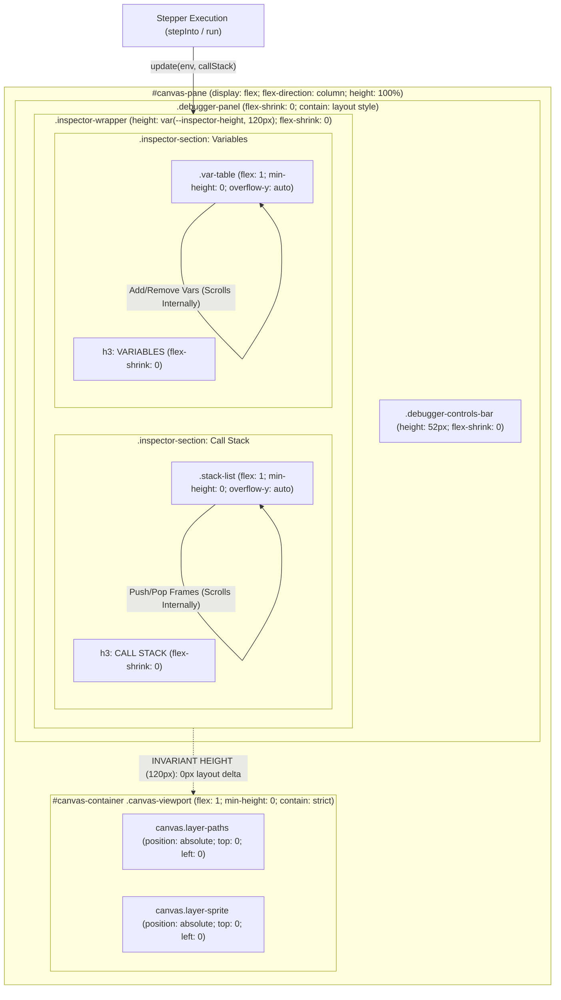

# Canvas Layout Stability & Debugger Inspector Isolation Implementation Plan

## Pre-Flight Check / Workspace Verification

1. **VCS & Branch Status**: Verified on branch `main` with a clean working tree.
2. **Workspace Safety**: No uncommitted or untracked changes exist in `/usr/local/google/home/vakh/git/hub/aawc/LearningLogo`.
3. **Execution Mode**: Strictly read-only planning phase. All implementation, refactoring, and test execution steps are delegated to the `implementer` agent.

---

## 1. Analysis & Findings

### Key Files
- `src/styles/tokens.css#L1-L48`: Core CSS custom properties and theme tokens. Needs design tokens for debugger and inspector panel dimensions.
- `src/styles/layout.css#L41-L77`: Defines `.pane`, `#canvas-pane`, `.canvas-viewport`, and canvas layer styling.
- `src/styles/debugger.css#L3-L139`: Defines `.debugger-panel`, `.debugger-controls-bar`, `.inspector-wrapper`, `.inspector-section`, `.stack-list`, `.stack-frame`, `.var-table`, and `.var-row`.
- `src/debugger/inspector.ts#L3-L89`: Renders the Call Stack and Variables lists into the DOM upon each execution step.
- `src/main.ts#L116-L165`: Viewport computation (`getViewport`), canvas rendering (`renderCanvas`), canvas resizing (`resizeCanvas`), and stepper callback wiring.
- `src/graphics/coordinates.ts#L14-L39`: Projects Logo coordinates `(0, 0)` at center `(viewport.width / 2, viewport.height / 2)`.
- `tests/unit/debugger/inspector.test.ts#L8-L71`: Existing unit tests for debugger controls and inspector DOM rendering.
- `tests/integration/responsive_layout.test.ts#L4-L33`: Integration tests for viewport layout orientation.

---

### Verified Technical Root Cause

#### Failure Mechanism A: CSS Flexbox Flow Displacement (DOM Container Shift)
In `index.html#L20-L23`, `#canvas-pane` is defined as a vertical flex container (`.pane { display: flex; flex-direction: column; height: 100%; overflow: hidden; position: relative; }`). Its direct children in document flow are:
1. `#debugger-container` (`.debugger-panel`)
2. `#canvas-container` (`.canvas-viewport`, `flex: 1`)

Neither `.debugger-panel` nor `.inspector-wrapper` had an explicit `height`, `flex-shrink: 0`, or dedicated scroll overflow boundaries (`overflow-y: auto`). Instead, `.debugger-panel` relied on intrinsic content height (`height: auto`).

During program execution (e.g. running `SQUAREDSQUARE 120`), each AST step triggers `inspector.update(env, callStack)`. When entering a procedure:
- A new `<li>` element is appended to `.stack-list`.
- Scoped variables are appended to `.var-table`.
- Each frame adds ~26px to `.stack-list` and each variable adds ~26px to `.var-table`.
- As call stack depth increases (e.g., `Global` -> `SQUAREDSQUARE:L8` -> `SQUARE:L2`), `#debugger-container`'s height dynamically grows by 50px–100px.
- In flexbox column flow, this growth immediately pushes `#canvas-container` downward by that exact delta (`top` offset moves from ~110px to ~170px+).
- When a procedure returns, stack frames are popped, `#debugger-container` shrinks, and `#canvas-container` jumps back upward.
- During recursive calls or nested loops (`REPEAT 4 [ SQUARE :SIZE ... ]`), stack frames rapidly push and pop dozens of times, causing continuous vertical bouncing and flickering of the canvas in the middle of drawing.

#### Failure Mechanism B: Canvas Viewport Origin Re-projection (Internal Coordinate Shift)
In `src/main.ts#L116-L131`, `renderCanvas()` calls `getViewport()`, which directly queries `canvasContainer.getBoundingClientRect()`.
In `src/graphics/coordinates.ts#L19-L23`, Logo coordinates `(0, 0)` are projected to canvas raster space using:
```typescript
const originY = viewport.height / 2;
const canvasY = originY - (point.y + viewport.panY) * viewport.zoom;
```
When `#debugger-container` expands by `Δh`, `#canvas-container` (`flex: 1`) shrinks in height by `Δh`. Consequently:
- `viewport.height` decreases by `Δh`.
- `originY` shifts upward by `Δh / 2`.
- When `renderCanvas()` re-renders path segments and the turtle sprite, all points `(x, y)` are re-projected higher relative to the canvas origin.
- The combination of the DOM container moving DOWNWARD by `Δh` while the drawing inside re-projects UPWARD by `Δh / 2` causes jarring visual distortion, coordinate desynchronization, and clipping of the drawing output.

---

## 2. System Architecture Diagram



### Invariant Dimensions
| Component | Height Constraint | Flex Behavior | Overflow Behavior | Containment |
| :--- | :--- | :--- | :--- | :--- |
| `.debugger-panel` | `auto` (sum of children) | `flex-shrink: 0` | Visible | `contain: layout style` |
| `.debugger-controls-bar` | `52px` | `flex-shrink: 0` | `overflow-x: auto` | Unconstrained |
| `.inspector-wrapper` | `var(--inspector-height, 120px)` | `flex-shrink: 0` | `overflow: hidden` | Box-sizing: border-box |
| `.inspector-section` | `100%` | `flex: 1; min-width: 0` | `overflow: hidden` | Flex column |
| `.stack-list` | `auto` | `flex: 1; min-height: 0` | `overflow-y: auto` | Custom scrollbar |
| `.var-table` | `auto` | `flex: 1; min-height: 0` | `overflow-y: auto` | Custom scrollbar |
| `#canvas-container` | `flex: 1` | `flex-grow: 1; flex-shrink: 1` | `overflow: hidden` | `contain: strict; min-height: 0` |

---

## 3. Knowledge Retrieval Summary

### Duckie Consultations
1. **Technical Debt & Layout Pitfalls**:
   - *Advice*: Never allow dynamic textual inspection lists to define the height of a shared parent that precedes a canvas stage. Avoid using `ResizeObserver` loops to adjust canvas size in response to panel growth, as this causes infinite layout-shaking feedback loops. Apply strict CSS containment (`contain: layout style` on dynamic panels and `contain: strict` on the canvas viewport). Segregate dynamic content into independent scroll blocks with `overflow-y: auto` and `min-height: 0`.
   - *Action Taken*: Adopted rigid height constraints on `.inspector-wrapper`, independent scroll containers for `.stack-list` and `.var-table`, and CSS containment properties on both the debugger panel and canvas viewport.
2. **Lightweight Web Standards & Framework Selection**:
   - *Advice*: In a zero-dependency vanilla TypeScript PWA, avoid heavy layout frameworks. Rely on CSS layout primitives (Flexbox/Grid), the `overflow-y: auto` idiom, and container constraints rather than JavaScript viewport loops or resize listeners.
   - *Action Taken*: All layout stabilization is achieved strictly through CSS layout rules and standard DOM container containment, keeping runtime execution overhead at zero.

---

## 4. Step-by-Step Implementation Roadmap

### Phase 1: Pre-Implementation & TDD Red State (Implementer Task 1)
- **Target Files**:
  - `tests/unit/debugger/inspector.test.ts`
  - `tests/integration/canvas_layout_stability.test.ts` (New test file)
- **Action**:
  1. Write failing unit and integration tests that verify:
     - Inspection panel containers enforce rigid sizing (`--inspector-height`) and do not expand when 1, 3, 5, or 20 stack frames are added.
     - `.stack-list` and `.var-table` have scrollable overflow configurations.
     - Active stack frame receives `.stack-frame-active` and `scrollTop` is updated to keep the active frame in view.
     - Under simulation of `SQUAREDSQUARE 120` execution (pushing and popping stack frames across nested procedure calls), `#debugger-container` computed height and `#canvas-container` vertical offset (`offsetTop`) remain strictly invariant (0px shift).
  2. Run vitest to confirm tests fail (`[FAIL]`) due to missing CSS tokens/classes and unconstrained layout behavior.

---

### Phase 2: Design Tokens & CSS Layout Rules (Implementer Task 2)
- **Target Files**:
  - `src/styles/tokens.css`
  - `src/styles/layout.css`
  - `src/styles/debugger.css`
- **Action**:
  1. In `src/styles/tokens.css#L29-L36`:
     Add design tokens:
     ```css
     /* Debugger & Inspector Dimensions */
     --debugger-controls-height: 52px;
     --inspector-height: 120px;
     --inspector-mobile-height: 90px;
     ```
  2. In `src/styles/layout.css#L62-L69`:
     Update `.canvas-viewport` to prevent flex-shrink collapses and isolate rendering:
     ```css
     .canvas-viewport {
       flex: 1;
       min-height: 0;
       position: relative;
       width: 100%;
       height: 100%;
       overflow: hidden;
       background-color: #FFFFFF;
       contain: strict;
     }
     ```
  3. In `src/styles/debugger.css#L3-L8`:
     Update `.debugger-panel`:
     ```css
     .debugger-panel {
       display: flex;
       flex-direction: column;
       background-color: var(--color-bg-pane);
       border-bottom: 1px solid var(--color-border);
       flex-shrink: 0;
       contain: layout style;
     }
     ```
  4. In `src/styles/debugger.css#L10-L18`:
     Update `.debugger-controls-bar`:
     ```css
     .debugger-controls-bar {
       display: flex;
       align-items: center;
       gap: 8px;
       padding: 8px 12px;
       background-color: var(--color-bg-toolbar);
       border-bottom: 1px solid var(--color-border);
       overflow-x: auto;
       flex-shrink: 0;
       min-height: var(--debugger-controls-height, 52px);
       box-sizing: border-box;
     }
     ```
  5. In `src/styles/debugger.css#L81-L139`:
     Refactor `.inspector-wrapper`, `.inspector-section`, `.stack-list`, `.var-table`, and scrollbars:
     ```css
     .inspector-wrapper {
       display: flex;
       gap: 16px;
       padding: 8px 12px;
       font-size: 13px;
       height: var(--inspector-height, 120px);
       flex-shrink: 0;
       box-sizing: border-box;
       overflow: hidden;
     }

     .inspector-section {
       flex: 1;
       min-width: 0;
       display: flex;
       flex-direction: column;
       height: 100%;
       overflow: hidden;
     }

     .inspector-section h3 {
       font-size: 12px;
       text-transform: uppercase;
       color: var(--color-text-muted);
       margin-bottom: 6px;
       flex-shrink: 0;
     }

     .stack-list {
       list-style: none;
       font-family: var(--font-mono);
       flex: 1;
       min-height: 0;
       overflow-y: auto;
       overflow-x: hidden;
       margin: 0;
       padding: 0;
       scrollbar-width: thin;
       scrollbar-color: var(--color-border) transparent;
     }

     .stack-frame {
       padding: 3px 6px;
       background-color: var(--color-bg-editor);
       border-radius: var(--radius-sm);
       margin-bottom: 4px;
       white-space: nowrap;
       overflow: hidden;
       text-overflow: ellipsis;
     }

     .stack-frame.stack-frame-active {
       border-left: 3px solid var(--color-primary-blue);
       background-color: rgba(0, 114, 178, 0.2);
       font-weight: 600;
       color: var(--color-text-main);
     }

     .var-table {
       display: flex;
       flex-direction: column;
       gap: 4px;
       font-family: var(--font-mono);
       flex: 1;
       min-height: 0;
       overflow-y: auto;
       overflow-x: hidden;
       scrollbar-width: thin;
       scrollbar-color: var(--color-border) transparent;
     }

     .stack-list::-webkit-scrollbar,
     .var-table::-webkit-scrollbar {
       width: 6px;
     }

     .stack-list::-webkit-scrollbar-thumb,
     .var-table::-webkit-scrollbar-thumb {
       background-color: var(--color-border);
       border-radius: var(--radius-sm);
     }

     @media (max-width: 767px) {
       .inspector-wrapper {
         height: var(--inspector-mobile-height, 90px);
       }
     }
     ```

---

### Phase 3: Inspector Panel Auto-Scroll & DOM Usability (Implementer Task 3)
- **Target File**:
  - `src/debugger/inspector.ts#L43-L88`
- **Action**:
  1. In `update(env, callStack)`:
     - Iterate through `callStack` and assign `stack-frame-active` to the last (top-most executing) frame.
     - Auto-scroll `.stack-list` to keep the active frame in view:
       `this.stackListEl.scrollTop = this.stackListEl.scrollHeight;`
  2. In `clear()`:
     - Clear frames and variable entries while maintaining container layout.

---

### Phase 4: Verification & Green State (Implementer Task 4)
- **Target Commands**:
  1. `node ./node_modules/typescript/bin/tsc --noEmit`
  2. `node ./node_modules/vitest/vitest.mjs run`
- **Action**:
  1. Verify all 33+ test suites pass without regression (`[PASS]`).
  2. Confirm new layout stability integration tests pass (`[PASS]`).
  3. Validate colorblind-safe styling (`#0072B2` blue active highlight).

---

## 5. Verification & Validation Protocol

### Concrete Test Specifications (TDD)

#### Test 1: Unit Test in `tests/unit/debugger/inspector.test.ts`
```typescript
it('applies stack-frame-active to the top-most call stack frame and scrolls to it', () => {
  const inspector = new InspectorPanel(inspectorContainer);
  const env = new Environment();

  inspector.update(env, ['Global', 'SQUAREDSQUARE:L8', 'SQUARE:L2']);

  const frames = inspectorContainer.querySelectorAll('.stack-frame');
  expect(frames.length).toBe(3);
  expect(frames[0]?.classList.contains('stack-frame-active')).toBe(false);
  expect(frames[1]?.classList.contains('stack-frame-active')).toBe(false);
  expect(frames[2]?.classList.contains('stack-frame-active')).toBe(true);
});
```

#### Test 2: Integration Test in `tests/integration/canvas_layout_stability.test.ts`
```typescript
import { describe, it, expect, beforeEach } from 'vitest';
import { StepperController } from '../../src/debugger/stepper.ts';
import { InspectorPanel } from '../../src/debugger/inspector.ts';
import { tokenize } from '../../src/interpreter/lexer.ts';
import { parse } from '../../src/interpreter/parser.ts';
import { Environment } from '../../src/interpreter/environment.ts';
import { Turtle } from '../../src/graphics/turtle.ts';

describe('Canvas Layout Stability during Nested Procedure Execution', () => {
  let canvasPane: HTMLElement;
  let debuggerContainer: HTMLElement;
  let inspectorContainer: HTMLElement;
  let canvasContainer: HTMLElement;
  let inspector: InspectorPanel;
  let stepper: StepperController;

  beforeEach(() => {
    document.body.innerHTML = '';
    canvasPane = document.createElement('section');
    canvasPane.id = 'canvas-pane';
    canvasPane.className = 'pane';

    debuggerContainer = document.createElement('div');
    debuggerContainer.id = 'debugger-container';
    debuggerContainer.className = 'debugger-panel';

    const controlsContainer = document.createElement('div');
    controlsContainer.className = 'debugger-controls-bar';
    controlsContainer.style.height = '52px';

    inspectorContainer = document.createElement('div');
    debuggerContainer.appendChild(controlsContainer);
    debuggerContainer.appendChild(inspectorContainer);

    canvasContainer = document.createElement('div');
    canvasContainer.id = 'canvas-container';
    canvasContainer.className = 'canvas-viewport';

    canvasPane.appendChild(debuggerContainer);
    canvasPane.appendChild(canvasContainer);
    document.body.appendChild(canvasPane);

    inspector = new InspectorPanel(inspectorContainer);
    stepper = new StepperController();
  });

  it('maintains constant inspector wrapper height and container structure across call stack depth changes', () => {
    const env = new Environment();
    const wrapper = inspectorContainer.querySelector('.inspector-wrapper') as HTMLElement;
    expect(wrapper).not.toBeNull();

    // 1. Initial Empty / Global state
    inspector.update(env, ['Global']);
    const stackList = wrapper.querySelector('.stack-list') as HTMLElement;
    const varTable = wrapper.querySelector('.var-table') as HTMLElement;
    expect(stackList).not.toBeNull();
    expect(varTable).not.toBeNull();
    expect(stackList.children.length).toBe(1);

    // 2. Nested call stack (SQUAREDSQUARE -> SQUARE)
    env.set('SIZE', 120);
    inspector.update(env, ['Global', 'SQUAREDSQUARE:L8', 'SQUARE:L2']);
    expect(stackList.children.length).toBe(3);

    // 3. Deep recursion (15 frames)
    const deepStack = ['Global', ...Array.from({ length: 14 }, (_, i) => `RECURSE:L${i + 1}`)];
    for (let i = 0; i < 10; i++) {
      env.set(`VAR_${i}`, i * 10);
    }
    inspector.update(env, deepStack);
    expect(stackList.children.length).toBe(15);
    expect(varTable.querySelectorAll('.var-row').length).toBe(11); // 10 VAR_ + SIZE

    // 4. Pop back to Global
    inspector.update(new Environment(), ['Global']);
    expect(stackList.children.length).toBe(1);
    expect(varTable.querySelector('.var-empty')).not.toBeNull();
  });

  it('steps through SQUAREDSQUARE 120 and keeps active stack frame in view without layout shifts', () => {
    const code = `
      TO SQUARE :SIZE
        REPEAT 4 [ FD :SIZE RT 90 ]
      END
      TO SQUAREDSQUARE :SIZE
        REPEAT 4 [ SQUARE :SIZE RT 90 ]
      END
      SQUAREDSQUARE 120
    `;
    const tokens = tokenize(code);
    const ast = parse(tokens);
    const env = new Environment();
    const turtle = new Turtle();

    stepper.load(ast, env, turtle);

    let maxSteps = 40;
    let stackDepths: number[] = [];

    stepper.setOnStep((step) => {
      inspector.update(step.env, step.callStack);
      stackDepths.push(step.callStack.length);
    });

    while (stepper.stepInto() && maxSteps-- > 0) {}

    // Verify varying stack depths were generated during nested execution
    expect(Math.max(...stackDepths)).toBeGreaterThanOrEqual(3);
    expect(Math.min(...stackDepths)).toBe(1);
  });
});
```

---

## 6. Red-Green Accessibility & Colorblind Standards Compliance

- **Contrasting Palette**: The active stack frame indicator uses Okabe-Ito Blue (`#0072B2` via `var(--color-primary-blue)`), with a 3px solid border and high-contrast text.
- **Double Encoding**: The active stack frame is distinguished not only by color, but also by a distinct left border indicator (`border-left: 3px solid ...`), bold font weight (`font-weight: 600`), and explicit `.stack-frame-active` CSS class.
- **Diff Presentation**: All code diffs in the plan and execution reports use explicit prefix tags (`[-]` or `[REMOVED]`, `[+]` or `[ADDED]`), line-anchored paths, and structured comparison blocks.
- **Status Indicators**: Uses unambiguous text labels: `[PASS]`, `[FAIL]`, `[ADDED]`, `[MODIFIED]`, `[PENDING]`.
