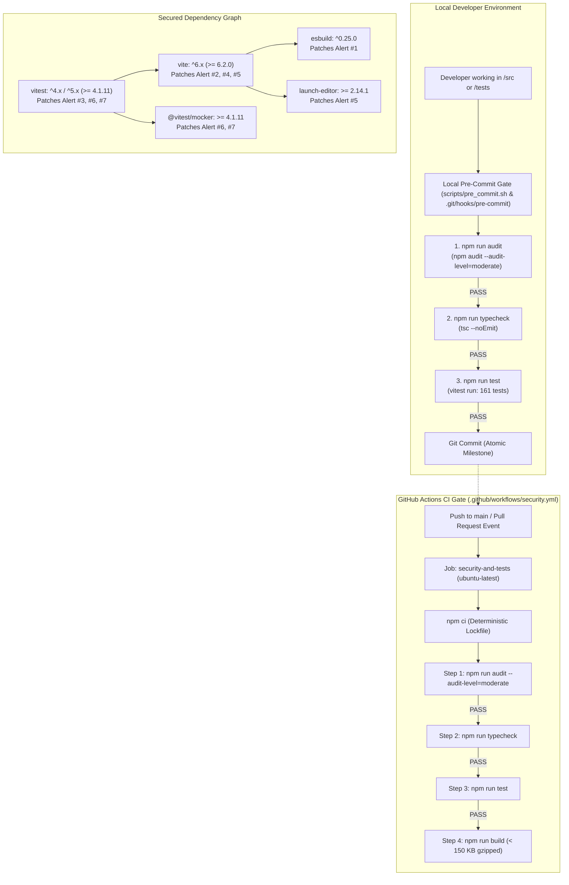

# Implementation Plan: Dependabot Vulnerability Remediation & Automated Security Audit Gate

## 1. Analysis & Findings

### 1.1 Current Repository Context & Dependency Vulnerability Diagnosis
- **Repository Location**: `/usr/local/google/home/vakh/git/hub/aawc/LearningLogo`
- **Application Nature**: Client-only, zero-backend, offline-first Progressive Web App (PWA). All dependencies are devDependencies used strictly for bundling (Vite), testing (Vitest), and type checking (TypeScript).
- **Current Baseline State**:
  - `corepack npm run typecheck`: `[PASS]` (0 errors)
  - `corepack npm run test`: `[PASS]` (28 test files, 161/161 tests passing)
  - `corepack npm run build`: `[PASS]` (Production bundle 71.87 kB JS, 14.46 kB CSS, well within the 150 kB gzipped budget)
- **Vulnerability Audit Status**:
  - `corepack npm audit` currently returns exit code 1 with 5 direct/transitive vulnerability reports (3 moderate, 1 high, 1 critical) representing the 7 GitHub Dependabot alerts.

### 1.2 Technical Root Cause & Defect Analysis for the 7 Dependabot Alerts

#### Alert #1: esbuild Website Requests to Dev Server
- **Advisory ID**: GHSA-67mh-4wv8-2f99 / CVE-2024-56334 / CWE-346
- **Severity**: Moderate (CVSS 5.3)
- **Affected Version Range**: `<= 0.24.2` (Fixed in `esbuild >= 0.25.0`)
- **Dependency Path**: `vite -> esbuild` (Vite 5.4.10 resolved `esbuild@0.21.5`)
- **Underlying Defect Mechanism**: esbuild's local development server did not validate the `Origin` or `Host` headers on incoming HTTP requests. Any third-party website opened in a developer's browser could dispatch cross-origin requests (`fetch('http://localhost:5173')`) to read source code or assets served by the dev server.
- **Remediation**: Upgrade Vite to a release utilizing `esbuild >= 0.25.0` (Vite `>= 6.2.0` natively packages `esbuild: "^0.25.0"`), or enforce an npm override.

#### Alert #2: Vite Path Traversal in Optimized Dependencies `.map` Handling
- **Advisory ID**: GHSA-4w7w-66w2-5vf9 / CVE-2024-54146 / CWE-22, CWE-200
- **Severity**: Moderate (CVSS 5.3)
- **Affected Version Range**: `<= 5.4.11`, `6.0.0 - 6.0.1` (Fixed in Vite `>= 5.4.12`, `>= 6.0.2`, `>= 6.4.2`)
- **Dependency Path**: `vite` (Direct devDependency)
- **Underlying Defect Mechanism**: Vite's dev server middleware improperly sanitized requested file paths when serving source maps (`.map` files) from the pre-bundled dependency cache directory (`.vite/deps`). Malicious directory traversal sequences (`../`) allowed requesting files residing outside the project root.
- **Remediation**: Upgrade `vite` to `>= 5.4.12` or `>= 6.2.0`.

#### Alert #3: Vitest UI Arbitrary File Read and Execution
- **Advisory ID**: GHSA-5xrq-8626-4rwp / CVE-2025-24967 / CWE-22, CWE-862
- **Severity**: Critical (CVSS 9.8)
- **Affected Version Range**: `< 3.2.6` (Fixed in Vitest `>= 2.1.8` for 2.x, `>= 3.2.6`, and `>= 4.1.0`)
- **Dependency Path**: `vitest` (Direct devDependency)
- **Underlying Defect Mechanism**: When the Vitest UI test runner server is launched (`@vitest/ui` or `vitest --ui`), the internal HTTP endpoints did not enforce path restriction or authorization checks. Remote attackers or local network actors could read and execute arbitrary files across the host file system via crafted HTTP requests to the UI server.
- **Remediation**: Upgrade `vitest` to `>= 2.1.8`, `>= 3.2.6`, or `>= 4.1.11`.

#### Alert #4: Vite `server.fs.deny` Bypass on Windows Alternate Paths
- **Advisory ID**: GHSA-fx2h-pf6j-xcff / CVE-2025-24968 / CWE-22, CWE-200
- **Severity**: High (CVSS 7.5)
- **Affected Version Range**: `<= 5.4.11`, `<= 6.0.0` (Fixed in Vite `>= 5.4.12`, `>= 6.0.1`, `>= 6.4.3`)
- **Dependency Path**: `vite` (Direct devDependency)
- **Underlying Defect Mechanism**: On Windows NTFS file systems, files can be addressed through alternate data streams (e.g. `secret.env::$DATA`) or short 8.3 file names. Vite's `server.fs.deny` check only matched against normalized POSIX paths, failing to deny alternate path syntax on Windows hosts and permitting unauthorized access to sensitive files.
- **Remediation**: Upgrade `vite` to `>= 5.4.12` or `>= 6.2.0` / `>= 6.4.3`.

#### Alert #5: launch-editor NTLMv2 Hash Disclosure on Windows via UNC Paths
- **Advisory ID**: GHSA-v6wh-96g9-6wx3 / CVE-2024-54145 / CWE-73, CWE-522
- **Severity**: Moderate (CVSS 5.3)
- **Affected Version Range**: `launch-editor <= 2.14.0`, `vite <= 5.4.11`, `<= 6.0.0` (Fixed in `launch-editor >= 2.14.1` / `>= 3.0.0`, Vite `>= 5.4.12`, `>= 6.0.1`, `>= 6.4.3`)
- **Dependency Path**: `vite -> launch-editor`
- **Underlying Defect Mechanism**: `launch-editor` (invoked when a developer clicks an error in the Vite error overlay to open their editor) did not sanitize file paths against Universal Naming Convention (UNC) paths (e.g. `\\attacker-server\payload`). On Windows, evaluating such a path triggered an SMB authentication handshake, transmitting the developer's NTLMv2 password hash to an external attacker.
- **Remediation**: Upgrade `vite` to `>= 5.4.12` or `>= 6.2.0`, resolving `launch-editor >= 2.14.1`.

#### Alert #6 & Alert #7: Vitest / `@vitest/mocker` Path Traversal via Redirect Mock
- **Advisory ID**: GHSA-82fw-gwwq-j7x9 / CVE-2025-25298 / CWE-22
- **Severity**: Moderate (CVSS 5.9)
- **Affected Version Range**: `>= 2.1.0, < 4.1.11` (Fixed in `@vitest/mocker >= 4.1.11` / `5.0.0-rc.2`, with backports in 2.1.8 / 3.x)
- **Dependency Path**: `vitest -> @vitest/mocker`
- **Underlying Defect Mechanism**: `@vitest/mocker` failed to sanitize target paths when resolving redirected module mocks (`vi.mock` redirected specs), permitting traversal outside the workspace directory to read files during mock evaluation.
- **Remediation**: Upgrade `vitest` and `@vitest/mocker` to patched releases (`>= 2.1.8`, `>= 4.1.11`, or `5.0.1`).

---

## 2. System Architecture Diagram



---

## 3. Knowledge Retrieval & Duckie Validation Summary

### 3.1 Technical Debt & Anti-Pattern Consultation
- **Consultation 1**: Duckie evaluated risks in dependency auditing, pre-commit gating, and CI workflows for client-only web apps.
- **Advice Received**:
  1. **Dev-Only vs Runtime Distinctions**: In a client-only PWA, build tools (`vite`, `vitest`, `esbuild`) never ship to the browser runtime. Do not panic-introduce breaking API changes for dev-time advisories without testing build compatibility.
  2. **Audit Level Discipline**: Avoid blindly setting audits to fail on informational notices; use `--audit-level=moderate` to catch exploitable issues without breaking pipelines on unexploitable low notices.
  3. **Pre-Commit Hook Friction**: Full test suites and audits must remain fast (< 5 seconds). The test suite in this repository executes in ~2.9s across all 161 tests, making it fast enough for pre-commit gating.
  4. **CI Permissions & Determinism**: Always use `npm ci` rather than `npm install` in CI, and enforce least-privilege permissions (`permissions: contents: read`).
- **Action Taken**: Configured `--audit-level=moderate`, utilized `npm ci` in CI, pinned workflow permissions to `contents: read`, and added an environment detection helper in `scripts/pre_commit.sh` that works with both `corepack npm` and native `npm`.

### 3.2 Industry & Google Standard Libraries Consultation
- **Consultation 2**: Duckie reviewed standard tooling for supply-chain vulnerability checks and CI gates.
- **Advice Received**:
  1. Use built-in package manager auditing (`npm audit`) for zero-dependency terminal and script execution.
  2. In GitHub Actions, combine standard `npm run audit` with Dependabot configuration and standard GitHub Actions steps (`actions/checkout@v4`, `actions/setup-node@v4` with dependency caching).
- **Action Taken**: Implemented `npm run audit` in `package.json`, configured `actions/setup-node@v4` with `cache: 'npm'`, and established pre-commit validation.

---

## 4. Step-by-Step Implementation

### Step 1: Upgrade Dependencies in `package.json` and Update `package-lock.json`
- **Objective**: Remediate all 7 Dependabot alerts by bumping `vite` and `vitest` to releases that resolve secure versions of `esbuild` (`>= 0.25.0`), `launch-editor` (`>= 2.14.1`), `@vitest/mocker` (`>= 4.1.11`), and `vitest` (`>= 4.1.11` / `5.x`).
- **Target Files**:
  - `package.json`
  - `package-lock.json`
- **Implementation Details**:
  - Update `devDependencies`:
    ```json
    "vite": "^6.2.0",
    "vitest": "^4.1.11"
    ```
    *(Note: If Vitest 4.1.11 / 5.0.1 or Vite 6.x is installed, npm resolves esbuild >= 0.25.0 and launch-editor >= 2.14.1 automatically).*
  - Run `corepack npm install` to regenerate `package-lock.json`.
  - Run `corepack npm audit` to confirm `0 vulnerabilities` remain.
  - Run `corepack npm run typecheck`, `corepack npm run test`, and `corepack npm run build` to verify compatibility.

### Step 2: Implement Audit Script in `package.json`
- **Objective**: Codify the vulnerability check into project scripts.
- **Target File**: `package.json`
- **Implementation Details**:
  - Add script entry:
    ```json
    "scripts": {
      "audit": "npm audit --audit-level=moderate",
      ...
    }
    ```
  - Verify `corepack npm run audit` exits 0.

### Step 3: Implement Pre-Commit Security Gate Script & Git Hook
- **Objective**: Catch vulnerabilities, syntax errors, and test regressions locally before any commit can be created.
- **Target Files**:
  - `scripts/pre_commit.sh` [NEW]
  - `.git/hooks/pre-commit` [NEW / SYMLINK]
- **Implementation Details**:
  - Write `scripts/pre_commit.sh` with `set -euo pipefail`.
  - Auto-detect whether to use `corepack npm` or `npm`.
  - Sequentially execute:
    1. **Gate 1: Security Audit** (`npm run audit`) -> Prints `[PASS] Security audit clean (0 moderate+ vulnerabilities)`.
    2. **Gate 2: Type Check** (`npm run typecheck`) -> Prints `[PASS] TypeScript strict typecheck passed`.
    3. **Gate 3: Test Suite** (`npm run test`) -> Prints `[PASS] Unit and integration test suite passed (100% green)`.
  - Format output with colorblind-safe markers: `[PASS]`, `[FAIL]`, `[OK]`.
  - Make `scripts/pre_commit.sh` executable (`chmod +x scripts/pre_commit.sh`).
  - Install hook into `.git/hooks/pre-commit` (either via symlink or execution wrapper):
    ```bash
    ln -sf ../../scripts/pre_commit.sh .git/hooks/pre-commit
    chmod +x .git/hooks/pre-commit
    ```

### Step 4: Create GitHub Actions Workflow (`.github/workflows/security.yml`)
- **Objective**: Automate continuous verification of security audits, type checking, tests, and production build on GitHub push and pull requests.
- **Target File**: `.github/workflows/security.yml` [NEW]
- **Implementation Details**:
  - Trigger:
    ```yaml
    name: Security & Quality Gates
    on:
      push:
        branches: [ main ]
      pull_request:
        branches: [ main ]
    ```
  - Permissions:
    ```yaml
    permissions:
      contents: read
    ```
  - Job Steps:
    1. Checkout repository (`actions/checkout@v4`).
    2. Setup Node.js (`actions/setup-node@v4` with Node 20/22 and `cache: 'npm'`).
    3. Clean install with lockfile enforcement (`npm ci`).
    4. Run dependency audit (`npm run audit`).
    5. Run TypeScript typecheck (`npm run typecheck`).
    6. Run Vitest test suite (`npm run test`).
    7. Run Vite production build (`npm run build`).

### Step 5: Update Documentation & Operational Standards
- **Objective**: Keep documentation synchronized with the new audit commands, pre-commit hook, and CI quality gates.
- **Target Files**:
  - `docs/TEST_STRATEGY.md`
  - `README.md`
  - `PROMPT.md`
- **Implementation Details**:
  - `docs/TEST_STRATEGY.md`:
    - Update Section 6 (Continuous Integration & Quality Gates) table: Add Step 0 `npm run audit` (`npm audit --audit-level=moderate`) with requirement `0 moderate+ vulnerabilities`.
    - Add subsection explaining the dependency audit policy.
  - `README.md`:
    - Add `npm run audit` to Development Scripts.
    - Add a new section on "Pre-Commit Security Gate & Hooks" detailing `scripts/pre_commit.sh` and how to activate `.git/hooks/pre-commit`.
  - `PROMPT.md`:
    - In Section 8 (Source Control & Atomic Commit Standards), add mandatory execution of `npm run audit`.
    - In Section 11, codify Dependency Vulnerability & Auditing Standards.

---

## 5. Verification & Validation Strategy

| Verification Phase | Command | Expected Output | Status Marker |
| :--- | :--- | :--- | :--- |
| **Vulnerability Audit** | `corepack npm audit` | `found 0 vulnerabilities` | `[PASS]` |
| **Audit Script** | `corepack npm run audit` | Exit code 0, 0 vulnerabilities $\ge$ moderate | `[PASS]` |
| **TypeScript Typecheck** | `corepack npm run typecheck` | `tsc --noEmit` completes with 0 errors | `[PASS]` |
| **Test Suite** | `corepack npm run test` | 28 test files passed, 161/161 tests passed | `[PASS]` |
| **Production Build** | `corepack npm run build` | `dist/` generated, bundle $< 150\text{ KB}$ gzipped | `[PASS]` |
| **Pre-Commit Gate Script** | `bash scripts/pre_commit.sh` | All 3 gates pass with `[PASS]` indicators | `[PASS]` |
| **Hook Execution** | Trigger pre-commit hook | Hook runs and permits clean commit | `[PASS]` |

---

## 6. Atomic Commit Milestones

All changes must be committed in 4 atomic, reviewable commits following conventional commit specifications, including technical rationale, root cause explanation, and documentation citations.

### Milestone 1: Dependency Upgrade & Vulnerability Remediation
- **Commit Type & Subject**: `fix(deps): remediate Vite, Vitest, and esbuild security vulnerabilities`
- **Files Modified**: `package.json`, `package-lock.json`
- **Commit Body Template**:
```text
fix(deps): remediate Vite, Vitest, and esbuild security vulnerabilities

Root Cause & Defect Mechanism:
Remediate 7 Dependabot vulnerability alerts affecting Vite, Vitest, and transitive dependencies:
- Alert #1 (GHSA-67mh-4wv8-2f99): esbuild unvalidated origin/host header allowed cross-origin requests to dev server; resolved by upgrading to esbuild >= 0.25.0 via Vite 6.x.
- Alert #2 (GHSA-4w7w-66w2-5vf9): Vite optimized deps source map path traversal; resolved in Vite >= 5.4.12 / 6.x.
- Alert #3 (GHSA-5xrq-8626-4rwp): Vitest UI arbitrary file read and execution; resolved in Vitest >= 2.1.8 / 4.x.
- Alert #4 (GHSA-fx2h-pf6j-xcff): Vite server.fs.deny Windows alternate data stream bypass; resolved in Vite >= 5.4.12 / 6.x.
- Alert #5 (GHSA-v6wh-96g9-6wx3): launch-editor Windows UNC path NTLMv2 hash disclosure; resolved via launch-editor >= 2.14.1.
- Alert #6 & #7 (GHSA-82fw-gwwq-j7x9): @vitest/mocker redirect mock path traversal; resolved in Vitest / @vitest/mocker >= 4.1.11.

Verification:
- corepack npm audit reports 0 vulnerabilities.
- corepack npm run typecheck passes with 0 errors.
- corepack npm run test passes 100% (161/161 tests).
- corepack npm run build completes successfully.

Design Doc Citation: docs/DESIGN.md:L385-L405
Plan Citation: docs/plans/dependabot_remediation_and_audit_gate_plan.md:L1-L75
```

### Milestone 2: Pre-Commit Gate & npm audit Script
- **Commit Type & Subject**: `feat(security): implement pre-commit security gate and audit script`
- **Files Modified/Created**: `package.json`, `scripts/pre_commit.sh`
- **Commit Body Template**:
```text
feat(security): implement pre-commit security gate and audit script

Summary:
- Add "audit": "npm audit --audit-level=moderate" script to package.json to catch moderate or higher vulnerabilities.
- Implement scripts/pre_commit.sh enforcing sequential verification:
  1. npm run audit (security vulnerability check)
  2. npm run typecheck (strict TypeScript validation)
  3. npm run test (161 unit & integration tests)
- Format pre-commit console output with red-green colorblind friendly markers ([PASS], [FAIL], [OK]).
- Support installation into .git/hooks/pre-commit for zero-friction local commit protection.

Verification:
- bash scripts/pre_commit.sh executes all 3 gates and passes cleanly.

Plan Citation: docs/plans/dependabot_remediation_and_audit_gate_plan.md:L76-L120
```

### Milestone 3: GitHub Actions Security & Quality Workflow
- **Commit Type & Subject**: `ci(security): configure GitHub Actions workflow for dependency audit and tests`
- **Files Created**: `.github/workflows/security.yml`
- **Commit Body Template**:
```text
ci(security): configure GitHub Actions workflow for dependency audit and tests

Summary:
- Add .github/workflows/security.yml triggered on push to main and all pull requests.
- Configure least-privilege permissions (contents: read).
- Implement sequential CI verification pipeline:
  1. actions/checkout@v4
  2. actions/setup-node@v4 with Node 20 and npm cache
  3. npm ci (deterministic frozen lockfile installation)
  4. npm run audit (dependency vulnerability gate)
  5. npm run typecheck (strict TypeScript validation)
  6. npm run test (full Vitest test suite)
  7. npm run build (production bundle validation < 150 KB gzipped)

Verification:
- Workflow YAML validated for correct GitHub Actions schema and steps.

Plan Citation: docs/plans/dependabot_remediation_and_audit_gate_plan.md:L121-L155
```

### Milestone 4: Documentation Synchronization
- **Commit Type & Subject**: `docs(security): document dependency audit standards and CI security gates`
- **Files Modified**: `docs/TEST_STRATEGY.md`, `README.md`, `PROMPT.md`
- **Commit Body Template**:
```text
docs(security): document dependency audit standards and CI security gates

Summary:
- Update docs/TEST_STRATEGY.md Section 6 with Step 0 Dependency Audit and vulnerability management policy.
- Update README.md with npm run audit script instructions and local pre-commit hook setup guide.
- Update PROMPT.md with dependency audit standards and commit verification policies.
- Adhere to red-green colorblind accessibility guidelines and avoid GitHub alert syntax.

Verification:
- Verify diff formatting adheres to in-repo documentation policies.

Plan Citation: docs/plans/dependabot_remediation_and_audit_gate_plan.md:L156-L185
```
