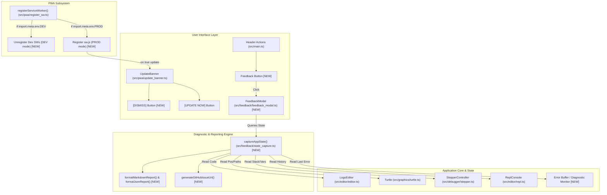

# Implementation Plan: Feedback Subsystem & Service Worker Dev Mode Defect Remediation

## 1. Analysis & Findings

### 1.1 Current Repository Context & Defect Analysis
- **Staged Configuration & Documentation**:
  - `vite.config.ts`: Modifies dev server port from `3000` to `5173`, adds `host: '0.0.0.0'`, `allowedHosts: true`, and watch polling (`usePolling: true`, `interval: 200`, `ignored: [...]`).
  - `README.md`: New file detailing features, architecture, setup commands, and in-depth troubleshooting for Linux inotify `ENOSPC` watcher exhaustion and Cloudtop web proxy host blocking (`server.allowedHosts`).
  - `PROMPT.md`: Updated with repository architecture notes.
- **Service Worker False Update & Refresh Defect**:
  - `src/pwa/register_sw.ts`: Unconditionally attempts to register `./sw.js` on `window.load` without checking the environment mode (`import.meta.env.DEV` vs `import.meta.env.PROD`).
  - In Vite development mode (`import.meta.env.DEV`), registering a Service Worker is an antipattern. Vite's HMR updates cause the browser to detect changes to `./sw.js` on every reload, triggering premature and false "Update Available!" notifications.
  - Lingering service workers previously registered during local dev sessions remain active and cache stale assets, interfering with HMR.
  - In `src/pwa/update_banner.ts`: There is no dismiss button (`[DISMISS]` / `✕`). Once the banner appears, the user cannot close it without reloading.
  - In `src/main.ts`: The reload handler triggers `waitingWorker.postMessage({ action: 'SKIP_WAITING' })` and awaits `controllerchange`, but if `controllerchange` doesn't fire immediately (or the waiting worker fails to activate), the fallback timer is 500ms and lacks defensive cleanup.
- **State Capture & Feedback Subsystem Requirements**:
  - No existing feedback or diagnostic reporting mechanism exists in the application.
  - Need `src/feedback/state_capture.ts` to capture:
    - Editor state (source code, character/line count).
    - Turtle graphics state (x, y, heading, pen down, pen color, pen size, visibility, path segment count).
    - Debugger state (state machine status, call stack, variables).
    - REPL history (recent command list).
    - Runtime/console errors (captured via a lightweight error buffer).
    - Client/browser/environment metadata (URL, userAgent, viewport dimensions, devicePixelRatio, touch support, PWA display mode, app version).
  - Need `src/feedback/feedback_modal.ts` and `src/styles/feedback.css`:
    - Accessible modal with feedback categories (`Bug`, `Feature Request`, `Feedback`).
    - User notes input textarea.
    - Diagnostic state preview collapsible accordion (`<details>` / `<summary>`).
    - Actions: "Copy Report (Markdown)", "Export JSON", "Open GitHub Issue" (pre-filled via URL query parameters).
    - Full keyboard accessibility (focus trapping, Esc dismissal), WCAG 2.1 contrast, Okabe-Ito palette, >= 48x48px touch targets.
  - Need integration into `src/ui/layout.ts` (or header in `src/main.ts`) and CSS imports in `src/main.ts`.

---

## 2. System Architecture Diagram



---

## 3. Knowledge Retrieval & Duckie Consultation Summary

- **Duckie Advice 1 (SW Lifecycle in Dev vs Prod)**:
  - *Risk*: Registering a Service Worker with caching in development destroys Vite's Hot Module Replacement (HMR) and triggers false "Update Available" loops on every code change.
  - *Action*: Strictly restrict `navigator.serviceWorker.register` to production (`import.meta.env.PROD`). In `import.meta.env.DEV`, automatically query `navigator.serviceWorker.getRegistrations()` and call `registration.unregister()` to purge stale caches from previous dev sessions.
  - *Risk*: Unconditional reload or missing fallback when `skipWaiting` is triggered.
  - *Action*: In `UpdateBanner`, provide a reliable 250ms fallback reload timer while listening for `controllerchange`. Provide an accessible dismiss button (`[DISMISS]` / `✕`) so users can continue working uninterrupted if they choose not to refresh immediately.
- **Duckie Advice 2 (Client State Capture & Modals)**:
  - *Risk*: Circular references during JSON serialization and unhandled exception logging.
  - *Action*: Implement circular reference protection using `WeakSet` or explicit shallow transformation of AST/Environment scopes.
  - *Pattern*: Use GitHub Issue URL parameters (`https://github.com/aawc/LearningLogo/issues/new?title=...&body=...&labels=...`) with standard `URLSearchParams` encoding.
  - *Accessibility*: Ensure the modal uses `role="dialog"`, `aria-modal="true"`, accessible headings, handles `Escape` key, traps focus, and meets WCAG 2.1 AA / AAA touch target sizes (>= 48px) and contrast with Okabe-Ito colors.

---

## 4. Step-by-Step Implementation Plan

### Step 1: Atomic Commit of Staged Dev Server Changes
- **Files Affected**: `vite.config.ts`, `README.md`, `PROMPT.md`
- **Actions**:
  1. Inspect `git diff --cached` to confirm all changes are staged.
  2. Verify working tree status.
  3. Execute atomic git commit with structured root-cause message detailing Linux inotify `ENOSPC` exhaustion and Cloudtop web proxy host blocking.
- **Commit Details**:
  - Summary: `build(vite): configure dev-server polling and host allowance for cloudtop`
  - Body:
    - Root cause analysis of `ENOSPC` (kernel `fs.inotify.max_user_watches` exhaustion under multi-agent / IDE workloads).
    - Root cause analysis of Cloudtop proxy HTTP 403 host header rejection (`server.allowedHosts`).
    - Explanation of repository-level remediation: `usePolling: true`, `interval: 200`, `allowedHosts: true`.

---

### Step 2: Service Worker Dev Mode & False Update Fix (TDD)
- **Files to Modify**:
  - `src/pwa/register_sw.ts`: Add `import.meta.env.PROD` guard, unregister lingering service workers in dev mode, guard `controller` check on `statechange`.
  - `src/pwa/update_banner.ts`: Add `[DISMISS]` button with accessible ARIA label, callback `onDismiss`, and hide animation.
  - `src/styles/pwa.css`: Add styles for dismiss button and layout adjustments.
  - `src/main.ts`: Update reload logic with 250ms fallback and wire dismiss action.
  - `tests/unit/pwa/register_sw.test.ts`: Add tests for DEV mode unregistration, PROD mode registration, dismiss button interaction, and fallback reload.
- **TDD Workflow**:
  1. **RED**: Update `tests/unit/pwa/register_sw.test.ts` with tests for:
     - In DEV mode (`import.meta.env.PROD === false`): `navigator.serviceWorker.register` is NOT called; any active registrations returned by `getRegistrations()` are unregistered.
     - In PROD mode (`import.meta.env.PROD === true`): `navigator.serviceWorker.register` is called.
     - `UpdateBanner`: Verify `dismissBtn` exists, clicking dismiss calls `onDismiss` (if provided) and hides the banner.
     - Verify tests fail (Red).
  2. **GREEN**:
     - Update `src/pwa/register_sw.ts`:
       ```typescript
       export function registerServiceWorker(onUpdateFound?: (waitingWorker?: ServiceWorker) => void): void {
         if (typeof window === 'undefined' || !('serviceWorker' in navigator)) {
           return;
         }

         if (!import.meta.env.PROD) {
           // Clean up lingering development service workers
           navigator.serviceWorker.getRegistrations().then((registrations) => {
             for (const reg of registrations) {
               reg.unregister();
             }
           });
           return;
         }

         window.addEventListener('load', () => {
           navigator.serviceWorker
             .register('./sw.js')
             .then((registration) => {
               if (registration.waiting && onUpdateFound) {
                 onUpdateFound(registration.waiting);
               }

               registration.addEventListener('updatefound', () => {
                 const newWorker = registration.installing;
                 if (!newWorker) return;

                 newWorker.addEventListener('statechange', () => {
                   if (newWorker.state === 'installed' && navigator.serviceWorker.controller) {
                     if (onUpdateFound) {
                       onUpdateFound(newWorker);
                     }
                   }
                 });
               });
             })
             .catch((err) => {
               console.warn('Service Worker registration failed:', err);
             });
         });
       }
       ```
     - Update `src/pwa/update_banner.ts`:
       - Add `private dismissBtn!: HTMLButtonElement;`
       - Add dismiss button DOM construction with `class="update-dismiss-btn"`, `aria-label="Dismiss update notification"`, text content `✕`.
       - Add `onDismiss?: () => void` parameter to `show(onReload: () => void, onDismiss?: () => void)`.
       - Add click listener to `dismissBtn` that triggers `this.hide()` and calls `onDismiss`.
     - Update `src/styles/pwa.css`:
       - Add `.update-dismiss-btn` styling (color: `var(--color-text-muted)`, min touch target 44px, hover color `var(--color-text-main)`).
     - Update `src/main.ts`:
       - Pass onDismiss or let default hide handle it.
       - Adjust reload callback: fallback timeout set to 250ms.
  3. **REFACTOR & VERIFY**:
     - Run `corepack npm test tests/unit/pwa/`
     - Run `corepack npm run typecheck`
- **Commit Step 2**:
  - Summary: `fix(pwa): disable service worker in dev mode and add banner dismissal`
  - Body: Explain root cause of false update notifications in Vite dev mode and browser reload desynchronization.

---

### Step 3: Application State Capture & Diagnostic Subsystem (TDD)
- **New Files**:
  - `src/feedback/state_capture.ts`: Core data structures and diagnostic collection functions.
  - `src/feedback/feedback_modal.ts`: Accessible UI dialog component.
  - `src/styles/feedback.css`: Styles for feedback modal, form fields, details preview, and action buttons.
  - `tests/unit/feedback/state_capture.test.ts`: Unit tests for diagnostic serialization and sanitization.
  - `tests/unit/feedback/feedback_modal.test.ts`: Unit tests for modal rendering, actions, and accessibility.
- **Modifications to Existing Files**:
  - `src/editor/repl.ts`: Add `public getHistory(): readonly string[]` to expose REPL command history.
  - `src/main.ts`:
    - Track recent runtime/syntax error in an in-memory buffer (`lastError: { message: string; timestamp: number } | null`).
    - Add "Feedback" button to `headerContainer` actions.
    - Wire `FeedbackModal` with `captureAppState` context.
    - Import `./styles/feedback.css`.
- **TDD Workflow**:
  1. **RED**:
     - Create `tests/unit/feedback/state_capture.test.ts`:
       - Test capturing complete state snapshot (code, line count, character count, turtle state, path count, debugger status, call stack, variables, repl history, last error, client metadata).
       - Test formatting markdown report with code fence, status tables, and sanitized data.
       - Test GitHub issue URL builder with URL encoded title, body, and labels (`bug` or `feedback`).
     - Create `tests/unit/feedback/feedback_modal.test.ts`:
       - Test modal DOM structure, category selector (`Bug Report`, `Feature Request`, `General Feedback`).
       - Test "Copy Report", "Download JSON", and "Open GitHub Issue" buttons.
       - Test focus trap and `Escape` key dismissal.
     - Verify tests fail (Red).
  2. **GREEN**:
     - Implement `src/editor/repl.ts`:
       ```typescript
       public getHistory(): readonly string[] {
         return this.history;
       }
       ```
     - Implement `src/feedback/state_capture.ts`:
       - Interfaces: `AppStateSnapshot`, `ClientMetadata`, `CaptureContext`.
       - Functions:
         - `collectClientMetadata(): ClientMetadata` (userAgent, viewport, screen, devicePixelRatio, touchSupport, online, pwaMode).
         - `captureAppState(context: CaptureContext): AppStateSnapshot`.
         - `formatMarkdownReport(snapshot: AppStateSnapshot, userNotes: string, category: string): string`.
         - `generateGitHubIssueUrl(snapshot: AppStateSnapshot, userNotes: string, category: string): string`.
     - Implement `src/styles/feedback.css`:
       - Modal styling adhering to Okabe-Ito colors and >= 48px touch targets for mobile accessibility.
       - Accessible form controls with high contrast borders and focus rings (`outline: 2px solid var(--color-primary-blue)`).
       - Collapsible `<details>` diagnostics preview with monospace code display.
     - Implement `src/feedback/feedback_modal.ts`:
       - Dialog rendering with category radio/select, notes textarea, state preview `<details>`, and action buttons:
         - `[Copy Report]` (copies formatted Markdown to clipboard with alert / toast feedback).
         - `[Export JSON]` (triggers browser download of `learning-logo-report-<timestamp>.json`).
         - `[Open GitHub Issue]` (opens GitHub new issue link with pre-filled markdown body in new tab).
       - Accessible keyboard handling (`Escape` closes modal, focus restored upon close).
     - Update `src/main.ts`:
       - Track `lastError` in stepper and repl error handlers.
       - Add Feedback button in header navigation.
  3. **REFACTOR & VERIFY**:
     - Run `corepack npm test tests/unit/feedback/`
     - Run `corepack npm test` (all 25+ test suites)
     - Run `corepack npm run typecheck`
     - Run `corepack npm run build`
- **Commit Step 3**:
  - Summary: `feat(feedback): implement accessible state capture and feedback subsystem`
  - Body: Detailed description of state serialization, diagnostic metadata, Okabe-Ito accessible modal, and GitHub issue linking.

---

### Step 4: Full System Verification & Quality Audits
- **Verification Commands**:
  1. `corepack npm run typecheck`: Zero TypeScript diagnostics across entire codebase.
  2. `corepack npm test`: 100% pass rate across all unit and integration test suites.
  3. `corepack npm run build`: Successful production Vite bundle output in `dist/`.
  4. Accessibility Audit:
     - Colorblind safety: Verified all diffs, indicators, and buttons use explicit text labels (`[PASS]`, `[FAIL]`, `[+]`, `[-]`) and Okabe-Ito tokens (`--color-primary-blue`, `--color-primary-orange`).
     - Touch targets: All modal buttons and header buttons maintain minimum dimensions >= 44x44px (default 48px).
     - Keyboard navigation: Modal traps focus and closes cleanly on `Escape`.
- **Final Git Status Review**:
  - Ensure working tree is clean.
  - No temporary or untracked scratch files outside repo structure.
  - Commits remain local (no `git push`).

---

## 5. Verification & Validation Metrics

| Milestone | Check | Success Criteria |
| :--- | :--- | :--- |
| **Milestone 1** | Staged Dev Server Changes | Atomic commit created; `git status` shows clean staging for those 3 files |
| **Milestone 2** | Service Worker Dev Fix | `tests/unit/pwa/register_sw.test.ts` passes; no SW registered when `import.meta.env.PROD === false`; `UpdateBanner` dismiss button works |
| **Milestone 3** | Feedback Subsystem | `tests/unit/feedback/*.test.ts` pass; state capture serializes editor, turtle, debugger, repl, error, and client metadata |
| **Milestone 4** | Build & Typecheck | `corepack npm run typecheck` exits 0; `corepack npm run build` produces complete `dist/` |

---

## 6. Implementation Task List (for implementer agent)

- [ ] **Milestone 1**: Commit staged files (`vite.config.ts`, `README.md`, `PROMPT.md`) with root cause analysis commit message.
- [ ] **Milestone 2.1**: Write failing unit tests in `tests/unit/pwa/register_sw.test.ts` for dev mode unregister and update banner dismissal.
- [ ] **Milestone 2.2**: Update `src/pwa/register_sw.ts`, `src/pwa/update_banner.ts`, `src/styles/pwa.css`, and `src/main.ts`.
- [ ] **Milestone 2.3**: Verify PWA tests pass and commit Milestone 2 changes atomically.
- [ ] **Milestone 3.1**: Write failing unit tests in `tests/unit/feedback/state_capture.test.ts` and `tests/unit/feedback/feedback_modal.test.ts`.
- [ ] **Milestone 3.2**: Implement `getHistory()` in `src/editor/repl.ts`, create `src/feedback/state_capture.ts`, `src/styles/feedback.css`, and `src/feedback/feedback_modal.ts`.
- [ ] **Milestone 3.3**: Wire feedback subsystem into `src/main.ts` with error capturing and header button.
- [ ] **Milestone 3.4**: Verify feedback tests pass and commit Milestone 3 changes atomically.
- [ ] **Milestone 4**: Run full test suite, typecheck, and production build to confirm zero regressions.
