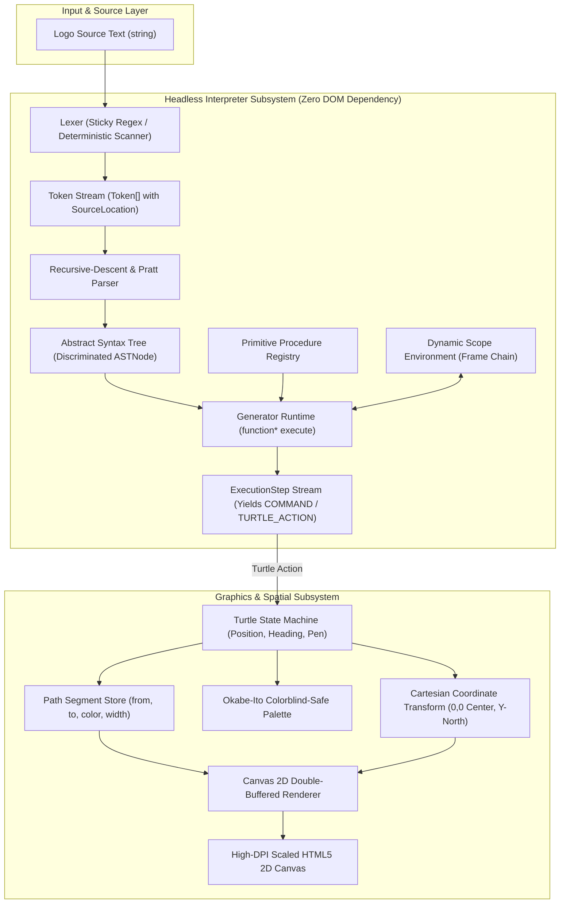

# LearningLogo Phase A Implementation Plan: Core Scaffolding, Interpreter Engine & Canvas Graphics Subsystem

## Executive Summary & Scope

This execution plan provides a comprehensive, fine-grained, test-driven development (TDD) blueprint for **Phase A** of the LearningLogo project. It establishes the client-side foundational architecture including the build scaffolding, lexical analyzer, recursive-descent AST parser, dynamic scoping environment, generator-based cooperative runtime, and high-DPI Cartesian canvas graphics subsystem.

All implementation steps strictly adhere to:
- **Zero-Mock Policy**: Real mathematical assertions and concrete execution across all domain logic.
- **Red-Green-Refactor TDD Cycle**: Verified failing tests (`[FAIL]`) before production implementation, followed by passing tests (`[PASS]`).
- **Red-Green Colorblind Accessibility**: Explicit indicators (`[PASS]`, `[FAIL]`, `[ADDED]`, `[REMOVED]`, `[MODIFIED]`, `[WARN]`, `[PENDING]`) and Okabe-Ito color mapping.
- **In-Repository Placement**: All source code, tests, documentation, and configuration reside strictly within `/usr/local/google/home/vakh/git/hub/aawc/LearningLogo`.
- **Atomic Commits**: Isolated, single-purpose commits with structured technical descriptions and zero internal tags.
- **Zero-Dependency Core**: Pure TypeScript 5 with strict typing; no external parser generator or heavy framework runtime.

---

## 1. Analysis & Architectural Findings

### 1.1 Key Files & Subsystem Mapping

| Subsystem | Target Source Files | Target Test Suites |
| :--- | :--- | :--- |
| **Tooling & Build** | `package.json`, `tsconfig.json`, `vite.config.ts`, `vitest.config.ts`, `src/index.html` | Build/typecheck gates (`tsc --noEmit`, `vitest run`) |
| **Lexer** | `src/interpreter/token.ts`, `src/interpreter/lexer.ts`, `src/interpreter/errors.ts` | `tests/unit/interpreter/lexer.test.ts` |
| **Parser** | `src/interpreter/ast.ts`, `src/interpreter/parser.ts` | `tests/unit/interpreter/parser.test.ts` |
| **Environment** | `src/interpreter/environment.ts` | `tests/unit/interpreter/environment.test.ts` |
| **Primitives** | `src/interpreter/primitives.ts` | `tests/unit/interpreter/primitives.test.ts` |
| **Cooperative Runtime** | `src/interpreter/runtime.ts` | `tests/unit/interpreter/runtime.test.ts` |
| **Geometry & Math** | `src/graphics/coordinates.ts`, `src/graphics/palette.ts` | `tests/unit/graphics/coordinates.test.ts`, `tests/unit/graphics/palette.test.ts` |
| **Turtle State Machine**| `src/graphics/turtle.ts` | `tests/unit/graphics/turtle.test.ts` |
| **Canvas Renderer** | `src/graphics/renderer.ts` | `tests/unit/graphics/renderer.test.ts` |
| **End-to-End Integration**| Subsystem integration | `tests/integration/end_to_end_scripts.test.ts` |

### 1.2 Design Patterns & Invariants

1. **Tagged / Discriminated Unions for AST Nodes**:
   Every AST node shares a literal `type` discriminator (e.g. `'Program'`, `'CommandCall'`, `'Repeat'`, `'BinaryOp'`). This enables exhaustive type narrowing in the parser and runtime without runtime reflection or loose `any` typing.
2. **Deterministic Lexical Analysis**:
   Regular expressions utilize the sticky flag (`y`) anchored to `lastIndex` or deterministic character inspection to eliminate catastrophic backtracking. Every token records `{ line, column, offset, length }` for line-anchored error diagnostics and visual tracer synchronization.
3. **Pratt / Precedence Climbing Expression Parsing**:
   Mathematical and logical operators are parsed using a binding power precedence table, properly resolving infix associativity (`10 - 4 - 2` as `(10 - 4) - 2`) and precedence (`2 + 3 * 4` as `2 + (3 * 4)`).
4. **Dynamic Scoping Semantics**:
   Procedures execute within dynamic call frames. Variable resolution traverses up the active frame stack. The `MAKE` primitive updates existing variables in the closest frame or binds to the global root if undefined.
5. **Generator-Based Cooperative Coroutine**:
   The runtime is implemented as a generator (`function*`) yielding `ExecutionStep` objects. This decouples execution from browser frame rendering, allows single-step debugging, eliminates UI thread freezing, and provides infinite loop protection via instruction counting and cancellation tokens.
6. **Headless Domain Isolation**:
   The entire interpreter engine and turtle math logic have zero DOM or browser dependencies, allowing 100% test execution in headless Node/Vitest environments.
7. **High-DPI Layered Canvas Architecture**:
   Coordinate transformations convert center-origin Cartesian space (Y-North, Heading 0° North) to Canvas top-left raster space. The renderer maintains a static path layer for drawn lines and a dynamic sprite layer for the turtle chevron.

---

## 2. System Architecture Diagram



---

## 3. Knowledge Retrieval Summary & Architectural Adjustments

### 3.1 Duckie Validation Findings

**Consultation 1: Technical Debt & Architectural Pitfalls**
- *Advice*:
  - Lax AST typing creates maintenance debt. Use TypeScript discriminated unions with strict string literal types.
  - RegExp catastrophic backtracking in the lexer freezes the browser on invalid input. Use the sticky flag (`y`) and simple patterns.
  - Parser infinite loops can occur during error recovery if the token cursor fails to advance. Enforce strict progress invariants.
  - Logo dynamic scoping can create "spooky action at a distance." Decouple static procedure signatures from dynamic runtime frames and define deterministic `MAKE` assignment rules.
  - Generator yield overhead: yielding on every microscopic instruction degrades performance. Support stepping mode for debugging and batched/turbo mode for execution.
  - Generator memory retention: un-iterated generators retain scope frames. Encapsulate execution in a cancellable runner that cleans up references.
  - Redundant double-buffering: browsers already double-buffer canvas frames. Use layered rendering (static paths canvas + dynamic turtle sprite canvas) rather than offscreen blitting.
  - Dynamic `devicePixelRatio`: handle displays with different DPI dynamically rather than caching a static initial value.
- *Action Taken*:
  - Added discriminated unions for all AST nodes with `type` tags.
  - Specified sticky flag (`y`) regexes and explicit character scanners in the Lexer.
  - Added token cursor progress assertions in parser error recovery.
  - Formalized dynamic scope resolution in `Environment`: local frame -> caller frames -> root global frame.
  - Added cooperative cancellation token with frame de-referencing in `Runtime`.
  - Structured the graphics pipeline with layered canvases and dynamic `devicePixelRatio` listeners.

**Consultation 2: Libraries, Frameworks & Zero-Dependency Core**
- *Advice*:
  - Parser generators (e.g. Chevrotain, Lezer) add bundle weight and complicate friendly educational diagnostic messages. Hand-written recursive descent with Pratt expression parsing is optimal.
  - Vector math for 2D turtle geometry requires only simple trigonometry. Custom 2D coordinate transformation avoids external dependencies.
  - Okabe-Ito is an established 8-color model. Embed static hex constants and paired accessible labels/roles rather than importing color libraries.
  - Coroutines and stepping are best implemented via native JavaScript generators (`function*` / `yield`).
  - Strict zero-dependency core ensures sub-150 KB production bundle and sub-1s load times on low-end Chromebooks.
- *Action Taken*:
  - Designed the entire core interpreter and graphics transformation subsystem with zero third-party runtime dependencies.
  - Configured Vite and Vitest exclusively as development and test harness dependencies.

### 3.2 Environment CLI Findings
- The development environment provides Node.js v22.22.2 and Corepack 0.24.0.
- `npm` and `npx` are executed via `corepack npm` and `corepack npx`.
- Git author configuration is verified as `Varun Khaneja <git.bin@khaneja.org>`.

---

## 4. Step-by-Step Implementation Plan

### Step 0: Repository Baseline Architecture Tracking

- **Objective**: Track the initial repository architecture and specification baseline files in Git.
- **Pre-Conditions**: Untracked files `LICENSE`, `PRD.md`, `PROMPT.md`, `docs/DESIGN.md`, `docs/TEST_STRATEGY.md` exist in the repository.
- **Files Affected**:
  - `[ADDED]` `LICENSE`
  - `[ADDED]` `PRD.md`
  - `[ADDED]` `PROMPT.md`
  - `[ADDED]` `docs/DESIGN.md`
  - `[ADDED]` `docs/TEST_STRATEGY.md`
- **Actions**:
  1. Add baseline files to git staging.
  2. Commit baseline architecture.
- **Atomic Commit Boundary**:
  - Commit Type: `chore(repo)`
  - Message:
    ```
    chore(repo): establish baseline architecture, product requirements, and test strategy

    Track foundational project documentation, product specifications, design
    contracts, and testing standards defining the LearningLogo educational
    turtle graphics Progressive Web Application.

    Design Doc Citation: docs/DESIGN.md:L1-L406
    PRD Citation: PRD.md:L1-L242
    ```

---

### Step 1: Tooling, Scaffolding & Strict Build Configuration

- **Objective**: Initialize the Node.js / Vite build environment with TypeScript 5 (strict mode), Vitest testing harness, and required directory trees.
- **Files Created**:
  - `[ADDED]` `package.json`
  - `[ADDED]` `tsconfig.json`
  - `[ADDED]` `tsconfig.node.json`
  - `[ADDED]` `vite.config.ts`
  - `[ADDED]` `vitest.config.ts`
  - `[ADDED]` `.gitignore`
  - `[ADDED]` `src/index.html`
- **Configuration Details**:
  - `package.json`:
    - Name: `learning-logo`
    - Type: `module`
    - Dependencies: none (zero runtime dependencies)
    - DevDependencies: `typescript` (~5.6), `vite` (~5.4), `vitest` (~2.1)
    - Scripts:
      - `"dev"`: `"vite"`
      - `"build"`: `"tsc --noEmit && vite build"`
      - `"preview"`: `"vite preview"`
      - `"test"`: `"vitest run"`
      - `"test:watch"`: `"vitest"`
      - `"typecheck"`: `"tsc --noEmit"`
  - `tsconfig.json`:
    - `target`: `ES2022`
    - `module`: `ESNext`
    - `moduleResolution`: `bundler`
    - `strict`: `true`
    - `noImplicitAny`: `true`
    - `strictNullChecks`: `true`
    - `exactOptionalPropertyTypes`: `true`
    - `noUncheckedIndexedAccess`: `true`
  - `.gitignore`:
    - Exclude `node_modules/`, `dist/`, `.gemini/`, `*.local`.
- **Verification Commands**:
  - `corepack npm install`
  - `corepack npm run typecheck` -> `[PASS]`
  - `corepack npm run test` -> `[PASS]` (0 tests / initial harness confirmation)
- **Atomic Commit Boundary**:
  - Commit Type: `chore(tooling)`
  - Message:
    ```
    chore(tooling): scaffold Vite, TypeScript 5 strict, and Vitest test harness

    Configure client-side development tooling, strict TypeScript 5 settings,
    and Vitest test runner with zero production dependencies to guarantee
    sub-150 KB production bundle limits and rapid offline testing.

    Design Doc Citation: docs/DESIGN.md:L385-L405
    ```

---

### Step 2: Lexer & Token Stream Specification (TDD)

- **Objective**: Implement the lexical analyzer converting raw Logo source text into a stream of typed tokens with exact source locations and friendly syntax diagnostics.
- **Red State (Failing Tests)**:
  - Create test file: `tests/unit/interpreter/lexer.test.ts`
  - Test Cases:
    1. `tokenize("FD 100 RT 90")`:
       - Expected: `[IDENTIFIER("FD"), NUMBER(100), IDENTIFIER("RT"), NUMBER(90), EOF]`
    2. Case-insensitivity: `tokenize("fOrWaRd 50")`:
       - Expected: `[IDENTIFIER("FORWARD"), NUMBER(50), EOF]` (identifiers normalized to uppercase)
    3. Word literal and variable dereference: `tokenize('"RADIUS :LENGTH')`:
       - Expected: `[WORD_LITERAL("RADIUS"), VAR_LOOKUP("LENGTH"), EOF]` (leading quote and colon stripped in `value`)
    4. Delimiters and nested brackets: `tokenize("REPEAT 4 [ FD 10 ]")`:
       - Expected: `[IDENTIFIER("REPEAT"), NUMBER(4), LIST_OPEN("["), IDENTIFIER("FD"), NUMBER(10), LIST_CLOSE("]"), EOF]`
    5. Operators and comparisons: `tokenize("2 + 3 * :X <> 10")`:
       - Expected: `[NUMBER(2), OPERATOR("+"), NUMBER(3), OPERATOR("*"), VAR_LOOKUP("X"), OPERATOR("<>"), NUMBER(10), EOF]`
    6. Comments & whitespace: `tokenize("; Draw a square\nCS ; reset\n")`:
       - Expected: `[IDENTIFIER("CS"), EOF]`
    7. Exact Source Locations:
       - `tokenize("  FD 50\nRT 90")`
       - Token `FD`: `{ line: 1, column: 3, offset: 2, length: 2 }`
       - Token `50`: `{ line: 1, column: 6, offset: 5, length: 2 }`
       - Token `RT`: `{ line: 2, column: 1, offset: 8, length: 2 }`
    8. Diagnostic error reporting:
       - `tokenize("FD @50")`
       - Throws `LexerError`: line 1, column 4, message: *"Unexpected symbol '@'. The turtle only recognizes numbers, words, brackets, and commands."*
  - Run verification: `corepack npm run test tests/unit/interpreter/lexer.test.ts` -> Verify `[FAIL]`.
- **Implementation (Production Code)**:
  - Create `src/interpreter/token.ts`:
    - `TokenType` enum: `NUMBER`, `WORD_LITERAL`, `VAR_LOOKUP`, `IDENTIFIER`, `LIST_OPEN`, `LIST_CLOSE`, `OPERATOR`, `LPAREN`, `RPAREN`, `COMMENT`, `EOF`.
    - `SourceLocation` interface: `{ line: number; column: number; offset: number; length: number }`.
    - `Token` interface: `{ type: TokenType; value: string | number; raw: string; loc: SourceLocation }`.
  - Create `src/interpreter/errors.ts`:
    - Base `LogoError` class.
    - `LexerError` class containing `line`, `column`, `hint`.
  - Create `src/interpreter/lexer.ts`:
    - `tokenize(source: string): Token[]` implementation using sticky (`y`) regex patterns and safe character iteration.
- **Green State (Passing Tests)**:
  - Run verification: `corepack npm run test tests/unit/interpreter/lexer.test.ts` -> Verify `[PASS]` (8/8 test suites pass).
  - Run `corepack npm run typecheck` -> `[PASS]`.
- **Atomic Commit Boundary**:
  - Commit Type: `feat(interpreter)`
  - Message:
    ```
    feat(interpreter): implement lexical analyzer with source location tracking and friendly diagnostics

    Build the Logo lexical scanner using deterministic sticky regex tokenization,
    tracking line, column, and character offset for every token. Includes friendly
    pedagogical error reporting on unrecognized tokens.

    Design Doc Citation: docs/DESIGN.md:L65-L80
    Test Strategy Citation: docs/TEST_STRATEGY.md:L44-L51
    ```

---

### Step 3: AST Node Definitions & Recursive-Descent Parser (TDD)

- **Objective**: Implement the recursive-descent parser with Pratt expression parsing to convert token streams into a typed Abstract Syntax Tree (AST).
- **Red State (Failing Tests)**:
  - Create test file: `tests/unit/interpreter/parser.test.ts`
  - Test Cases:
    1. Command invocation: `parse("FD 100")`:
       - Expected: `ProgramNode` with one `CommandCallNode("FD", [NumberLiteralNode(100)])`.
    2. Operator precedence (Multiplicative over Additive): `parse("2 + 3 * 4")`:
       - Expected: `BinaryOpNode("+", 2, BinaryOpNode("*", 3, 4))`.
    3. Left-associativity for subtraction/division: `parse("10 - 4 - 2")`:
       - Expected: `BinaryOpNode("-", BinaryOpNode("-", 10, 4), 2)`.
    4. Grouping parentheses: `parse("(2 + 3) * 4")`:
       - Expected: `BinaryOpNode("*", BinaryOpNode("+", 2, 3), 4)`.
    5. Control structure `REPEAT`: `parse("REPEAT 4 [ FD 50 RT 90 ]")`:
       - Expected: `RepeatNode(count: NumberLiteralNode(4), body: [CommandCallNode("FD", [50]), CommandCallNode("RT", [90])])`.
    6. Conditional `IF`: `parse("IF :X > 0 [ FD 10 ]")`:
       - Expected: `IfNode(condition: BinaryOpNode(">", VarLookupNode("X"), 0), thenBody: [...])`.
    7. Conditional `IFELSE`: `parse("IFELSE :FLAG [ FD 10 ] [ BK 10 ]")`:
       - Expected: `IfElseNode(condition: VarLookupNode("FLAG"), thenBody: [...], elseBody: [...])`.
    8. Variable assignment `MAKE`: `parse('MAKE "SIZE 50')`:
       - Expected: `MakeNode(variableName: "SIZE", value: NumberLiteralNode(50))`.
    9. Procedure definition `TO ... END`:
       - `parse("TO SQUARE :SIDE REPEAT 4 [ FD :SIDE RT 90 ] END")`
       - Expected: `ProcedureDefNode(name: "SQUARE", params: ["SIDE"], body: [...])`.
    10. Unclosed procedure diagnostic: `parse("TO SQUARE FD 50")`:
        - Throws `ParserError` citing: *"Expected 'END' to close procedure 'SQUARE' started at line 1"*.
    11. Unclosed list bracket: `parse("REPEAT 4 [ FD 50")`:
        - Throws `ParserError` citing unclosed `[` at line 1, column 10.
    12. Parser progress invariant: Error recovery blocks guarantee token advancement to prevent infinite loops.
  - Run verification: `corepack npm run test tests/unit/interpreter/parser.test.ts` -> Verify `[FAIL]`.
- **Implementation (Production Code)**:
  - Create `src/interpreter/ast.ts`:
    - Discriminated union types:
      - `ProgramNode`: `{ type: 'Program'; body: ASTNode[]; loc: SourceLocation }`
      - `CommandCallNode`: `{ type: 'CommandCall'; name: string; args: ExpressionNode[]; loc: SourceLocation }`
      - `ProcedureDefNode`: `{ type: 'ProcedureDef'; name: string; params: string[]; body: ASTNode[]; loc: SourceLocation }`
      - `RepeatNode`: `{ type: 'Repeat'; count: ExpressionNode; body: ASTNode[]; loc: SourceLocation }`
      - `IfNode`: `{ type: 'If'; condition: ExpressionNode; thenBody: ASTNode[]; loc: SourceLocation }`
      - `IfElseNode`: `{ type: 'IfElse'; condition: ExpressionNode; thenBody: ASTNode[]; elseBody: ASTNode[]; loc: SourceLocation }`
      - `MakeNode`: `{ type: 'Make'; varName: string; value: ExpressionNode; loc: SourceLocation }`
      - `BinaryOpNode`: `{ type: 'BinaryOp'; op: string; left: ExpressionNode; right: ExpressionNode; loc: SourceLocation }`
      - `NumberLiteralNode`: `{ type: 'NumberLiteral'; value: number; loc: SourceLocation }`
      - `WordLiteralNode`: `{ type: 'WordLiteral'; value: string; loc: SourceLocation }`
      - `ListLiteralNode`: `{ type: 'ListLiteral'; elements: ASTNode[]; loc: SourceLocation }`
      - `VarLookupNode`: `{ type: 'VarLookup'; name: string; loc: SourceLocation }`
      - `StopNode`: `{ type: 'Stop'; loc: SourceLocation }`
      - `OutputNode`: `{ type: 'Output'; value: ExpressionNode; loc: SourceLocation }`
  - Update `src/interpreter/errors.ts`:
    - Add `ParserError` carrying line, column, and educational suggestion.
  - Create `src/interpreter/parser.ts`:
    - `Parser` class with `parse()`, `parseStatement()`, `parseExpression(precedence)` using Pratt binding power table, and `parseListBlock()`.
- **Green State (Passing Tests)**:
  - Run verification: `corepack npm run test tests/unit/interpreter/parser.test.ts` -> Verify `[PASS]`.
  - Run `corepack npm run typecheck` -> `[PASS]`.
- **Atomic Commit Boundary**:
  - Commit Type: `feat(interpreter)`
  - Message:
    ```
    feat(interpreter): implement recursive-descent AST parser with Pratt operator precedence and error recovery

    Build the recursive-descent Logo parser with Pratt expression parsing
    for mathematical and logical operators. Implements AST node discrimination,
    control structures (REPEAT, IF, IFELSE, TO...END), and educational error
    diagnostics.

    Design Doc Citation: docs/DESIGN.md:L81-L138
    Test Strategy Citation: docs/TEST_STRATEGY.md:L52-L65
    ```

---

### Step 4: Dynamic Scoping Environment & Symbol Table (TDD)

- **Objective**: Implement the dynamic scoping environment and symbol table managing variable bindings, procedure registrations, and call-stack frame hierarchies.
- **Red State (Failing Tests)**:
  - Create test file: `tests/unit/interpreter/environment.test.ts`
  - Test Cases:
    1. Root variable binding: `env.set("X", 42)` -> `env.get("X")` returns `42`.
    2. Case-insensitivity: `env.set("Total", 100)` -> `env.get("TOTAL")` returns `100`.
    3. Shadowing in child frame:
       - Parent binds `A = 10`.
       - Child frame defines local `A = 20`.
       - Child reads `20`; parent still reads `10`.
    4. Dynamic scoping access:
       - Parent binds `G = "GLOBAL"`.
       - Child frame accesses `G` -> returns `"GLOBAL"`.
    5. Dynamic mutation via `set()`:
       - Parent binds `COUNT = 0`.
       - Child frame calls `env.set("COUNT", 1)`.
       - Parent frame reflects `COUNT = 1`.
    6. Global variable creation on undefined assignment:
       - Child frame calls `env.set("NEW_VAR", "CREATED")` where `NEW_VAR` exists in neither child nor parent.
       - Value is assigned to root/global frame.
    7. Procedure registration:
       - `env.defineProcedure("SQUARE", procNode)` -> `env.getProcedure("square")` returns `procNode`.
    8. Undefined variable lookup error:
       - `env.get("UNKNOWN")` throws `RuntimeError`: *"Turtle doesn't know what :UNKNOWN is. Did you define it with MAKE?"*.
  - Run verification: `corepack npm run test tests/unit/interpreter/environment.test.ts` -> Verify `[FAIL]`.
- **Implementation (Production Code)**:
  - Create `src/interpreter/environment.ts`:
    - `LogoValue` type definition: `number | string | boolean | LogoValue[]`.
    - `Environment` class:
      - `private bindings: Map<string, LogoValue>`
      - `private procedures: Map<string, ProcedureDefNode>`
      - `private parent: Environment | null`
      - `get(name: string): LogoValue`
      - `set(name: string, value: LogoValue): void` (updates nearest existing frame or root)
      - `defineLocal(name: string, value: LogoValue): void` (binds strictly to current frame)
      - `defineProcedure(name: string, def: ProcedureDefNode): void`
      - `getProcedure(name: string): ProcedureDefNode | null`
      - `createChild(): Environment`
- **Green State (Passing Tests)**:
  - Run verification: `corepack npm run test tests/unit/interpreter/environment.test.ts` -> Verify `[PASS]`.
  - Run `corepack npm run typecheck` -> `[PASS]`.
- **Atomic Commit Boundary**:
  - Commit Type: `feat(interpreter)`
  - Message:
    ```
    feat(interpreter): implement dynamic scoping environment with frame inheritance and procedure registry

    Implement the dynamic scoping symbol table for variable bindings and procedure
    definitions. Supports frame hierarchy traversal, case-insensitive identifiers,
    parameter shadowing, and caller variable mutation matching classic Logo semantics.

    Design Doc Citation: docs/DESIGN.md:L139-L162
    Test Strategy Citation: docs/TEST_STRATEGY.md:L66-L71
    ```

---

### Step 5: Cartesian Coordinates, Trigonometry & Okabe-Ito Color Subsystem (TDD)

- **Objective**: Implement center-origin Cartesian coordinate transformations, heading trigonometry, and the Okabe-Ito colorblind-safe color registry.
- **Red State (Failing Tests)**:
  - Create test file: `tests/unit/graphics/coordinates.test.ts`:
    1. Origin projection: canvas $800 \times 600$, Logo $(0, 0)$ -> canvas $(400, 300)$.
    2. Y-Axis inversion: Logo $(0, 100)$ -> canvas $(400, 200)$ (positive Y extends North).
    3. X-Axis progression: Logo $(100, 0)$ -> canvas $(500, 300)$ (positive X extends East).
    4. Zoom scaling: zoom $2\times$, Logo $(50, 50)$ -> canvas $(500, 200)$.
    5. Pan offset: panX = $+50$, panY = $-30$ applied cleanly.
    6. Heading calculations:
       - 0° (North): $\Delta x = 0, \Delta y = 100$ for distance 100.
       - 90° (East): $\Delta x = 100, \Delta y = 0$.
       - 180° (South): $\Delta x = 0, \Delta y = -100$.
       - 270° (West): $\Delta x = -100, \Delta y = 0$.
    7. Heading normalization: $450^\circ \to 90^\circ$, $-90^\circ \to 270^\circ$, $-360^\circ \to 0^\circ$.
    8. Inverse projection: canvas point $(500, 200)$ maps back to Logo $(100, 100)$.
  - Create test file: `tests/unit/graphics/palette.test.ts`:
    9. Indices 0–7 return verified Okabe-Ito hex codes (`#000000`, `#0072B2`, `#D55E00`, `#56B4E9`, `#009E73`, `#F0E442`, `#CC79A7`, `#E69F00`).
    10. Named color resolution: `"BLUE"` -> `#0072B2`, `"ORANGE"` / `"VERMILION"` -> `#D55E00`.
    11. Secondary indicator metadata: every color entry includes accessible name and dual-encoding indicator (`[PASS]`, `[FAIL]`, `[WARN]`, etc.).
    12. WCAG contrast check: calculate relative luminance and verify contrast ratio $\ge 3.0:1$ against white background for all drawing colors.
  - Run verification: `corepack npm run test tests/unit/graphics/` -> Verify `[FAIL]`.
- **Implementation (Production Code)**:
  - Create `src/graphics/coordinates.ts`:
    - `Point2D` interface `{ x: number; y: number }`.
    - `ViewportState` interface `{ width: number; height: number; zoom: number; panX: number; panY: number }`.
    - `CoordinateTransform` class:
      - `logoToCanvas(point: Point2D, viewport: ViewportState): Point2D`
      - `canvasToLogo(point: Point2D, viewport: ViewportState): Point2D`
      - `calculateDisplacement(distance: number, heading: number): Point2D`
      - `normalizeHeading(degrees: number): number`
      - `calculateTowards(from: Point2D, to: Point2D): number`
  - Create `src/graphics/palette.ts`:
    - `PaletteEntry` interface `{ index: number; name: string; hex: string; role: string; indicator: string }`.
    - `OKABE_ITO_PALETTE`: static array of verified colors.
    - `resolveColor(input: string | number): string`.
- **Green State (Passing Tests)**:
  - Run verification: `corepack npm run test tests/unit/graphics/` -> Verify `[PASS]`.
  - Run `corepack npm run typecheck` -> `[PASS]`.
- **Atomic Commit Boundary**:
  - Commit Type: `feat(graphics)`
  - Message:
    ```
    feat(graphics): implement Cartesian coordinate transformations, heading trigonometry, and Okabe-Ito color mapping

    Deliver the mathematical coordinate system mapping Logo center-origin
    Cartesian space (Y-North, Heading 0° North) to Canvas 2D raster space.
    Implements Okabe-Ito 8-color palette with accessible dual-encoding metadata.

    Design Doc Citation: docs/DESIGN.md:L194-L249
    Test Strategy Citation: docs/TEST_STRATEGY.md:L77-L87
    ```

---

### Step 6: Turtle State Machine & Vector Path Recording (TDD)

- **Objective**: Implement the turtle state machine managing spatial location, heading, pen state, and recording vector path segments.
- **Red State (Failing Tests)**:
  - Create test file: `tests/unit/graphics/turtle.test.ts`:
    1. Initial state: position $(0, 0)$, heading 0°, penDown true, penColor `#000000`, penSize 2, visible true.
    2. `forward(100)`: position becomes $(0, 100)$; records `PathSegment` from $(0, 0)$ to $(0, 100)$ with penDown true.
    3. `right(90)`: heading becomes 90°. `forward(50)`: position becomes $(50, 100)$; records segment from $(0, 100)$ to $(50, 100)$.
    4. `penup()`: `forward(30)` moves position to $(80, 100)$; records segment with penDown false.
    5. `pendown()`: subsequent movements record drawn segments.
    6. `back(50)`: moves backward along current heading.
    7. `home()`: resets position to $(0, 0)$ and heading to 0°; records line segment if pen is down.
    8. `clearscreen()`: resets position to $(0, 0)$, heading to 0°, clears recorded path segments.
    9. `clean()`: clears recorded path segments without moving the turtle.
    10. `setxy(100, -50)`: sets position directly to $(100, -50)$ and records segment.
    11. `setheading(180)`: sets heading to 180° directly.
  - Run verification: `corepack npm run test tests/unit/graphics/turtle.test.ts` -> Verify `[FAIL]`.
- **Implementation (Production Code)**:
  - Create `src/graphics/turtle.ts`:
    - `PathSegment` interface: `{ from: Point2D; to: Point2D; color: string; width: number; penDown: boolean }`.
    - `TurtleState` interface: `{ x: number; y: number; heading: number; penDown: boolean; penColor: string; penSize: number; visible: boolean }`.
    - `Turtle` class with motion methods (`forward`, `back`, `left`, `right`, `home`, `setXY`, `setX`, `setY`, `setHeading`), pen methods (`penUp`, `penDown`, `setColor`, `setSize`), appearance (`hideTurtle`, `showTurtle`), and path queries (`getPathSegments()`, `clearPaths()`, `reset()`).
- **Green State (Passing Tests)**:
  - Run verification: `corepack npm run test tests/unit/graphics/turtle.test.ts` -> Verify `[PASS]`.
  - Run `corepack npm run typecheck` -> `[PASS]`.
- **Atomic Commit Boundary**:
  - Commit Type: `feat(graphics)`
  - Message:
    ```
    feat(graphics): implement turtle state machine with vector path segment recording and spatial controls

    Build the headless turtle state machine tracking position, heading, pen status,
    and line width. Emits vector path segment records for all drawing actions,
    supporting standard educational Logo spatial commands.

    Design Doc Citation: docs/DESIGN.md:L220-L232
    Test Strategy Citation: docs/TEST_STRATEGY.md:L77-L87
    ```

---

### Step 7: Logo Primitive Procedures Registry (TDD)

- **Objective**: Implement the built-in primitive procedure registry supporting Logo mathematics, logic, list manipulation, and turtle queries.
- **Red State (Failing Tests)**:
  - Create test file: `tests/unit/interpreter/primitives.test.ts`:
    1. Arithmetic: `SUM 10 20` -> 30, `DIFFERENCE 50 15` -> 35, `PRODUCT 4 5` -> 20, `QUOTIENT 20 4` -> 5, `REMAINDER 14 5` -> 4.
    2. Logic: `AND true false` -> false, `OR true false` -> true, `NOT false` -> true.
    3. Math functions: `SQRT 25` -> 5, `ROUND 3.7` -> 4, `ABS -42` -> 42, `SIN 90` -> 1, `COS 0` -> 1, `RANDOM 100` -> integer $0 \le n < 100$.
    4. List functions:
       - `FIRST [APPLE BANANA]` -> `"APPLE"`
       - `BUTFIRST [APPLE BANANA CHERRY]` -> `["BANANA", "CHERRY"]`
       - `LAST [APPLE BANANA]` -> `"BANANA"`
       - `BUTLAST [APPLE BANANA CHERRY]` -> `["APPLE", "BANANA"]`
       - `ITEM 2 [A B C]` -> `"B"`
       - `COUNT [A B C]` -> 3
       - `FPUT "Z" ["A" "B"]` -> `["Z", "A", "B"]`
       - `LPUT "Z" ["A" "B"]` -> `["A", "B", "Z"]`
       - `SENTENCE "HELLO "WORLD` -> `["HELLO", "WORLD"]`
    5. Turtle spatial queries:
       - `TOWARDS 100 100` from $(0, 0)$ -> 45°.
       - `XCOR`, `YCOR`, `HEADING` return exact turtle state values.
  - Run verification: `corepack npm run test tests/unit/interpreter/primitives.test.ts` -> Verify `[FAIL]`.
- **Implementation (Production Code)**:
  - Create `src/interpreter/primitives.ts`:
    - `PrimitiveFunction` type: `(args: LogoValue[], context: ExecutionContext) => LogoValue | void`.
    - `PrimitiveDefinition` interface `{ arity: number; execute: PrimitiveFunction; isCommand: boolean }`.
    - `PrimitiveRegistry` class registering standard primitives with case-insensitive aliasing (`FORWARD`/`FD`, `CLEARSCREEN`/`CS`, `BUTFIRST`/`BF`, etc.).
- **Green State (Passing Tests)**:
  - Run verification: `corepack npm run test tests/unit/interpreter/primitives.test.ts` -> Verify `[PASS]`.
  - Run `corepack npm run typecheck` -> `[PASS]`.
- **Atomic Commit Boundary**:
  - Commit Type: `feat(interpreter)`
  - Message:
    ```
    feat(interpreter): implement standard Logo primitive procedure registry with math, list, and logic operations

    Register core Logo primitive procedures including arithmetic, trigonometry,
    relational logic, list processing, and spatial queries with arity validation
    and educational error handling.

    PRD Citation: PRD.md:L69-L125
    Design Doc Citation: docs/DESIGN.md:L48-L60
    ```

---

### Step 8: Cooperative Generator Runtime & Infinite Loop Guard (TDD)

- **Objective**: Implement the generator-based cooperative execution runtime yielding step events, managing call stacks, enforcing instruction budgets, and supporting cooperative cancellation.
- **Red State (Failing Tests)**:
  - Create test file: `tests/unit/interpreter/runtime.test.ts`:
    1. Step generator yields: executing `FD 50\nRT 90\nFD 50` yields `ExecutionStep` for each command with source location.
    2. Variable evaluation in runtime: `MAKE "SIZE 20\nFD :SIZE` moves turtle forward 20.
    3. `REPEAT` execution with `REPCOUNT`: `REPEAT 3 [ MAKE "SUM :SUM + REPCOUNT ]` yields 3 iterations with `REPCOUNT` evaluating to 1, 2, 3.
    4. Procedure invocation & call stack:
       ```logo
       TO SQUARE :SIDE
         REPEAT 4 [ FD :SIDE RT 90 ]
       END
       SQUARE 100
       ```
       Pushes child frame, binds `SIDE = 100`, executes 4 iterations, pops frame, restores caller environment.
    5. Recursive procedure execution:
       ```logo
       TO COUNTDOWN :N
         IF :N <= 0 [ STOP ]
         COUNTDOWN :N - 1
       END
       COUNTDOWN 5
       ```
       Completes 6 frames and terminates cleanly without stack overflow.
    6. Instruction budget ceiling:
       - Runaway loop `REPEAT 1000000 [ MAKE "X :X + 1 ]` with budget set to 5,000 operations.
       - Halts execution and throws `InstructionBudgetExceededError`.
    7. Cooperative cancellation:
       - Calling `cancellationToken.cancel()` terminates the generator immediately and de-references scope frames.
    8. Dynamic scope access:
       - Procedure `CHILD` reads variable `PARAM` defined in caller procedure `PARENT`.
  - Run verification: `corepack npm run test tests/unit/interpreter/runtime.test.ts` -> Verify `[FAIL]`.
- **Implementation (Production Code)**:
  - Update `src/interpreter/errors.ts`:
    - Add `InstructionBudgetExceededError` and `ExecutionAbortedError`.
  - Create `src/interpreter/runtime.ts`:
    - `CancellationToken` class.
    - `ExecutionStep` interface: `{ type: 'COMMAND' | 'TURTLE_ACTION' | 'FRAME_PUSH' | 'FRAME_POP' | 'YIELD'; node: ASTNode; location: SourceLocation }`.
    - `RuntimeOptions` interface: `{ instructionCeiling?: number; yieldInterval?: number }`.
    - `Runtime` class with generator `execute(program: ProgramNode, env: Environment, turtle: Turtle, cancelToken: CancellationToken, options?: RuntimeOptions): Generator<ExecutionStep, void, unknown>`.
- **Green State (Passing Tests)**:
  - Run verification: `corepack npm run test tests/unit/interpreter/runtime.test.ts` -> Verify `[PASS]`.
  - Run `corepack npm run typecheck` -> `[PASS]`.
- **Atomic Commit Boundary**:
  - Commit Type: `feat(interpreter)`
  - Message:
    ```
    feat(interpreter): implement cooperative generator runtime with dynamic scoping and infinite loop budget guard

    Deliver the cooperative generator-based execution runtime. Yields execution
    steps with source location metadata, executes procedure call stacks with
    dynamic scoping, enforces instruction budget limits against runaway loops,
    and supports cooperative cancellation.

    Design Doc Citation: docs/DESIGN.md:L163-L190
    Test Strategy Citation: docs/TEST_STRATEGY.md:L72-L76
    ```

---

### Step 9: Canvas 2D Rendering Pipeline & Subpixel Scaling (TDD)

- **Objective**: Implement the high-DPI Canvas 2D rendering pipeline with layered double-buffering, subpixel display scaling, and dynamic viewport controls.
- **Red State (Failing Tests)**:
  - Create test file: `tests/unit/graphics/renderer.test.ts`:
    1. Subpixel DPR scaling: On canvas with CSS size $800 \times 600$ and $\text{DPR} = 2$, buffer dimensions scale to $1600 \times 1200$, context scales by $(2, 2)$.
    2. Dynamic DPR adjustment: Simulating display DPI change updates canvas buffer size and scale factor.
    3. Layered rendering:
       - Static path layer renders vector path segments (`moveTo`, `lineTo`, `strokeStyle`, `lineWidth`).
       - Dynamic sprite layer renders directional turtle chevron with heading rotation at turtle coordinate.
    4. Viewport panning and zooming: Pan $(+50, -30)$ and zoom $1.5\times$ correctly update coordinate projection without mutating original path data.
    5. Headless mock resilience: Renderer executes cleanly against mock or offscreen canvas context in headless Node/Vitest environments.
  - Run verification: `corepack npm run test tests/unit/graphics/renderer.test.ts` -> Verify `[FAIL]`.
- **Implementation (Production Code)**:
  - Create `src/graphics/renderer.ts`:
    - `CanvasRenderer` class:
      - `constructor(pathCanvas: HTMLCanvasElement | MockCanvas, spriteCanvas: HTMLCanvasElement | MockCanvas)`
      - `resize(cssWidth: number, cssHeight: number, dpr?: number): void`
      - `renderPaths(segments: PathSegment[], viewport: ViewportState): void`
      - `renderTurtle(turtleState: TurtleState, viewport: ViewportState): void`
      - `clear(): void`
      - `setViewport(zoom: number, panX: number, panY: number): void`
- **Green State (Passing Tests)**:
  - Run verification: `corepack npm run test tests/unit/graphics/renderer.test.ts` -> Verify `[PASS]`.
  - Run `corepack npm run typecheck` -> `[PASS]`.
- **Atomic Commit Boundary**:
  - Commit Type: `feat(graphics)`
  - Message:
    ```
    feat(graphics): implement high-DPI canvas 2D renderer with layered double-buffering and viewport controls

    Construct the Canvas 2D rendering subsystem featuring devicePixelRatio subpixel
    scaling, layered rendering (static paths layer and dynamic turtle sprite layer),
    and pan/zoom Cartesian viewport transformations.

    Design Doc Citation: docs/DESIGN.md:L250-L259
    PRD Citation: PRD.md:L127-L143
    ```

---

### Step 10: Phase A End-to-End Geometric Integration Suite (TDD)

- **Objective**: Validate complete Logo programs executing through lexer, parser, dynamic environment, runtime generator, and turtle geometry to assert exact spatial outcomes.
- **Red State & Verification**:
  - Create test file: `tests/integration/end_to_end_scripts.test.ts`:
    1. Closed square geometric proof:
       ```logo
       CS
       REPEAT 4 [ FD 100 RT 90 ]
       ```
       - Assert turtle ends at position $(0, 0)$ within floating-point epsilon ($< 10^{-10}$).
       - Assert turtle heading is 0°.
       - Assert 4 path segments recorded with length 100 forming a closed square.
    2. Parametric regular polygon procedure:
       ```logo
       TO POLYGON :SIDES :LENGTH
         REPEAT :SIDES [ FD :LENGTH RT 360 / :SIDES ]
       END
       CS
       POLYGON 6 50
       ```
       - Assert turtle completes hexagon, returning to $(0, 0)$ with heading 0°.
       - Assert exactly 6 path segments of length 50.
    3. Composite modularity (House Program):
       ```logo
       TO SQUARE :SIDE
         REPEAT 4 [ FD :SIDE RT 90 ]
       END
       TO TRIANGLE :SIDE
         REPEAT 3 [ FD :SIDE RT 120 ]
       END
       TO HOUSE :SIDE
         SQUARE :SIDE
         FD :SIDE RT 30
         TRIANGLE :SIDE
       END
       CS
       HOUSE 100
       ```
       - Assert all procedure calls resolve cleanly across dynamic scopes.
       - Assert combined path contains square and roof segments.
    4. Dynamic variable assignment & accumulator:
       ```logo
       MAKE "TOTAL 0
       MAKE "STEP 10
       REPEAT 5 [
         MAKE "TOTAL :TOTAL + :STEP
       ]
       ```
       - Assert environment variable `TOTAL` equals 50.
  - Run verification: `corepack npm run test tests/integration/end_to_end_scripts.test.ts` -> Verify `[PASS]`.
- **Atomic Commit Boundary**:
  - Commit Type: `test(integration)`
  - Message:
    ```
    test(integration): verify end-to-end Logo geometric programs and procedural composition

    Add end-to-end integration tests validating multi-step Logo execution across
    closed polygons, recursive procedures, dynamic scope variable accumulation,
    and coordinate transformations.

    Test Strategy Citation: docs/TEST_STRATEGY.md:L92-L103
    ```

---

## 5. Verification & Validation Quality Gates

Every implementation step is verified through the sequential quality gate pipeline:

```
[PASS] Gate 1: Type Checking (corepack npm run typecheck -> tsc --noEmit)
[PASS] Gate 2: Unit Testing (corepack npm run test tests/unit)
[PASS] Gate 3: Integration Testing (corepack npm run test tests/integration)
[PASS] Gate 4: Production Build (corepack npm run build -> bundle < 150 KB gzipped)
```

### Summary of Commit Sequence

1. `chore(repo): establish baseline architecture, product requirements, and test strategy`
2. `chore(tooling): scaffold Vite, TypeScript 5 strict, and Vitest test harness`
3. `feat(interpreter): implement lexical analyzer with source location tracking and friendly diagnostics`
4. `feat(interpreter): implement recursive-descent AST parser with Pratt operator precedence and error recovery`
5. `feat(interpreter): implement dynamic scoping environment with frame inheritance and procedure registry`
6. `feat(graphics): implement Cartesian coordinate transformations, heading trigonometry, and Okabe-Ito color mapping`
7. `feat(graphics): implement turtle state machine with vector path segment recording and spatial controls`
8. `feat(interpreter): implement standard Logo primitive procedure registry with math, list, and logic operations`
9. `feat(interpreter): implement cooperative generator runtime with dynamic scoping and infinite loop budget guard`
10. `feat(graphics): implement high-DPI canvas 2D renderer with layered double-buffering and viewport controls`
11. `test(integration): verify end-to-end Logo geometric programs and procedural composition`
