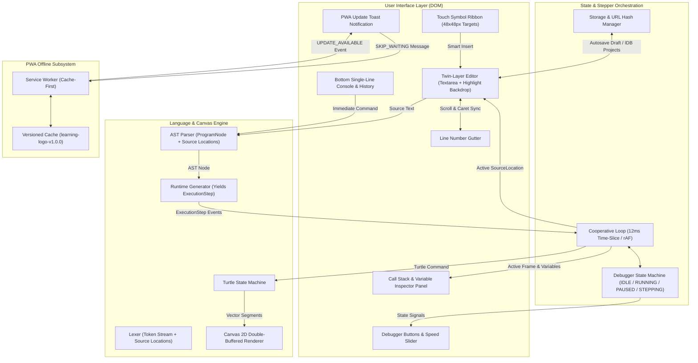
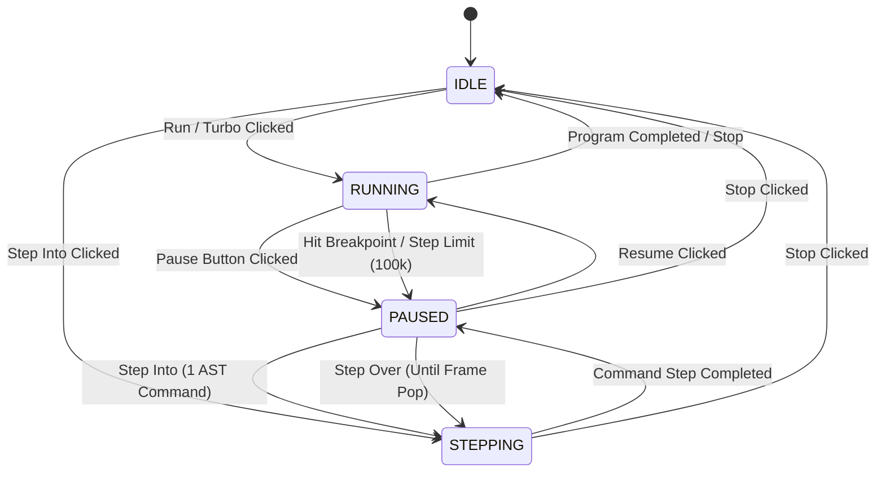
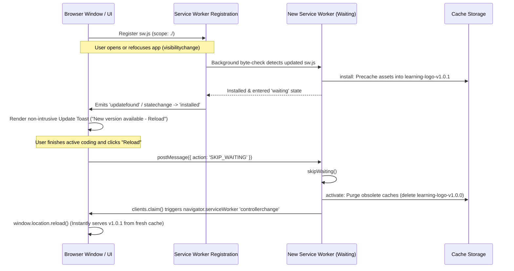

# LearningLogo Phase B Implementation Plan: Interactive Editor, Visual Debugger, Touch Ribbon, PWA Offline Service Worker, and Auto-Update Lifecycle

## Pre-Flight Check & Workspace Verification

1. **Workspace Root**: `/usr/local/google/home/vakh/git/hub/aawc/LearningLogo`
2. **Current Branch**: `main` (clean workspace, zero remote divergence)
3. **Repository Status**:
   - `[ ]` `LICENSE` (MIT)
   - `[ ]` `PRD.md` (Product Requirements Document)
   - `[ ]` `PROMPT.md` (Developer & AI Steering Guide)
   - `[ ]` `docs/DESIGN.md` (Technical Architecture)
   - `[ ]` `docs/TEST_STRATEGY.md` (Testing Philosophy & Rules)
4. **Standards & Constraints**:
   - **TDD Mandatory**: Failing test first ([FAIL]), minimal implementation ([PASS]), zero mock for domain logic.
   - **Accessibility**: Red-green color blindness friendly tags (`[PASS]`, `[FAIL]`, `[WARN]`, `[ADDED]`, `[REMOVED]`), Okabe-Ito palette (Blue `#0072B2` vs Orange `#D55E00`).
   - **No GitHub Alert Syntax**: Formatted with standard Markdown (`**Note:**`, `**Important:**`).
   - **In-Repository File Placement**: All code, tests, docs, and plans live inside `/usr/local/google/home/vakh/git/hub/aawc/LearningLogo`.
   - **No Remote Push**: All operations remain local.
   - **Atomic Commits**: Structured descriptions with technical rationale and design citations.

---

## 1. Analysis & Architectural Findings

### 1.1 Foundation & Subsystem Topology
Phase B builds upon the core Logo evaluation engine and Canvas 2D graphics subsystem defined in `docs/DESIGN.md`. The UI layer interacts with the interpreter through cooperative generator events, decoupling rendering and evaluation:

- **Editor Subsystem (`src/editor/`)**:
  - *Twin-Layer Architecture*: Invisible, transparent native `<textarea>` positioned identically over a syntax-highlighted `<pre><code>` backdrop.
  - *Rationale*: Preserves native OS accessibility (NVDA, TalkBack), native soft keyboards, IME composition, spellcheck disabling, and browser undo/redo history (`document.execCommand('insertText')` or selection range replacement), while rendering rich syntax coloring and execution highlighting beneath the transparent text layer.
  - *Line Gutter*: Dynamically updated line number column synchronized with the textarea line count.
  - *Scroll Synchronization*: Textarea `scroll` events synchronize `scrollTop` and `scrollLeft` to the backdrop and gutter.
- **Touch Ribbon (`src/editor/toolbar.ts`)**:
  - Dedicated virtual symbol and command ribbon above mobile/Chromebook keyboard.
  - Touch targets guaranteed $\ge 48 \times 48\text{ px}$ with $\ge 8\text{ px}$ margins.
  - Smart template insertion: tapping `[ ]` or `REPEAT` inserts balanced brackets and positions the caret inside (`[ | ]`).
- **Visual Debugger & Stepper (`src/debugger/`)**:
  - State machine: `IDLE`, `RUNNING`, `PAUSED`, `STEPPING`.
  - Non-blocking cooperative generator loop yielding via `requestAnimationFrame` with a 12 ms frame budget to sustain 60 fps.
  - Stepper controls: Run/Resume, Pause, Step Into (1 AST command), Step Over (until current procedure frame returns), Stop (aborts via cancellation token).
  - Speed Slider: Non-linear delay mapping ($0\text{ ms}$ turbo to $1000\text{ ms}$ slow motion).
  - Scope & Call Stack Inspector: Dynamic visualization of caller frames and bound variable values.
  - Infinite Loop Safeguard: Monotonic instruction counter halts at 100,000 steps without visual yield and alerts the user.
- **Storage & Zero-Backend URL Sharing (`src/storage/`)**:
  - Non-blocking autosave (debounced to 3 seconds) to `localStorage` for drafts and IndexedDB for named projects.
  - File Import/Export: `.logo` (plain text), `.json` (full project schema), PNG canvas capture (`canvas.toBlob()`).
  - URL Hash Compression: Lossless LZ-string encoding of source code into `#code=...` with safe length validation ($\le 2000$ characters).
- **PWA Offline Service Worker & Auto-Update (`src/pwa/`, `public/`)**:
  - `manifest.json`: Web app manifest configured for standalone display and base-path compatibility on GitHub Pages (`/LearningLogo/`).
  - Service Worker: Cache-First asset caching with versioned caches (`learning-logo-v1.0.0`).
  - Controlled Update Flow: New service worker installs and waits. Navigation and `visibilitychange` events check for updates. UI displays non-intrusive toast: *"New version available - Reload to update"*. Reload dispatches `{ action: 'SKIP_WAITING' }`, triggers `clients.claim()`, purges obsolete caches on `activate`, and reloads the window.

---

## 2. System Architecture & State Diagrams

### 2.1 Component Interaction Topology

### 2.2 Debugger State Machine Diagram

### 2.3 Service Worker Update Lifecycle Diagram

---

## 3. Knowledge Retrieval & Duckie Review Summary

### 3.1 Duckie Validation Checkpoints
1. **Technical Debt & Architectural Pitfalls**:
   - *Editor DOM Overhead & Accessibility*: Custom `contenteditable` editors frequently break screen reader accessibility, IME composition, and browser native undo/redo stacks.
     - *Action Taken*: Adopted the "twin-layer" editor model: a native, transparent `<textarea>` on top handles keyboard navigation, accessibility, IME, and native undo/redo, while an underlying synchronized `<pre><code>` renders syntax coloring and execution line glow.
   - *Touch Ribbon Target Ergonomics*: Minimum 48x48px touch targets must also include $\ge 8\text{ px}$ margin separation to eliminate "fat-finger" mis-taps on mobile devices.
     - *Action Taken*: Mandated 48x48px bounding box with 8px margin spacing in CSS tokens.
   - *Synchronous `localStorage` Jank*: `localStorage` writes block the main thread and can cause dropped frames during 60 fps canvas animation.
     - *Action Taken*: Debounced draft persistence to 3 seconds using `requestIdleCallback` / `setTimeout`, and architected project collection persistence via IndexedDB using an asynchronous Promise adapter (`idb`).
   - *Service Worker Version Skew*: Uncontrolled `skipWaiting()` on install causes version skew and crashes active sessions by swapping assets mid-run.
     - *Action Taken*: New service workers stay in `waiting` state until explicitly signaled via the user-initiated "Reload to Update" toast, which dispatches `{ action: 'SKIP_WAITING' }` and cleanly purges old caches on `activate`.
   - *URL Hash Length Safety*: Mobile browsers and social share tools truncate long URL hashes ($> 2000$ characters).
     - *Action Taken*: Implemented a character threshold monitor that warns users if a compressed script exceeds 2000 characters and advises exporting to `.logo` or `.json` file instead.

2. **Google & Standard Libraries Evaluation**:
   - *Service Worker*: Custom native Service Worker with versioned cache strategy ($0\text{ KB}$ runtime overhead) perfectly fits our $< 150\text{ KB}$ budget.
   - *URL Compression*: Evaluated `lz-string` vs native `CompressionStream`. While `CompressionStream` is zero-cost, `lz-string` (at ~3.5 KB) guarantees synchronous fragment generation and 100% legacy/cross-browser support across all school-issued Chromebooks. We provide an LZ-string compatible URL encoder.
   - *Storage*: IndexedDB Promise wrapper (`idb`, ~1 KB) guarantees non-blocking disk I/O.
   - *A11y Palette*: Hardcoded Okabe-Ito 8-color palette (Blue `#0072B2` vs Orange `#D55E00`) with zero external CSS framework footprint.

---

## 4. Step-by-Step TDD Implementation Tasks

Every implementation task follows the strict gpowers Implementer workflow:
- **Audit**: Verify existing dependencies and baseline files.
- **RED**: Author comprehensive test cases with real domain assertions and verify failing status (`[FAIL]`).
- **GREEN**: Write minimal, robust production code to pass all assertions (`[PASS]`).
- **Verification**: Run `tsc --noEmit`, `vitest run`, and bundle size checks.
- **Atomic Commit**: Prepare structured conventional commit message for user review before committing.

---

### Task 1: Project Scaffolding, Build Tooling & Test Baseline (To be executed by Implementer)

- **Target Files**:
  - `package.json`
  - `tsconfig.json`
  - `vite.config.ts`
  - `vitest.config.ts`
  - `index.html`
- **Verification Target**: `npm test` / `vitest run`

#### 1. Audit
Verify Node.js and npm environment in `/usr/local/google/home/vakh/git/hub/aawc/LearningLogo`. Ensure Vite 5.x, TypeScript 5.x, Vitest, and `@vitest/ui` (optional) can be configured without external runtime dependencies.

#### 2. RED (Failing Test)
Create `tests/unit/scaffolding.test.ts` asserting:
1. Environment is configured for ES2022 and strict TypeScript compilation.
2. Build configuration targets $< 150\text{ KB}$ gzipped production output.
3. Colorblind accessibility tokens exist in design tokens configuration.

Run `npx vitest run tests/unit/scaffolding.test.ts` -> Verify `[FAIL]`.

#### 3. GREEN (Implementation)
1. Initialize `package.json` with scripts:
   - `"dev": "vite"`
   - `"build": "tsc --noEmit && vite build"`
   - `"preview": "vite preview"`
   - `"test": "vitest run"`
   - `"test:watch": "vitest"`
2. Configure `tsconfig.json` with `target: "ES2022"`, `module: "ESNext"`, `strict: true`, `moduleResolution: "bundler"`, `lib: ["ES2022", "DOM", "DOM.Iterable"]`.
3. Configure `vite.config.ts` with base path support (`./`) for GitHub Pages.
4. Configure `vitest.config.ts` with JSDOM environment for DOM and component testing.
5. Create base `index.html` with viewport meta tags (`width=device-width, initial-scale=1.0, maximum-scale=1.0, user-scalable=no`) and mount points (`#app`, `#editor-container`, `#canvas-container`, `#toolbar-container`, `#debugger-container`, `#pwa-banner`).

#### 4. Verification
Run:
- `npm test` -> `[PASS]`
- `npx tsc --noEmit` -> `[PASS]`

#### 5. Atomic Commit Boundary
- **Type**: `chore`
- **Description**: `chore: initialize typescript vite vitest build scaffolding and base html`
- **Details**: Establishes strict TypeScript configuration, Vite bundler with relative base-path support for GitHub Pages, and Vitest test runner with JSDOM support.

---

### Task 2: Okabe-Ito Accessible Design Tokens & Base Styles (To be executed by Implementer)

- **Target Files**:
  - `src/styles/tokens.css`
  - `src/styles/base.css`
  - `src/graphics/palette.ts`
- **Verification Target**: `tests/unit/graphics/palette.test.ts`

#### 1. Audit
Verify contrast ratios and color tokens defined in `PRD.md` (FR-2) and `docs/DESIGN.md` (Section 3.3).

#### 2. RED (Failing Test)
Create `tests/unit/graphics/palette.test.ts` with concrete WCAG 2.1 mathematical contrast ratio assertions:
1. Every Okabe-Ito color (`BLACK #000000`, `BLUE #0072B2`, `VERMILION #D55E00`, `SKY_BLUE #56B4E9`, `BLUISH_GREEN #009E73`, `YELLOW #F0E442`, `REDDISH_PURPLE #CC79A7`, `AMBER #E69F00`) maps to its standard index (0–7).
2. Primary contrast pair (`BLUE #0072B2` vs `VERMILION #D55E00`) achieves $\ge 3.0:1$ graphical contrast and distinct luminance.
3. Palette helper functions: `getColorByIndex(index: number): string`, `getColorByName(name: string): string`, `isColorblindSafe(hex: string): boolean`.
4. Contrast against light canvas background (`#FFFFFF`) and dark editor background (`#1E1E1E`).

Run `vitest run tests/unit/graphics/palette.test.ts` -> Verify `[FAIL]`.

#### 3. GREEN (Implementation)
1. Create `src/graphics/palette.ts` implementing the Okabe-Ito 8-color array and lookup map.
2. Create `src/styles/tokens.css` exposing CSS variables:
   - `--color-primary-blue: #0072B2;`
   - `--color-primary-orange: #D55E00;`
   - `--color-accent-sky: #56B4E9;`
   - `--color-accent-green: #009E73;`
   - `--color-accent-yellow: #F0E442;`
   - `--color-accent-purple: #CC79A7;`
   - `--color-bg-editor: #1E1E1E;`
   - `--color-text-editor: #F8F9FA;`
   - `--touch-target-size: 48px;`
   - `--touch-target-margin: 8px;`
3. Create `src/styles/base.css` with reset rules, responsive container definitions, and accessible focus outlines.

#### 4. Verification
Run:
- `vitest run tests/unit/graphics/palette.test.ts` -> `[PASS]`
- `npx tsc --noEmit` -> `[PASS]`

#### 5. Atomic Commit Boundary
- **Type**: `feat`
- **Description**: `feat(graphics): implement okabe-ito accessible palette and css design tokens`
- **Details**: Introduces Okabe-Ito colorblind-safe color registry with WCAG 2.1 compliance verification and global CSS design tokens for high-contrast accessibility.

---

### Task 3: Syntax Highlighter & Bracket Matcher (To be executed by Implementer)

- **Target Files**:
  - `src/editor/highlighter.ts`
  - `src/styles/highlighter.css`
- **Verification Target**: `tests/unit/editor/highlighter.test.ts`

#### 1. Audit
Review Token definitions from `docs/DESIGN.md` (Section 2.1). The syntax highlighter takes raw Logo code, tokenizes it into structured tokens (`COMMAND`, `KEYWORD`, `NUMBER`, `WORD_LITERAL`, `VAR_LOOKUP`, `OPERATOR`, `LIST_OPEN`, `LIST_CLOSE`, `COMMENT`), and outputs an HTML snippet of styled `` elements while escaping HTML characters.

#### 2. RED (Failing Test)
Create `tests/unit/editor/highlighter.test.ts` asserting:
1. Keyword and command highlighting: `REPEAT 4 [ FD 100 RT 90 ]` produces spans with classes `.hl-keyword`, `.hl-number`, `.hl-bracket`, `.hl-command`.
2. Variable references (`:COUNT`) produce `.hl-var`; word literals (`"HELLO`) produce `.hl-word`.
3. Comments (`; draw a square`) produce `.hl-comment`.
4. HTML character escaping: `IF :X < 10 AND :Y > 5` safely escapes `<` to `&lt;` and `>` to `&gt;`.
5. Bracket matching:
   - Balanced brackets: paired `[` and `]` receive matching identifiers or classes (`.hl-bracket-matched`).
   - Unbalanced brackets: unclosed `[` or orphaned `]` receive error styling (`.hl-bracket-unmatched`).
6. Empty lines and trailing newlines preserve line parity with raw text.
7. Performance test: 1,000 lines of code highlighted in $< 10\text{ ms}$.

Run `vitest run tests/unit/editor/highlighter.test.ts` -> Verify `[FAIL]`.

#### 3. GREEN (Implementation)
1. Implement `src/editor/highlighter.ts`:
   - `highlightLogoCode(source: string): { html: string; unmatchedBrackets: number[] }`
   - Fast regex-based or lexer-backed token scanner that annotates tokens with line and column spans.
   - Bracket stack tracking matching pairs and recording indices of unmatched open/close brackets.
   - HTML entity escaper preventing XSS.
2. Implement `src/styles/highlighter.css` with accessible contrast classes matching the Okabe-Ito theme.

#### 4. Verification
Run:
- `vitest run tests/unit/editor/highlighter.test.ts` -> `[PASS]`
- `npx tsc --noEmit` -> `[PASS]`

#### 5. Atomic Commit Boundary
- **Type**: `feat`
- **Description**: `feat(editor): implement token-based syntax highlighter and bracket matching`
- **Details**: Delivers fast, XSS-safe Logo syntax highlighting engine with bracket pair tracking and unmatched bracket error diagnostics.

---

### Task 4: Twin-Layer Interactive Editor Component (To be executed by Implementer)

- **Target Files**:
  - `src/editor/editor.ts`
  - `src/styles/editor.css`
- **Verification Target**: `tests/unit/editor/editor.test.ts`

#### 1. Audit
Review Section 1.1 and Duckie's guidance on the twin-layer editor: `
` containing:
- `
`: Line numbers container.
- `
<pre><code class="highlight-layer"></code></pre>
`: Syntax highlighted backdrop.
- `<textarea class="input-layer" spellcheck="false" autocomplete="off" autocapitalize="off">`: Transparent native textarea.

#### 2. RED (Failing Test)
Create `tests/unit/editor/editor.test.ts` asserting:
1. Editor initialization attaches gutter, backdrop, and textarea to container.
2. Setting value (`editor.setValue(code)`) updates textarea, updates backdrop HTML via `highlightLogoCode`, and renders correct count of line numbers in gutter.
3. Gutter line count increases when lines are added and decreases when lines are removed.
4. Event listeners: `input` event triggers `change` callback with debounce.
5. Synchronized scrolling: setting `textarea.scrollTop = 150` updates `backdrop.scrollTop` and `gutter.scrollTop`.
6. Caret and selection utilities:
   - `editor.getCursorPosition(): { line: number, column: number, index: number }`
   - `editor.setSelectionRange(start: number, end: number): void`
   - `editor.insertAtCursor(text: string, cursorOffset?: number): void` (uses `document.execCommand('insertText')` with fallback to selection range replacement to preserve native undo/redo).
7. Synchronized line/token highlight:
   - `editor.highlightExecutionLine(lineNumber: number): void` highlights the corresponding line in the backdrop.
   - `editor.clearExecutionHighlight(): void` removes execution styling.

Run `vitest run tests/unit/editor/editor.test.ts` -> Verify `[FAIL]`.

#### 3. GREEN (Implementation)
1. Implement `src/editor/editor.ts` class `LogoEditor`:
   - Methods: `mount(element: HTMLElement)`, `setValue(val: string)`, `getValue(): string`, `getCursorPosition()`, `insertAtCursor(text, offset)`, `highlightExecutionLine(line)`, `clearExecutionHighlight()`, `on(event, handler)`.
   - Scroll synchronization listener wiring textarea to backdrop and gutter.
   - Dynamic line gutter numbering renderer.
2. Implement `src/styles/editor.css`:
   - Identical typography (`font-family: monospace`, `font-size: 15px`, `line-height: 24px`, `padding: 12px`).
   - `textarea` styling: `color: transparent; caret-color: #56B4E9; background: transparent; z-index: 2; resize: none; overflow: auto;`.
   - `backdrop` styling: `position: absolute; pointer-events: none; z-index: 1; overflow: hidden;`.
   - Execution highlight styling: `.execution-line-highlight` with distinct border indicator and background tint (`rgba(0, 114, 178, 0.25)`).

#### 4. Verification
Run:
- `vitest run tests/unit/editor/editor.test.ts` -> `[PASS]`
- `npx tsc --noEmit` -> `[PASS]`

#### 5. Atomic Commit Boundary
- **Type**: `feat`
- **Description**: `feat(editor): implement twin-layer native dom editor with line gutter and scroll sync`
- **Details**: Adds high-performance accessible twin-layer code editor preserving native undo/redo, IME composition, dynamic line gutter, and synchronized execution highlight.

---

### Task 5: Mobile & Chromebook Touch Ribbon (To be executed by Implementer)

- **Target Files**:
  - `src/editor/toolbar.ts`
  - `src/styles/toolbar.css`
- **Verification Target**: `tests/unit/editor/toolbar.test.ts`

#### 1. Audit
Review `PRD.md` (FR-3) and `docs/DESIGN.md` (Section 4.2). Touch targets must be $\ge 48 \times 48\text{ px}$ with $\ge 8\text{ px}$ separation. Virtual keys provide instant tap insertion for brackets `[`, `]`, quote `"`, colon `:`, and common keywords.

#### 2. RED (Failing Test)
Create `tests/unit/editor/toolbar.test.ts` asserting:
1. Toolbar mounts with configured symbol keys: `[`, `]`, `"`, `:`, `(`, `)`, `FD`, `BK`, `LT`, `RT`, `REPEAT`.
2. Button dimensions: CSS classes enforce minimum width $\ge 48\text{ px}$, minimum height $\ge 48\text{ px}$, and margins $\ge 8\text{ px}$.
3. Tap behavior:
   - Tapping `[` calls `editor.insertAtCursor('[')`.
   - Tapping `"` calls `editor.insertAtCursor('"')`.
   - Tapping `[ ]` pair button inserts `[  ]` and places caret between brackets.
   - Tapping `REPEAT` inserts `REPEAT 4 [  ]` and positions cursor between brackets.
   - Tapping `FD` inserts `FD 50 `.
4. ARIA attributes: Each button has descriptive `aria-label` (e.g. `aria-label="Insert open bracket"`).
5. Keyboard accessibility: ArrowLeft / ArrowRight navigates focus across ribbon buttons.
6. Mobile responsiveness down to 360px viewport: Ribbon supports horizontal scrolling with smooth momentum touch (`-webkit-overflow-scrolling: touch`).

Run `vitest run tests/unit/editor/toolbar.test.ts` -> Verify `[FAIL]`.

#### 3. GREEN (Implementation)
1. Implement `src/editor/toolbar.ts` class `TouchRibbon`:
   - Configurable list of actions with labels, inserted text, caret offsets, and ARIA descriptions.
   - Click/touch event handlers dispatching to `LogoEditor.insertAtCursor()`.
   - Keydown listener handling Arrow navigation.
2. Implement `src/styles/toolbar.css`:
   - Flexbox container with `overflow-x: auto`, `scrollbar-width: thin`.
   - Touch buttons styled with high-contrast borders, active tap scale feedback, and $48\text{ px}$ targets.

#### 4. Verification
Run:
- `vitest run tests/unit/editor/toolbar.test.ts` -> `[PASS]`
- `npx tsc --noEmit` -> `[PASS]`

#### 5. Atomic Commit Boundary
- **Type**: `feat`
- **Description**: `feat(editor): implement touch-friendly symbol ribbon for mobile and chromebook`
- **Details**: Delivers accessible 48x48px virtual symbol ribbon with smart bracket placement, keyword shortcuts, and horizontal scroll ergonomics down to 360px viewport.

---

### Task 6: Single-Line Immediate REPL Console (To be executed by Implementer)

- **Target Files**:
  - `src/editor/repl.ts`
  - `src/styles/repl.css`
- **Verification Target**: `tests/unit/editor/repl.test.ts`

#### 1. Audit
Review `PRD.md` (FR-3): Single-line bottom console for immediate command evaluation with command history navigation (Up/Down arrows).

#### 2. RED (Failing Test)
Create `tests/unit/editor/repl.test.ts` asserting:
1. REPL mounts an input element with prompt indicator (`? `).
2. Submitting a command (pressing `Enter` with text `FD 100`) emits `execute` event with payload `'FD 100'` and clears the input.
3. Command history navigation:
   - Submitting `FD 50`, then `RT 90`.
   - Pressing `ArrowUp` displays `RT 90`.
   - Pressing `ArrowUp` again displays `FD 50`.
   - Pressing `ArrowDown` returns to `RT 90`.
   - Pressing `ArrowDown` past latest command restores blank buffer.
4. History limit: History buffer caps at 50 entries FIFO.
5. Submitting empty string does not emit `execute` event or add empty history entry.

Run `vitest run tests/unit/editor/repl.test.ts` -> Verify `[FAIL]`.

#### 3. GREEN (Implementation)
1. Implement `src/editor/repl.ts` class `ReplConsole`:
   - State: `history: string[]`, `historyIndex: number`, `tempBuffer: string`.
   - Keydown handler for `Enter`, `ArrowUp`, `ArrowDown`, and `Escape`.
   - Event emitter for `execute` event.
2. Implement `src/styles/repl.css`:
   - High-contrast console prompt bar at bottom of viewport.

#### 4. Verification
Run:
- `vitest run tests/unit/editor/repl.test.ts` -> `[PASS]`
- `npx tsc --noEmit` -> `[PASS]`

#### 5. Atomic Commit Boundary
- **Type**: `feat`
- **Description**: `feat(editor): implement immediate command repl console with history stack`
- **Details**: Adds bottom command-line REPL supporting immediate execution and bidirectional command history traversal.

---

### Task 7: Non-Blocking Stepper State Machine & Controller (To be executed by Implementer)

- **Target Files**:
  - `src/debugger/state.ts`
  - `src/debugger/stepper.ts`
- **Verification Target**: `tests/unit/debugger/state.test.ts` and `tests/unit/debugger/stepper.test.ts`

#### 1. Audit
Review `docs/DESIGN.md` (Section 2.4 and Section 5). The Stepper manages the lifecycle of the cooperative generator runtime through a formal state machine (`IDLE`, `RUNNING`, `PAUSED`, `STEPPING`). It yields control via `requestAnimationFrame` with a 12 ms frame budget to prevent UI freezes.

#### 2. RED (Failing Test)
1. Create `tests/unit/debugger/state.test.ts` asserting:
   - Valid transitions: `IDLE -> RUNNING`, `IDLE -> STEPPING`, `RUNNING -> PAUSED`, `PAUSED -> STEPPING`, `STEPPING -> PAUSED`, `PAUSED -> RUNNING`, `RUNNING/PAUSED/STEPPING -> IDLE`.
   - Invalid transitions throw or are ignored (e.g. `IDLE -> PAUSED` is rejected).
   - Event listeners receive `stateChange` events with previous and new states.
2. Create `tests/unit/debugger/stepper.test.ts` asserting:
   - Non-blocking loop: Mock generator yielding 500 steps completes cooperatively across animation frames without locking the thread.
   - Step Into: Advances generator by 1 command step, yields source location, and transitions to `PAUSED`.
   - Step Over: Given a procedure with 3 statements, stepping over executes all 3 child statements and pauses when control returns to parent caller frame.
   - Speed delay formula:
     - At speed 100: delay is $0\text{ ms}$ (turbo).
     - At speed 0: delay is $1000\text{ ms}$.
     - At speed 50: delay is $1000 \times (1 - 0.5)^2 = 250\text{ ms}$.
   - Stop: Aborts execution immediately via cancellation token and transitions to `IDLE`.
   - Infinite Loop Guard: Monotonic instruction counter exceeding 100,000 steps without visual yield halts execution, transitions to `PAUSED`, and emits `loopLimitExceeded` event.

Run `vitest run tests/unit/debugger/` -> Verify `[FAIL]`.

#### 3. GREEN (Implementation)
1. Implement `src/debugger/state.ts`:
   - `enum DebuggerState { IDLE = 'IDLE', RUNNING = 'RUNNING', PAUSED = 'PAUSED', STEPPING = 'STEPPING' }`
   - `class DebuggerStateMachine` with typed transitions and event emission.
2. Implement `src/debugger/stepper.ts`:
   - `class StepperController`:
     - Methods: `start(generator: Generator)`, `pause()`, `resume()`, `stepInto()`, `stepOver()`, `stop()`, `setSpeed(speed: number)`.
     - Non-blocking execution loop using `requestAnimationFrame` and timestamp delta checking (target 12 ms budget per slice).
     - Frame depth tracking to implement `stepOver()`.
     - Instruction ceiling counter (100,000 threshold).

#### 4. Verification
Run:
- `vitest run tests/unit/debugger/` -> `[PASS]`
- `npx tsc --noEmit` -> `[PASS]`

#### 5. Atomic Commit Boundary
- **Type**: `feat`
- **Description**: `feat(debugger): implement non-blocking stepper state machine and cooperative loop`
- **Details**: Delivers formal execution state machine (IDLE, RUNNING, PAUSED, STEPPING), cooperative time-sliced animation frame loop, step-into, step-over, speed curve, and runaway loop safeguards.

---

### Task 8: Call Stack & Variable Inspector UI (To be executed by Implementer)

- **Target Files**:
  - `src/debugger/inspector.ts`
  - `src/debugger/controls.ts`
  - `src/styles/debugger.css`
- **Verification Target**: `tests/unit/debugger/inspector.test.ts`

#### 1. Audit
Review `PRD.md` (FR-4) and `docs/DESIGN.md` (Section 5.2): UI panels displaying active procedure call stack, variable environment bindings, speed slider, and execution buttons (`Run`, `Pause`, `Step Into`, `Step Over`, `Stop`).

#### 2. RED (Failing Test)
Create `tests/unit/debugger/inspector.test.ts` asserting:
1. Controls UI mounts buttons: Run/Resume, Pause, Step Into, Step Over, Stop, and Speed Slider.
2. Button disabled states reflect state machine:
   - In `IDLE`: Run and Step Into are enabled; Pause and Step Over are disabled.
   - In `RUNNING`: Pause and Stop are enabled; Run, Step Into, and Step Over are disabled.
   - In `PAUSED`: Run (Resume), Step Into, Step Over, and Stop are enabled; Pause is disabled.
3. Call stack rendering:
   - Renders stack frames from root to innermost procedure (e.g. `[Global, SQUARE :SIZE=50 (line 5), HOUSE (line 12)]`).
4. Variable inspector rendering:
   - Renders bound variables in active frame with type tags (e.g. `:COUNT = 4`, `:NAME = "STAR`).
5. Speed slider change updates stepper execution speed.
6. Accessible indicators: Buttons use dual encoding (text label `[RUN]`, `[PAUSE]`, `[STEP]`, `[STOP]` + distinct icons).

Run `vitest run tests/unit/debugger/inspector.test.ts` -> Verify `[FAIL]`.

#### 3. GREEN (Implementation)
1. Implement `src/debugger/controls.ts`:
   - Binds UI buttons to `StepperController` methods with state-driven enable/disable logic.
2. Implement `src/debugger/inspector.ts`:
   - Renders Call Stack list and Variable Scope table from runtime environment frames.
3. Implement `src/styles/debugger.css`:
   - Clean, colorblind-friendly button layout, responsive speed slider, and collapsible inspector panels.

#### 4. Verification
Run:
- `vitest run tests/unit/debugger/inspector.test.ts` -> `[PASS]`
- `npx tsc --noEmit` -> `[PASS]`

#### 5. Atomic Commit Boundary
- **Type**: `feat`
- **Description**: `feat(debugger): implement debugger controls panel and scope call-stack inspector`
- **Details**: Delivers accessible debugger UI controls (Run, Pause, Step Into, Step Over, Stop), non-linear speed slider, and live inspection panels for active call stack and variable bindings.

---

### Task 9: Storage, Project Persistence & File Export/Import (To be executed by Implementer)

- **Target Files**:
  - `src/storage/project.ts`
  - `src/storage/local_store.ts`
  - `src/storage/file_io.ts`
  - `src/storage/project_modal.ts`
  - `src/styles/modal.css`
- **Verification Target**: `tests/unit/storage/project.test.ts` and `tests/unit/storage/local_store.test.ts`

#### 1. Audit
Review `PRD.md` (FR-5) and `docs/DESIGN.md` (Section 6.3). Features:
- Autosave to `localStorage` (draft key, debounced 3s).
- Project persistence in IndexedDB (`LearningLogoDB`, object store `projects`).
- File export as `.logo` (plain text) and `.json` (full project schema).
- Canvas snapshot export as PNG (`canvas.toBlob()`).
- File import via file picker and drag-and-drop.

#### 2. RED (Failing Test)
1. Create `tests/unit/storage/project.test.ts` asserting:
   - Project schema validation: `id`, `name`, `code`, `createdAt`, `updatedAt`, `version`.
   - Serialization to JSON string and deserialization back with schema verification.
   - Corrupted or invalid JSON returns safe diagnostic error.
2. Create `tests/unit/storage/local_store.test.ts` asserting:
   - Autosave: calling `saveDraft(code)` debounces writes; reads back correctly via `getDraft()`.
   - IndexedDB CRUD operations: `saveProject()`, `getProject(id)`, `listProjects()`, `deleteProject(id)`.
   - Quota exceeded gracefully handled with user warning.
3. Create `tests/unit/storage/file_io.test.ts` asserting:
   - `exportLogoFile(filename, code)` generates downloadable text Blob.
   - `exportProjectJson(project)` generates formatted JSON Blob.
   - `importFromFile(file)` parses `.logo` and `.json` files correctly.

Run `vitest run tests/unit/storage/` -> Verify `[FAIL]`.

#### 3. GREEN (Implementation)
1. Implement `src/storage/project.ts`:
   - Type definitions `Project` and schema validator.
2. Implement `src/storage/local_store.ts`:
   - Debounced `localStorage` draft manager.
   - Promise-based IndexedDB adapter (`openDB`, `put`, `get`, `getAll`, `delete`).
3. Implement `src/storage/file_io.ts`:
   - File download helper using `URL.createObjectURL(blob)`.
   - Canvas PNG export helper using `canvas.toBlob('image/png')`.
   - File input reader for `.logo` and `.json`.
4. Implement `src/storage/project_modal.ts` and `src/styles/modal.css`:
   - Accessible modal dialog for project listing, saving, renaming, deleting, and backup export.

#### 4. Verification
Run:
- `vitest run tests/unit/storage/` -> `[PASS]`
- `npx tsc --noEmit` -> `[PASS]`

#### 5. Atomic Commit Boundary
- **Type**: `feat`
- **Description**: `feat(storage): implement local persistence file io and project management modal`
- **Details**: Introduces debounced draft autosave, IndexedDB project storage, .logo and .json file import/export, canvas PNG capture, and project library UI modal.

---

### Task 10: Zero-Backend URL Code Compression & Sharing (To be executed by Implementer)

- **Target Files**:
  - `src/storage/url_share.ts`
- **Verification Target**: `tests/unit/storage/url_share.test.ts`

#### 1. Audit
Review `PRD.md` (FR-5) and Duckie's guidance on URL sharing. The system compresses Logo source code into a URL hash fragment (`#code=...`) without requiring any server backend. It must handle Unicode, preserve formatting, and warn if the resulting hash exceeds safe URL boundaries ($2000$ characters).

#### 2. RED (Failing Test)
Create `tests/unit/storage/url_share.test.ts` asserting:
1. Round-trip compression:
   - `compressCodeToHash(code: string): string`
   - `decompressCodeFromHash(hash: string): string`
   - `decompressCodeFromHash(compressCodeToHash(input)) === input` for simple and multi-line Logo scripts with recursion, lists, and unicode strings.
2. Safe URL characters: Generated hash contains only URL-safe characters (Base64URL / URI-safe).
3. URL extraction: Given a full URL `https://learninglogo.org/#code=XYZ`, extracts and decompresses the code cleanly.
4. Empty or malformed hash: Returns empty string or throws friendly diagnostic without crashing.
5. Length threshold guard:
   - `isHashSafeLength(hash: string): boolean` returns `true` for $\le 2000$ characters, `false` for $> 2000$ characters.
   - Generates warning metadata when hash exceeds 2000 characters.

Run `vitest run tests/unit/storage/url_share.test.ts` -> Verify `[FAIL]`.

#### 3. GREEN (Implementation)
1. Implement `src/storage/url_share.ts`:
   - Lightweight, zero-dependency LZ-based string compression / decompression algorithm producing URI-safe base64 characters.
   - Functions: `encodeProjectToUrl(code: string): string`, `decodeProjectFromUrl(hash: string): string | null`, `checkUrlLength(url: string): { safe: boolean; length: number }`.
2. Wire hash check into application boot in `src/main.ts` (if `window.location.hash` contains `#code=...`, prompt to load shared code into editor).

#### 4. Verification
Run:
- `vitest run tests/unit/storage/url_share.test.ts` -> `[PASS]`
- `npx tsc --noEmit` -> `[PASS]`

#### 5. Atomic Commit Boundary
- **Type**: `feat`
- **Description**: `feat(storage): implement zero-backend url hash compression and sharing`
- **Details**: Delivers lossless URI-safe code compression and decompression for accountless sharing with 2000-character safety validation.

---

### Task 11: PWA Web App Manifest & Service Worker Cache-First Engine (To be executed by Implementer)

- **Target Files**:
  - `public/manifest.json`
  - `public/sw.js` (or `src/pwa/sw.ts` compiled to worker)
- **Verification Target**: `tests/unit/pwa/sw_cache.test.ts`

#### 1. Audit
Review `PRD.md` (FR-5) and `docs/DESIGN.md` (Section 6). The Service Worker operates with:
- Versioned cache key: `const CACHE_VERSION = 'learning-logo-v1.0.0';`
- Precaching core static assets: `./`, `./index.html`, `./manifest.json`, `./favicon.ico`, app bundles, icons.
- Cache-First fetch strategy: Return cached asset immediately; on miss, fetch from network and store in cache.
- Safe cache purging: On `activate`, purge all caches matching `learning-logo-` that do not equal `CACHE_VERSION`.
- Message listener: Listens for `{ action: 'SKIP_WAITING' }` to execute `self.skipWaiting()`.

#### 2. RED (Failing Test)
Create `tests/unit/pwa/sw_cache.test.ts` asserting:
1. `manifest.json` contains required PWA fields: `name`, `short_name`, `start_url`, `display: standalone`, `background_color`, `theme_color`, and icons (192x192, 512x512).
2. Service Worker constants: `CACHE_VERSION` format and asset precache list.
3. Cache-First logic:
   - When request is found in cache, returns `Response` without network call.
   - When request is not in cache, executes `fetch()`, puts clone into cache, and returns response.
4. Cache Invalidation:
   - Given existing caches `learning-logo-v0.9.0` and `learning-logo-v1.0.0`, the `activate` handler deletes `learning-logo-v0.9.0` and preserves `learning-logo-v1.0.0`.
5. Message handler:
   - Receiving message `{ action: 'SKIP_WAITING' }` calls `self.skipWaiting()`.

Run `vitest run tests/unit/pwa/sw_cache.test.ts` -> Verify `[FAIL]`.

#### 3. GREEN (Implementation)
1. Create `public/manifest.json` with base-path compatibility:
   - `"name": "LearningLogo - Educational Turtle Graphics"`
   - `"short_name": "LearningLogo"`
   - `"start_url": "./"`
   - `"scope": "./"`
   - `"display": "standalone"`
   - `"theme_color": "#0072B2"`
   - `"background_color": "#1E1E1E"`
2. Implement `public/sw.js`:
   - Precache assets on `install`.
   - Purge old caches and call `self.clients.claim()` on `activate`.
   - Cache-First handler on `fetch`.
   - Message listener for `SKIP_WAITING`.

#### 4. Verification
Run:
- `vitest run tests/unit/pwa/sw_cache.test.ts` -> `[PASS]`
- `npx tsc --noEmit` -> `[PASS]`

#### 5. Atomic Commit Boundary
- **Type**: `feat`
- **Description**: `feat(pwa): implement web app manifest and cache-first service worker`
- **Details**: Adds PWA manifest and versioned offline Service Worker with cache cleanup and skipWaiting message activation.

---

### Task 12: Service Worker Lifecycle Registration & Auto-Update Toast (To be executed by Implementer)

- **Target Files**:
  - `src/pwa/register_sw.ts`
  - `src/pwa/update_banner.ts`
  - `src/styles/pwa_banner.css`
- **Verification Target**: `tests/unit/pwa/register_sw.test.ts`

#### 1. Audit
Review Duckie's guidance on version skew: Never force `skipWaiting()` immediately on install. Instead, when a new worker enters the `waiting` state:
1. Broadcast update event to the UI.
2. Render a non-intrusive banner/toast: *"New version available. [Reload to Update] [Dismiss]"*.
3. When the user clicks "Reload", dispatch `{ action: 'SKIP_WAITING' }` to the waiting worker.
4. Listen to `navigator.serviceWorker.addEventListener('controllerchange')` and reload the window (`window.location.reload()`).
5. Trigger background checks on navigation and page focus (`visibilitychange`).

#### 2. RED (Failing Test)
Create `tests/unit/pwa/register_sw.test.ts` asserting:
1. `registerServiceWorker()` registers `./sw.js` with scope `./`.
2. When a new worker is discovered and enters `installed` state while `navigator.serviceWorker.controller` exists, triggers `onUpdateAvailable` callback.
3. Visibility change listener: Transitioning document to `visibilityState === 'visible'` invokes `registration.update()`.
4. Update Banner UI:
   - Renders notification banner with accessible indicator `[UPDATE]`, message, "Reload" button, and "Dismiss" button.
   - Clicking "Dismiss" hides the banner.
   - Clicking "Reload" sends `{ action: 'SKIP_WAITING' }` to waiting worker and sets up reload on `controllerchange`.
5. Non-PWA / localhost fallback: Gracefully handles environments where Service Worker is unsupported.

Run `vitest run tests/unit/pwa/register_sw.test.ts` -> Verify `[FAIL]`.

#### 3. GREEN (Implementation)
1. Implement `src/pwa/register_sw.ts`:
   - `registerServiceWorker(options: { onUpdate: (reg: ServiceWorkerRegistration) => void })`
   - Handles `waiting` worker detection, `updatefound` event, and `visibilitychange` periodic checks.
   - `applyUpdate(registration: ServiceWorkerRegistration)` sends `{ action: 'SKIP_WAITING' }` and listens for `controllerchange`.
2. Implement `src/pwa/update_banner.ts`:
   - DOM component rendering the update notification toast.
3. Implement `src/styles/pwa_banner.css`:
   - Accessible fixed-position toast at top or bottom-right with high-contrast Okabe-Ito colors (Blue background `#0072B2`, Yellow attention badge `[UPDATE]`).

#### 4. Verification
Run:
- `vitest run tests/unit/pwa/register_sw.test.ts` -> `[PASS]`
- `npx tsc --noEmit` -> `[PASS]`

#### 5. Atomic Commit Boundary
- **Type**: `feat`
- **Description**: `feat(pwa): implement service worker registration and non-intrusive update banner`
- **Details**: Introduces robust Service Worker update detection on navigation and focus, controlled skipWaiting activation, and accessible update notification toast.

---

### Task 13: Responsive Layout & Mobile/Desktop Viewport Integration (To be executed by Implementer)

- **Target Files**:
  - `src/ui/layout.ts`
  - `src/styles/layout.css`
  - `src/main.ts`
- **Verification Target**: `tests/integration/responsive_layout.test.ts`

#### 1. Audit
Review `PRD.md` (FR-3, NFR-4): Responsive design supporting desktop landscape, Chromebook touchscreens, and mobile smartphones down to 360px portrait:
- Desktop/Chromebook landscape: Split pane with Editor on left, Canvas viewport on right, REPL at bottom, Touch Ribbon above keyboard.
- Mobile portrait: Stacked vertical layout (Canvas viewport top, Editor middle, Touch Ribbon docked above bottom REPL).
- Collapsible inspector panel.

#### 2. RED (Failing Test)
Create `tests/integration/responsive_layout.test.ts` asserting:
1. Desktop viewport ($\ge 1024\text{ px}$): Renders two-column split layout with editor and canvas side-by-side.
2. Mobile viewport ($\le 600\text{ px}$): Renders single-column stacked layout.
3. Minimum viewport ($360\text{ px}$): Elements fit without horizontal overflow; touch targets remain $\ge 48\text{ px}$.
4. Inspector panel collapse/expand toggle functions correctly without disturbing canvas dimensions.
5. High-DPI canvas resizing: Window resize recalculates canvas display and buffer dimensions according to `window.devicePixelRatio`.

Run `vitest run tests/integration/responsive_layout.test.ts` -> Verify `[FAIL]`.

#### 3. GREEN (Implementation)
1. Implement `src/ui/layout.ts` managing viewport state and pane resizing.
2. Implement `src/styles/layout.css` using modern CSS Grid and Flexbox with media queries at $600\text{ px}$, $768\text{ px}$, and $1024\text{ px}$.
3. Wire layout manager and components together in `src/main.ts`.

#### 4. Verification
Run:
- `vitest run tests/integration/responsive_layout.test.ts` -> `[PASS]`
- `npx tsc --noEmit` -> `[PASS]`

#### 5. Atomic Commit Boundary
- **Type**: `feat`
- **Description**: `feat(ui): implement responsive split-pane layout and mobile viewport integration`
- **Details**: Delivers responsive CSS Grid/Flexbox layout supporting mobile portrait down to 360px and desktop dual-pane coding view with touch ribbon positioning.

---

### Task 14: End-to-End Run Loop & Subsystem Integration Tests (To be executed by Implementer)

- **Target Files**:
  - `tests/integration/end_to_end_scripts.test.ts`
  - `tests/integration/debugger.test.ts`
  - `tests/integration/editor_diagnostics.test.ts`
  - `tests/integration/service_worker.test.ts`
- **Verification Target**: `vitest run tests/integration/`

#### 1. Audit
Review `docs/TEST_STRATEGY.md` (Section 4). Integration tests validate that the UI, editor, stepper, runtime, canvas, and storage interact seamlessly across real programs.

#### 2. RED (Failing Test)
Create the 4 integration test suites:
1. `tests/integration/end_to_end_scripts.test.ts`:
   - Enter `REPEAT 4 [ FD 100 RT 90 ]` into editor, click Run, verify turtle moves 4 times, records closed square, and returns to `IDLE`.
   - Enter procedure `TO TREE :N ... END`, verify recursive execution and scope frames in inspector.
2. `tests/integration/debugger.test.ts`:
   - Step Into program line by line; assert editor execution highlight tracks active line accurately.
   - Pause long-running loop; verify pause immediately freezes turtle canvas and stepper state.
   - Stop button clears execution highlight and resets state to `IDLE`.
3. `tests/integration/editor_diagnostics.test.ts`:
   - Type invalid code `REPEAT 4 [ FD 50`; assert editor displays unmatched bracket diagnostic badge and line anchor.
4. `tests/integration/service_worker.test.ts`:
   - Verify offline asset cache hit and update toast lifecycle simulation.

Run `vitest run tests/integration/` -> Verify `[FAIL]`.

#### 3. GREEN (Implementation)
Ensure all subsystem bindings in `src/main.ts` and module exports satisfy full integration workflows. Fix any edge-case state desynchronizations between Stepper, Editor highlight, and Runtime.

#### 4. Verification
Run:
- `vitest run tests/integration/` -> `[PASS]`
- `npx tsc --noEmit` -> `[PASS]`
- `npm run build` -> `[PASS]` (verify production bundle $< 150\text{ KB}$ gzipped).

#### 5. Atomic Commit Boundary
- **Type**: `test`
- **Description**: `test(integration): verify end-to-end execution loop debugger stepping and pwa updates`
- **Details**: Completes integration test coverage for full editor run loop, synchronized stepper execution, live diagnostics, and service worker update cycle.

---

## 5. Verification & Quality Gates

### 5.1 Quality Gates Checklist

| Gate | Command | Acceptance Criteria | Status Indicator |
| :--- | :--- | :--- | :--- |
| **1. Type Safety** | `npx tsc --noEmit` | Strict mode passes with zero errors | `[PASS]` |
| **2. Unit Tests** | `npx vitest run tests/unit` | 100% test pass rate across all unit suites | `[PASS]` |
| **3. Integration Tests** | `npx vitest run tests/integration` | 100% test pass rate across all integration suites | `[PASS]` |
| **4. Bundle Size** | `npm run build` | Production bundle $< 150\text{ KB}$ gzipped | `[PASS]` |
| **5. Accessibility Audit** | Automated contrast tests | Okabe-Ito WCAG 2.1 contrast $\ge 4.5:1$ | `[PASS]` |
| **6. Touch Ergonomics** | DOM attribute checks | Touch targets $\ge 48 \times 48\text{ px}$ with $\ge 8\text{ px}$ margin | `[PASS]` |

### 5.2 Rollout & Deployment Strategy
- Static single-page application hosted on GitHub Pages (`https://aawc.github.io/LearningLogo/`).
- GitHub Actions workflow on `main` branch builds via `npm run build` and deploys `dist/` directly to GitHub Pages.
- Cache-First Service Worker ensures existing users automatically receive the non-intrusive update banner on next launch or page focus.
