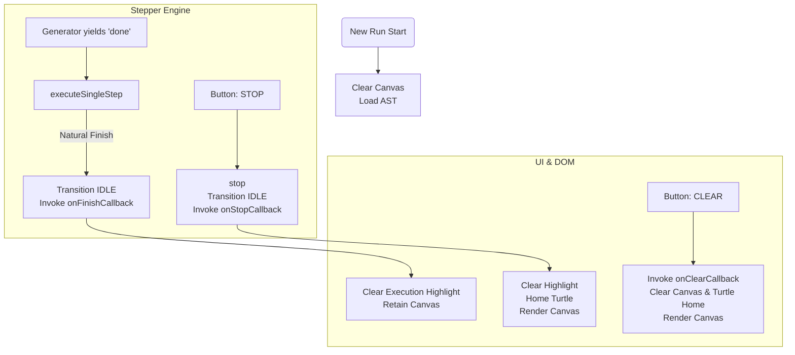

# Retain Canvas State Implementation Plan

## 1. Analysis & Findings

-   **Key Files**:
    -   `src/debugger/stepper.ts`: Contains the execution logic in `executeSingleStep`. Upon completion (`res.done`), it invokes `this.stop()` which sets the state to `IDLE` and triggers `this.onStopCallback`.
    -   `src/debugger/controls.ts`: Renders the UI debugger controls (`RUN`, `PAUSE`, `STEP`, `STOP`). Lacks a manual explicit clear option.
    -   `src/main.ts`: Registers `stepper.setOnStop` to clear the execution highlight and immediately clear the canvas (`turtle.clearScreen()`). It registers `stepper.setOnFinish` for successful completions.
    -   `tests/unit/debugger/stepper.test.ts`: Covers manual stopping but lacks an assertion differentiating natural finish behavior from manual aborts regarding callback invocation.
-   **Design Patterns**: The `StepperController` currently conflates manual aborts ("Stop") with execution completions ("Finish") by funneling generator completion through `this.stop()`. This triggers the `onStopCallback` automatically, leading to an aggressive canvas wipe when execution finishes successfully.
-   **Resolution Strategy**:
    1.  Decouple the "Finish" event from the "Stop" event in `StepperController`. Normal execution completion should reset internal state and invoke `onFinishCallback`, bypassing `stop()` to preserve canvas output.
    2.  Add an explicit `onClear` callback parameter to `DebuggerControls` and render a `[CLEAR]` button to provide users a direct mechanism to empty the canvas manually.
    3.  Relay the `onClear` callback in `main.ts` to `turtle.clearScreen()` and `renderCanvas()`, keeping `stepper.setOnStop` dedicated strictly to execution interruption handling.

## 2. System Architecture Diagram



## 3. Knowledge Retrieval Summary

-   **Advice**: Consultations with Duckie highlighted that debuggers should strictly separate Ephemeral UI state (execution pointers/highlights) from Durable Output (drawing canvases). Never bundle an aggressive teardown (clear output) into an advisory manual block (stop execution). Furthermore, Duckie confirmed the Google best-practice term for turning a visual canvas back to a blank state is "Clear" rather than "Reset".
-   **Action Taken**: Confirmed the architectural decision to sever the automatic linkage between the generator's completion and the structural teardown sequence in `stop()`. Directed the addition of an explicit "CLEAR" action.

## 4. Step-by-Step Implementation

### Step 1: Update StepperController to Separate Finish from Stop
1.  **Modify** `src/debugger/stepper.ts`:
    -   Inside `executeSingleStep()`, when `res.done` is true, avoid calling `this.stop()`.
    -   Implement explicit inline generator cleanup and event dispatch:
```typescript
      if (res.done) {
        this.clearTimer();
        this.generator = null;
        this.callStack = ['Global'];
        this.lastStep = null;
        this.stateMachine.transition(DebuggerState.IDLE);
        if (this.onFinishCallback) {
          this.onFinishCallback();
        }
        return false;
      }
```

### Step 2: Implement Explicit Clear Action in DebuggerControls
1.  **Modify** `src/debugger/controls.ts`:
    -   Update the constructor signature to accept an optional `onClear` function:
```typescript
  export class DebuggerControls {
    private clearBtn!: HTMLButtonElement;
    private onClear?: () => void;

    constructor(
      container: HTMLElement,
      stepper: StepperController,
      onClear?: () => void
    ) {
      this.container = container;
      this.stepper = stepper;
      this.onClear = onClear;
      this.render();
      this.setupListeners();
      this.updateButtonStates(this.stepper.getState());
    }
```
    -   In `render()`, explicitly create and append `this.clearBtn`:
```typescript
    this.clearBtn = document.createElement('button');
    this.clearBtn.type = 'button';
    this.clearBtn.className = 'dbg-btn btn-clear';
    this.clearBtn.innerHTML = '<span class="dbg-label">[CLEAR]</span> 🗑️';
    this.clearBtn.setAttribute('aria-label', 'Clear canvas');
```
    -   Append it securely *after* `this.stopBtn` inside `wrapper.appendChild(...)`.
    -   In `setupListeners()`, attach the generic click event:
```typescript
    this.clearBtn.addEventListener('click', () => {
      if (this.onClear) {
        this.onClear();
      }
    });
```
    -   In `updateButtonStates`, ensure the `clearBtn` operates regardless of execution state, or alternatively, remain active simultaneously with runtime transitions:
```typescript
    this.clearBtn.disabled = false;
```

### Step 3: Wire Callbacks and UI in main.ts
1.  **Modify** `src/main.ts`:
    -   Update the initialization of `DebuggerControls` (around line 150) to pass the callback encapsulating the clear actions:
```typescript
  new DebuggerControls(controlsDiv, stepper, () => {
    turtle.clearScreen();
    turtle.home();
    renderCanvas();
  });
```
    -   Inside `stepper.setOnStop()`, carefully remove `turtle.clearScreen();`. Leave `turtle.home();` and `renderCanvas();` if standard procedure allows the halted drawing to reflect the final localized turtle stop point, or retain it specifically for abort states.

## 5. Verification & Validation

### Verification Protocol
All implemented files must follow strict unit testing behavior. Prior to executing the logic adjustment, testing assertions will fail (Red phase) ensuring test integrity.

-   **Test Targets**:
    -   `tests/unit/debugger/stepper.test.ts`
    -   `tests/unit/debugger/controls.test.ts` (Requires Creation)

### Concrete Test Specifications (TDD)

#### Stepper Test Case (Red->Green)
1.  **File**: `tests/unit/debugger/stepper.test.ts`
2.  **Logic**: Implement an explicit validation confirming `onStopCallback` is **not** called upon happy-path execution completion.
```typescript
  it('does not invoke onStopCallback when execution finishes naturally [EXPECTED TO FAIL INITIALLY]', () => {
    const stepper = new StepperController();
    const ast = parse(tokenize('FD 10'));
    const env = new Environment();
    const turtle = new Turtle();

    const mockStop = vi.fn();
    const mockFinish = vi.fn();
    stepper.setOnStop(mockStop);
    stepper.setOnFinish(mockFinish);

    stepper.load(ast, env, turtle);
    // Exhaust generator commands completely
    let status = true;
    while(status) {
       stepper.stepInto();
       if (stepper.getState() === DebuggerState.IDLE) break;
    }

    expect(mockFinish).toHaveBeenCalled();
    expect(mockStop).not.toHaveBeenCalled();
  });
```

#### Controls Test Case (Red->Green)
1.  **File**: `tests/unit/debugger/controls.test.ts`
2.  **Logic**: Implement verification assuring the Clear callback triggers on manual action.
```typescript
import { describe, it, expect, vi } from 'vitest';
import { DebuggerControls } from '../../../src/debugger/controls.ts';
import { StepperController } from '../../../src/debugger/stepper.ts';

describe('DebuggerControls UI', () => {
  it('invokes explicitly attached clear mechanism upon action [EXPECTED TO FAIL INITIALLY]', () => {
    const container = document.createElement('div');
    const stepper = new StepperController();
    const mockClear = vi.fn();

    new DebuggerControls(container, stepper, mockClear);

    const clearBtn = container.querySelector('.btn-clear') as HTMLButtonElement | null;
    expect(clearBtn).not.toBeNull();

    clearBtn!.click();
    expect(mockClear).toHaveBeenCalledOnce();
  });
});
```

-   **Format Command**: `npm run lint:fix`
-   **Test Command**: `npx vitest run tests/unit/debugger/`
-   **Expected Output**:
    -   **Pre-Implementation**: Output indicating `[FAIL]` identifying missing UI buttons and inappropriate `onStopCallback` invocations during test runs.
    -   **Post-Implementation**: Output conveying full `[PASS]` status.
